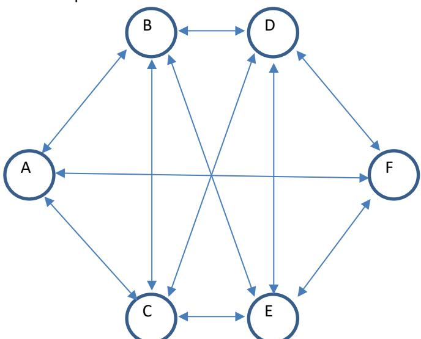
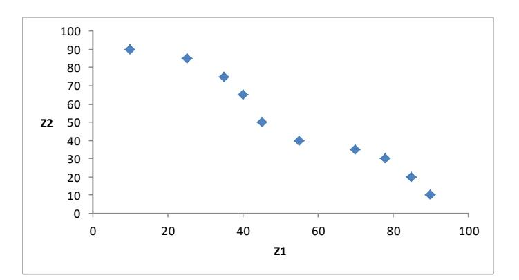

## **Oppgave 1 (10 %)**

- a) Anta at vi skal benytte oss av en metaheuristikk (f.eks en nabolagsheuristikk) for å finne optimale verdier på inputparameterne (kontrollvariablene) våre i en simuleringsmodell. Forklar kort hvordan man kan evaluere mulige flytt i algoritmen, og hvordan dette skiller seg fra et deterministisk optimeringsproblem.
- b) Gi to eksempler på hvordan man kan gjøre denne evalueringen mer beregningseffektiv. Forklar kort!

## **Oppgave 2 (15 %)**

- a) Hva er et scenario-tre? Hvilken betydning har «in-sample» og «out-of-sample» stabilitet for genereringen av scenario-trær?
- b) L-shaped metoden for å løse stokastiske problemer kan genere både «feasibility cuts» og «optimality cuts».
  - b1) Hvilken betingelse må være oppfylt for at generering av «feasibility cuts» ikke er nødvendig? Forklar kort hvorfor.
  - b2) Hvilken annen metode kjenner du, som i dette tilfellet kan betraktes som en spesiell variant av L-shaped metoden?
- c) Gi en kort beskrivelse av «Stochastic Decomposition». Hva er den største forskjellen sammenlignet med L-shaped metoden?

## **Oppgave 3 (25 %)**

Figuren under viser et lite transportnettverk:

Nodene i nettverket er bussholdeplasser, mens buene er veistrekninger mellom to bussholdeplasser. Veistrekningene betjenes av forskjellige bussruter, der en bussrute består av en eller flere veistrekninger. Hver bussrute har en kapasitet, dvs. et antall passasjerer som kan fraktes mellom to holdeplasser, og en fast kostnad for å drifte bussruten.

Det lokale busselskapet er i ferd med å planlegge sommerrutene neste år. Etterspørsel etter transporttjenester, dvs. antall passasjerer, er knyttet til veistrekningene mellom holdeplassene, dvs. etterspørsel finnes f.eks. mellom holdeplassene B og D og holdeplassene D og F, men ikke mellom holdeplassene B og F (siden det ikke finnes en direkte forbindelse mellom B og F). Passasjerer skal transporteres direkte mellom to holdeplasser. Antall passasjerer pr. dag langs hver veistrekning er dessverre ikke kjent for neste sommer, men antas til å være uniformt fordelt mellom en nedre og øvre grense.

Busselskapet ønsker din hjelp til å finne ut hvilke bussruter som skal tilbys slik at totalkostnaden minimeres.

Ta utgangspunkt i følgende notasjon:

#### Mengder:

- V Et sett som inneholder alle veistrekninger mellom holdeplasser
- R Et sett som inneholder alle bussruter busselskapet kan velge blant

#### Parametere:

- $Q_r$  Kapasitet pr. dag for bussrute r (i antall passasjerer pr. veistrekning).
- $C_r$  Fast kostnad for å drifte bussrute r.
- a) Vi antar her at passasjerenes etterspørsel etter transporttjenester skal dekkes. Dersom passasjerer ikke kan fraktes pga. av for liten kapasitet på de utvalgte bussrutene, antar vi at busselskapet må leie taxi. Det er en gitt kostnad for å frakte en passasjer med taxi på hver veistrekning. Sett opp scenario-formuleringen for et to-stegs stokastisk programmerings problem og definer tilhørende notasjon utover den som er gitt over.

Istedenfor å forplikte seg til å frakte alle passasjerer, vil busselskapet bare forplikte seg til at alle passasjerer transporteres på minst 90% av dagene ruteplanen gjelder for i oppgavene b) og c).

- b) Sett opp chance constraint-formuleringen for dette problemet. Utvid notasjonen hvis nødvendig.
- c) Forklar forskjellen mellom bruk av flere individuelle chance constraints og bruk av én joint chance constraint i transportnettverket.
- d) Hva blir styrende for valg av bussruter hvis en bruker en robust optimeringsmodell basert på Soyster (1973).
- e) Forklar kort forskjellen(e) mellom den opprinnelige tilnærmingen til robust optimering til Soyster (1973) og den nyere tilnærmingen til Bertsimas og Sim (2004).

# **Oppgave 4 (20 %)**

- a) Hvilke betingelser må være oppfylt for at en løsning, x, kan sies å være Pareto-optimal for et multi-kriterie optimeringsproblem?
- b)

Modellen til høyre beskriver et bi-objektiv optimeringsproblem for et produktmiks-problem.  $z_1$  og  $z_2$  beskriver de to objektfunksjonene som vi begge ønsker å maksimere, mens variablene  $x_1$ ,  $x_2$  og  $x_3$  angir produsert mengde av produktene 1, 2 og 3. Vis hvordan du kan bruke  $\varepsilon$ -constrained-metoden til å generere en Pareto-front for dette problemet.

$$z_{1} = P_{1}x_{1} + P_{2}x_{2} + P_{3}x_{3}$$
  

$$z_{2} = R_{1}x_{1} + R_{2}x_{2} + R_{3}x_{3}$$

$$x_{1} + x_{2} + x_{3} \geq D$$
$$A_{21}x_{1} + A_{22}x_{2} + A_{32}x_{3} \leq T$$
$$A_{31}x_{1} + A_{32}x_{2} + A_{32}x_{3} \leq Q$$
$$x_{1}, x_{2}, x_{3} \geq 0$$

c)
Figuren til høyre viser Paretofronten for problemet i b). Du
får oppgitt at den er
fremkommet ved bruk av enten
vektet sum-metoden eller εconstrained-metoden. Kan du si
hvilke av de to metodene som
er benyttet? Begrunn svaret.

d) Beskriv minst to gode grunner til at Evolusjonære (Genetiske) Algoritmer ofte brukes for å approksimere Pareto-fronten.

# **Oppgave 5 (10 %)**

Følgende beskrivelse av selskapet U B E R er hentet fra Wikipedia:

"Uber Technologies Inc. (skrevet U B E R) er et internasjonalt transportnettverksselskap med hovedkvarter i San Francisco i California. Selskapet utvikler, markedsfører og drifter mobilappen Uber som formidler kjøreoppdrag mellom passasjerer og Ubertilknyttede sjåfører som benytter sine egne biler i transporten. I 2015 var selskapets tjenester tilgjengelig i 67 land og 300 byer verden over. Siden Ubers etablering har selskapets forretningsmodell blitt så velkjent at selskap som benytter smarttelefonteknologi for å knytte kjøpere og selgere av småoppdrag sammen gjerne omtales som «Uberifisering».

Uber ble grunnlagt under navnet «UberCab» av Travis Kalanick og Garrett Camp i 2009 og mobilappen ble lansert i juni dette året. Initiativtakerne fjernet «Cab» i navnet for å distansere seg fra ulike lovers definisjoner av taxi.

I 2012 utvidet selskapet virksomheten også til land utenfor USA. I 2014 gjorde selskapet forsøk med bildeling. Høsten 2015 var selskapet verdsatt til over 60 milliarder amerikanske dollar. Forretningsmodellen som selskapet benytter, er i strid med gjeldende taxiregulering i en rekke land og byer, eller den utfordrer taxiselskap og -sentraler."

Diskuter de viktigste økonomiske mekanismene som kan begrunne den høye verdsettingen av dette unge selskapet!

# **Oppgave 6 (20 %)**

Følgende problemstillinger berører i hovedsak kombinatoriske auksjoner generelt, men ta gjerne utgangspunkt i salg av flere frekvensbånd for trådløs kommunikasjon i flere geografiske regioner dersom du ønsker å bruke en bestemt situasjon som eksempel i svarene også før det blir påkrevd i siste deloppgave.

- a) Beskriv de faktorer som vil bidra til at det kan være lønnsomt for selger og effektivt for samfunnet at det gjennomføres kombinatoriske auksjoner i stedet for at hvert objekt auksjoneres for seg!
- b) I litteraturen henvises det til blant annet "private value model", "common value model" og "affiliated value model". Forklar hva de sentrale forskjellene er i forutsetninger og hvilke implikasjoner modellene har for utforming av kombinatoriske auksjoner!
- c) En mulig mekanisme for kombinatoriske auksjoner kalles "Vickrey-Clarke-Groves", VCG. En annen mulig mekanisme omtales som "Combinatorial Clock Auction", CC.
  - c1) Forklar kort hva de to mekanismene går ut på og diskuter mulige fordeler og ulemper ved dem!
  - c2) Hva er en naturlig forklaring på at CC er foretrukket framfor blant annet VCG i flere store auksjoner av frekvensbånd i senere tid?