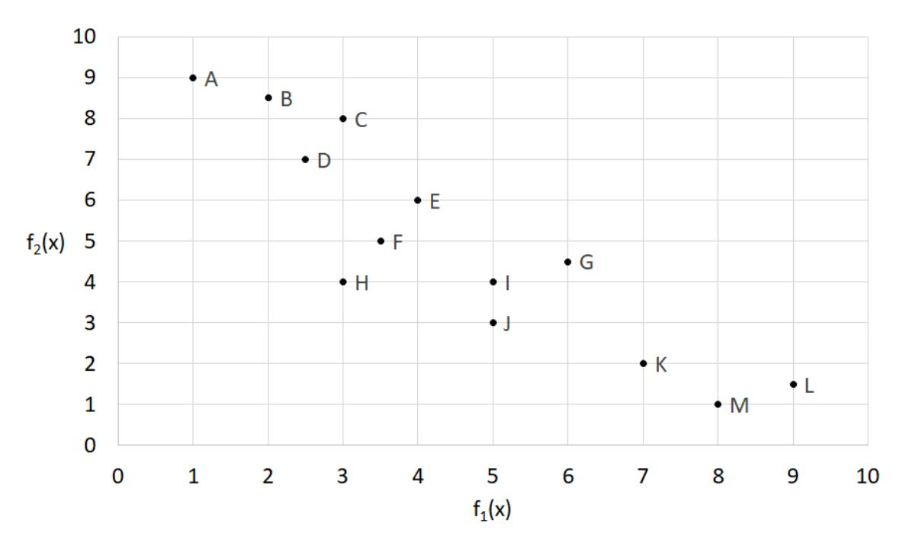

# Oppgave 1, Multikriterie, vekt: 10 %

Figuren under viser forskjellige løsninger for et bi-objektiv optimeringsproblem.  $f_1(x)$  og  $f_2(x)$  representerer funksjonsverdien for hvert av de to objektivene. Vi ønsker å minimere begge objektivene.

- a) Hvilke løsninger ligger på paretofronten?
- b) Hvilke løsninger vil man kunne finne ved bruk av vektet sum-metoden?
- c) La  $w_1$  og  $w_2$  være vekt av henholdsvis  $f_1(x)$  og  $f_2(x)$ . Legg til grunn at summen av vektene skal være lik 1. For hver av løsningene du fant i oppgave b), finn intervallene til  $w_1$  og  $w_2$  som gir denne løsningen, ved bruk av *vektet sum*-metoden.
- d) Hvilke løsninger vil du finne ved bruk av  $\epsilon$ -constrained-metoden for hver  $\epsilon$ , gitt steglengde lik to? Anta at objektiv 1 går inn som en restriksjon.

# Oppgave 2, Simularing, vekt: 10 %

Anta at du studerer et enkelt ruteproblem hvor ett kjøretøy skal besøke et utvalg av punkter i løpet av en arbeidsdag. Et besøk i et punkt gir en profitt dersom besøket skjer innenfor et gitt tidsvindu. Tiden det tar å kjøre fra et punkt til et annet er stokastisk, og gitt av en sannsynlighetsfordeling. Anta videre at du har en deterministisk optimeringsmodell hvor tiden mellom hvert punkt er gitt som konstante parametre. Optimeringsmodellen søker etter ruten med maksimal profitt. Siden tiden mellom hvert punkt er stokastisk vil man nødvendigvis ikke få den profitten som optimeringsmodellen foreskriver.

Du ønsker å benytte diskret hendelsessimulering for å evaluere løsninger fra optimeringsmodellen i en stokastisk setting. Om nødvendig kan du anta: dersom kjøretøyet ankommer et punkt før tidsvinduet er åpent, vil kjøretøyet vente til det åpner; og dersom kjøretøyet ankommer et punkt etter at tidsvinduet er stengt, vil kjøretøyet kjøre videre til neste punkt på ruten.

- a) Simuleringsklokka: Når du utvikler simuleringsmodellen har du ulike valg for oppdatering av simuleringsklokka. Beskriv forskjellen mellom å oppdatere simuleringsklokka med faste tidsinkrement og hendelsesbaserte tidsinkrement i diskret hendelsessimulering.
- b) Generering av tilfeldige tilfeldige observasjoner fra en sannsynlighetsfordeling: Anta at tiden mellom to punkter følger en gitt lognormalfordeling. Du kjenner ingen metode for å invertere denne fordelingen, og bestemmer deg for å bruke akseptanse-avslagmetoden for å generere tilfeldige observasjoner fra fordelingen. Beskriv hvordan du kan bruke akseptanse-avslag-metoden for å generere tilfeldig observasjoner.
- c) Simulering for å evaluere løsninger fra en optimeringsmodell: Anta at du har fått optimeringsmodellen til å generere to ulike løsninger som du ønsker å evaluere ved hjelp av simuleringsmodellen. Beskriv hvordan du vil sammenlikne den simulerte kvaliteten av løsningene ved bruk av parvis sammenlikning. Hvordan kan bruk av common random numbers redusere variansen i sammenlikningen?

### Oppgave 3, Usikkerhet, vekt: 15 %

Ta utgangspunkt i følgende to-stegs lineære stokastiske optimeringsproblem. La S være mengden av scenarier og p(s) sannsynligheten for scenario s.

$$\max cx + Q(x) \tag{1}$$

subject to:

$$Ax = b (2)$$

$$x \ge 0 \tag{3}$$

where:

$$Q(x) = \sum_{s \in \mathcal{S}} p(s)Q(x,s) \tag{4}$$

$$Q(x,s) = \max\{qy|Wy = b - T(s)x, y \ge 0\}$$
 (5)

- a) Du får vite at problemet har relatively complete recourse. Hva innebærer det?
- **b)** Beskriv i detalj L-shaped-algoritmen for dette problemet under antagelsen om *relatively complete recourse*, og der det som vist kun er usikkerhet i T-matrisen.
- c) Når du skal regne ut Q(x) for en gitt x må du løse en mengde med LP-er, én for hver  $s \in \mathcal{S}$ . Hvordan vil du organisere disse beregningene slik at det går fort?

#### Oppgave 4, Grenser, vekt: 10 %

Du har en en-dimensjonal stokastisk variabel med en kontinuerlig uniform fordeling på [0,10]. Den inngår i et lineært maksimeringsproblem der den stokastiske variabelen sitter på høyresiden.

- a) Anta at du løser en variant av problemet der den stokastiske variabelen er byttet ut med fordelingens forventningsverdi 5. Hva kan vi da si om løsningen til det deterministiske problemet du har løst relativt til det opprinnelige problemet?
- b) Anta du bytter ut fordelingen med en diskret to-punktfordeling med mulige verdier 0 og 10, hver med en sannsynlighet på 1/2 og løser dette forenklede stokastiske problemet til optimum. Hva kan vi da si om løsningen til det stokastiske problemet du har løst relativt til det opprinnelige problemet?
- c) Vi vil gjerne ha en 11-punktsfordeling over mengden  $\{0,1,2,...,9,10\}$  som gir en nedre skranke på det opprinnelig problemet hvis den brukes i stedet for den kontinuerlige uniforme fordelingen. Om alle punktene skal ha en positiv vekt (sannsynlighet), hva blir da disse vektene?

## Oppgave 5, Sekvensielle beslutninger, vekt: 15 %

En servicetekniker har et sett med kunder  $\mathcal{I}$ . Kundene kan ringe teknikeren om de har feil på utstyret. Teknikeren har forhandlet individuelle kontrakter med kundene og vil motta en betaling  $r_i$  om han utfører en etterspurt service hos kunde  $i \in \mathcal{I}$ . Tiden er diskretisert i et antall tidsperioder, indeksert av  $t \in \{1, \ldots, T\}$ . I hver tidsperiode kan teknikeren reise fra hvilken som helst posisjon, til hvilken som helst posisjon, og utføre service hos maks en kunde. Teknikeren kan reise til en kunde uten å faktisk utføre service hos kunden. Kostnaden av å reise mellom to kunder  $i, j \in \mathcal{I}$  er gitt ved  $d_{ij} > 0$ . I hver periode er det en sannsynlighet  $0 \le p_i < 1$  for at en feil som teknikeren kan fikse oppstår hos kunde i. Anta at sannsynligheten for feil hos en kunde i er den samme i alle tidsperioder og at den er uavhengig over perioder. Teknikeren ønsker å maksimerer profitten, altså maksimere akkumulerte mottatte betalinger minus den akkumulerte reisekostnaden.

- a) Diskuter hvordan man bør definere følgende:
  - En tilstand (state),  $S_t$
  - En beslutning,  $x_t$
  - Utfallsrommet (outcome space),  $\Omega_t$ , av den eksogene informasjonen.
- b) Sett opp et utrykk for den direkte kostnaden  $C_t(S_t, x_t)$  av å gjøre beslutning  $x_t$  i tilstand  $S_t$ .
- c) Sett opp verdi rekursjonen (the value recursion) av å være i en gitt tilstand  $S_t$  i periode t.

### Oppgave 6, Airbnb, vekt: 10 %

Følgende beskrivelse av selskapet Airbnb er hentet fra Wikipedia:

"Airbnb is an online marketplace and hospitality service, enabling people to lease or rent short-term lodging including vacation rentals, apartment rentals, homestays, hostel beds, or hotel rooms. The company does not own any lodging; it is merely a broker and receives percentage service fees (commissions) from both guests and hosts in conjunction with every booking. It has over 3,000,000 lodging listings in 65,000 cities and 191 countries, and the cost of lodging is set by the host."

Gjennom appen til Airbnb formidles annonser fra utleiere, det er søkemuligheter, det er en meldingsfunksjon der potensielle gjester kan kommunisere med utleiere og det er brukervurderinger av gjester og av utleiere. Utleier setter pris, men Airbnb formidler anbefalinger. Airbnb belaster gjester 6 % til 12 % og utleiere 3 % til 5 % av prisen. I tillegg til informasjonsutvekslingen i appen, bidrar Airbnb med forsikring for utleiere, en sikker betalingsløsning og også en tjeneste der identiteten til leietakere verifiseres via scann av identitetspapirer.

Suksessen til Airbnb har utløst noen kontroverser. Hoteller, pensjonater og andre i den mer tradisjonelle bransjen for utleie av husrom, mener gjerne at det blir en urettferdig konkurranse ettersom de er regulert av det offentlige slik at de må tilfredsstille en rekke krav, mens utleiere i Airbnb leier ut uten godkjenning, og mange oppgir heller ikke leieinntekten for beskatning. Det hevdes også at utleie via Airbnb har bidratt til prisøkning for eiendommer i sentrale områder slik at det er blitt vanskeligere å etablere seg der for personer som ønsker å bo permanent.

- a) Forklar hvordan ulike mekanismer bidrar til verdiskapningen til Airbnb!
- b) Airbnb har valgt en modell der selskapet gir utleiere anbefalinger om priser, men det er utleier som bestemmer pris. Hvilke vurderinger tror du ligger bak dette valget?

## Oppgave 7, Auksjoner, vekt: 15 %

En såkalt "combinatorial clock auction", CCA, består av en fase der det bys mengder basert på nivåer gitt av én prisklokke for hvert produkt, etterfulgt av én, eventuelt flere, runder med bud på kombinasjoner av produkter og/eller objekter. Det kan være en aktivitetsregel og endelig pris kan være basert på andreprisprinsippet. Her skal du kommentere ulike egenskaper ved denne auksjonsformen. Fokuser på de mest sentrale poengene. Svar konsist og presist.

- a) I stedet for én prisklokke for hvert objekt, kan en CCA gjennomføres med prisklokker for det som omtales som produkter. Forklar hvorfor!
- b) I CCA er det først en fase med prisklokker og deretter én eller flere runder med ekte kombinatoriske auksjoner. Hva er hensikten med klokkefasen?
- c) Aktivitetsregelen skal hindre at noen byr større mengder på høyere priser mot slutten av auksjonen. Hva er hensikten med en slik regel?
- d) I stedet for å kreve at vinnere betaler det de har bydd, kan det være naturlig å bruke et andreprisprinsipp i form av Vickrey-priser eller "Vickrey-nearest-core". Forklar hensikten bak bruken av andreprisprinsippet!
- e) I en veldig enkel auksjon der endelig pris er basert på andreprisprinsippet, er det bare to objekter, A og B. Det er avgitt 5 bud som følger:  $b_1\{A,B\}=230$ ,  $b_2\{A\}=100$ ,  $b_3\{B\}=100$ ,  $b_4\{A\}=150$ ,  $b_5\{B\}=150$ . Her har altså byder nummer 1 bydd 230 for kombinasjonen av A og B, mens de andre har bydd på enten A eller B alene. Hvem vinner auksjonen? Hva betaler vinneren(e) basert på henholdsvis Vickrey-priser eller "Vickrey-nearest-core"?

# Oppgave 8, Robusthet, vekt: 15 %

Etter å ha fullført studiet sitt ved ett av landets største universiteter, planlegger Kari en velfortjent tur til Sør-Amerika. Hun sliter litt med å bestemme seg for hva hun bør ta med seg og har bedt deg om å hjelpe henne med å pakke ryggsekken. Hun har laget en liste over gjenstandene hun vurdere å ta med, men er litt usikker når det gjelder deres vekt. Kari har også satt opp nytten de forskjellige gjenstandene har for henne (se tabellen under).

|                   | Nytte | Vekt (kg)     |
|-------------------|-------|---------------|
| Sovepose          | 7     | $2\pm1$       |
| Telt              | 10    | $3\pm1$       |
| Liggeunderlag     | 4,5   | $1,5 \pm 0,5$ |
| Guidebøker        | 11    | $4\pm 2$      |
| Ekstra varme klær | 13    | $5,5 \pm 1,5$ |
| Mobil, iPad, osv. | 6     | $2\pm1$       |
| Mat og drikke     | 12    | $4\pm1$       |

Kari ønsker å ikke måtte bære mer enn 15 kg.

- a) Formuler og løs Karis problem som et robust optimeringsproblem. Bruk tilnærmingen til Soyster (1973) med kolonnevis usikkerhet. Husk å forklare modellen.
- **b)** Hvor mye "beskyttelse" mot økning i vekt ligger i den optimale løsningen til det robuste optimeringsproblemet?

Kari har hørt at robust optimering leverer svært robuste, men også svært konservative løsninger. Hun ber deg om å bruke stokastisk programmering, siden dette skal gi gode fleksible løsninger.c) Formuler et Karis problem to-stegs stokastisk programmeringsproblem. I første steget skal sekken pakkes slik at forventet vekt ikke overstiger sekkens kapasitet, mens du i andre steget har anledning til å fjerne gjenstander fra sekken, dersom det skulle vise seg at sekken er for tung (det skal ikke være mulig å ta med nye gjenstander). Bruk scenarionotasjon. Husk å føre opp nødvendige antakelser og forklar modellen.