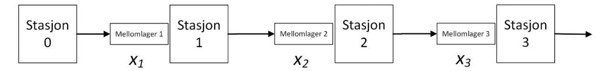

Institutt for Industriell Økonomi og Teknologiledelse

# Eksamensoppgave i TlØ4505 Anvendt økonomi og optimering, fordypningsemne

| Faglig kontakt under eksamen: | Kjetil Fagerholt |
|-------------------------------|------------------|
| Tlf.:                         | 97 56 84 97      |

| Eksamensdato:                           | 03.12.2018                                                         |
|-----------------------------------------|--------------------------------------------------------------------|
| Eksamenstid (fra-til):                  | 09.00 – 13.00                                                      |
| Hjelpemiddelkode/Tillatte hjelpemidler: | C / godkjent kalkulator og K. Rottmann: «Matematisk formelsamling» |

Annen informasjon:

| Målform/språk:                    | Bokmål |
|-----------------------------------|--------|
| Antall sider (inkludert forside): | 6      |
| Antall sider vedlegg:             | 0      |

Informasjon om trykking av eksamensoppgave

Originalen er:

| 1-sidig                | □ | 2-sidig | □ |
|------------------------|---|---------|---|
| sort/hvit              | □ | farger  | □ |
| skal ha flervalgskjema | □ |         |   |

Kontrollert av:

## Oppgave 1 (10 %)

Flere av selskapene i delingsøkonomien, slik som Uber og Airbnb, søker å motvirke uheldige virkninger av asymmetrisk informasjon samtidig som de søker å utnytte godt informasjonsgrunnlag i dynamisk prising.

- a) Forklar på hvilken måte asymmetrisk informasjon kan hemme verdiskapningen til selskaper i delingsøkonomien. Hvilke tiltak er vanlige for å motvirke disse effektene?
- b) Hvilken type informasjon er det som gjør at selskaper i delingsøkonomien potensielt kan utnytte dynamisk prising mer effektivt enn det som har vært vanlig i mer tradisjonell virksomhet? Hva er hensikten med dynamisk prising? Kan dynamisk prising bidra til mer effektive markeder? Forklar!

## **Oppgave 2** (20 %)

En «simultaneous ascending auction» (SAA) innebærer at ulike objekter auksjoneres simultant i engelske auksjoner uten mulighet til å by eksplisitt på kombinasjoner. En såkalt "combinatorial clock auction", CCA, består av en fase der det bys mengder basert på nivåer gitt av én prisklokke for hvert produkt, etterfulgt av én, eventuelt flere, runder med bud på kombinasjoner. Det kan være en aktivitetsregel og endelig pris kan være basert på andreprisprinsippet. I denne oppgaven er hensikten å få fram fellestrekk og ulikheter mellom disse to auksjonsformene.

- a) Både SAA og CCA er åpne, iterative auksjoner med stigende priser. Forklar kort hvilke mekanismer som kan bidra til at det gir høyere verdi for selger enn lukkede auksjoner.
- b) CCA kan ses på som en SAA, men med en etterfølgende kombinatorisk auksjon. Hvilke fordeler kan det være for selger at det er en ekte kombinatorisk auksjon etter klokkefasen?
- c) I stedet for å kreve at vinnere betaler det de har bydd slik som i SAA, kan det være naturlig å bruke et andreprisprinsipp i form av Vickrey-priser eller "Vickrey-nearest-core" i CCA. Forklar hensikten bak bruken av andreprisprinsippet.
- d) Diskuter hvilken rolle «the treshold problem» kan spille i SAA og CCA.

#### **Oppgave 3** (20 %)

Ta utgangspunkt i ryggsekkproblemet

$$\max Cx$$
 slik at  $Ax \leq B$ ,  $x \in \{0,1\}$ 

der x beskriver om vi tar med element i (x(i) = 1) eller ikke (x(i) = 0). Videre er C(i) verdien av element i, A(i) volumet av element i, og B maksimalvolumet vi kan legge i ryggsekken.

Anta nå at maksimalvolumet B vi kan håndtere er usikkert, og at denne usikkerheten er beskrevet ved at Pr(B = B(j)) = p(j), for j = 1, ..., n. (Dette leses som at sannsynligheten for at B er lik B(j) er gitt ved p(j), der  $\sum_{j=1}^{n} p(j) = 1$ . Anta at B(j) < B(j+1) for j = 1, ..., n-1. Logikken nå er at vi må først plukke de elementene vi vil ha, og deretter lærer vi verdien på B. Så må vi forholde oss til observert B og hva vi plukket av elementer, altså er klassisk to-stegs stokastisk optimeringsproblem.

a) Anta at vi krever at uansett hva *B* er må alle elementene vi plukker passe oppi ryggsekken. Hvilken modell får vi da?

- b) Hva om vi aksepterer at det ikke alltid er slik at alle elementene får plass, men vi krever at med sannsynlighet minst  $\alpha$  skal det gå bra. Hvordan blir modellen nå?
- c) Hva om vi kan plukke så mange elementer vi vil, og volumet kan bli hva som helst, men vi må betale en enhetskostnader  $\beta$  (per volumenhet) for alt som ikke går oppi sekken, og målet er å maksimere forventet verdi? (Altså at vi maksimerer verdien av det vi plukker minus forventede kostnader som følge av at ikke alt får plass i sekken). Hvordan blir denne modellen?
- d) Hva mener vi med harde og myke betingelser (hard and soft constraints)? Hvordan vil du karakterisere de modellene du satte opp i a), b) og c) med hensyn til harde og myke betingelser?
- e) Ta utgangspunkt i den opprinnelige modellen, og anta at du løser den separat for alle mulige verdier av *B*. Forklar hvorfor (eller hvorfor ikke) du kan bruke løsningene til disse *n* problemene til å finne løsninger til modellene i a), b) og c).

## **Oppgave 4** (vekt 20 %)

Ta utgangspunkt i lineærprogrammeringsproblemet

$$F(b,c) = \max \{ cx \ slik \ at \ Ax = b, x \ge 0 \}$$

Parameterne b og/eller c i problemet er stokastiske, og målet er å finne skranker eller approksimasjoner av E[F], det vil si forventningsverdien til F.

Tips! Optimalverdien til lineærprogrammeringsproblemet er konvekst i *c* og konkavt i *b*.

- a) Anta at kun b er stokastisk med forventningsverdi E[b]. Løs problemet over med b byttet ut med E[b]. Gir det en øvre skranke, nedre skranke eller en approksimasjon av E[F]? Hvorfor? (Med approksimasjon mener vi at vi ikke vet om det er en skranke, men at det gir et rimelig estimat av E[F].)
- b) Anta at kun c er stokastisk med forventningsverdi E[c]. Løs problemet over med c byttet ut med E[c]. Gir det en øvre skranke, nedre skranke eller en approksimasjon av E[F]? Hvorfor?
- c) Anta nå at både b og c er stokastiske. Løs problemet over med b byttet ut med E[b] og c byttet ut med E[c]. Gir det en øvre skranke, nedre skranke eller en approksimasjon av E[F]? Hvorfor?
- d) Anta nå at både b og c er stokastiske, men at du av en eller annen numerisk grunn må la b være lik E[b]. Du trenger en øvre skranke på E[F]. Anta at c enten har en kontinuerlig fordeling eller er beskrevet diskret, men med så mange utfall at du ikke klarer å håndtere dem med full enumerasjon. Det er kjent at c ligger i et intervall [a1, a2]. Så du må forenkle på ett eller annet vis. Hvordan kan du nå behandle c slik at det totale resultatet garantert blir en øvre skranke på E[F]?

#### **Oppgave 5 (15%)**

Vi skal studere en produksjonslinje som består av fire stasjoner i sekvens, som vist i figuren under. Den første stasjonen (Stasjon 0) har alltid råmateriale tilgjengelig, og straks Stasjon 0 er ferdig med å prosessere råmaterialet, sender den produktet videre til Stasjon 1; Stasjon 1 prosesserer deretter produktet og sender så videre til Stasjon 2, osv. Mellomlagrene mellom stasjonene 0 og 1, 1 og 2, og 2 og 3 er begrenset til i sum 50 produkter. Hvis Stasjon 2 er ferdig med et produkt, men mellomlageret før Stasjon 3 er fullt, er Stasjon 2 blokkert inntil det blir ledig plass i mellomlageret før Stasjon 3. Det samme gjelder for stasjonene 0 og 1.

Spørsmålet er hvordan man bør allokere disse 50 mellomlagerplassene for å minimere forventet gjennomstrømningstid per produkt (fra Stasjon 0 til ferdigstilling i Stasjon 3).

Figur 1 Produksjonslinje med 4 stasjoner i sekvens

La  $x_i$  være antall mellomlagerplasser før Stasjon i. Vi har altså de heltallige beslutningsvariablene  $x_1, x_2, x_3$  med restriksjonen  $x_1 + x_2 + x_3 = 50$ , som gir totalt 1326 mulige konfigurasjoner av produksjonslinja.

Anta at du har en simulator av produksjonslinja som basert på en strøm av uniformt tilfeldige tall og verdier for  $x_1, x_2, x_3$  (input), gir deg et estimat på forventet gjennomstrømningstid per produkt T.

- a) Sett opp en stegvis beskrivelse av en optimeringsalgoritme (f.eks. basert på tabusøk) som benytter simulatoren for å søke etter konfigurasjonen, og som gir minimal forventet gjennomstrømningstid. Unngå bruk av variansreduserende teknikker. Forklar hvordan algoritmen initialiseres, hvordan man bestemmer hvilke løsninger som evalueres i hver iterasjon av algoritmen, og kriterier for å velge beste løsning(er) og løsning(er) i neste iterasjon.
- b) Modifiser algoritmen du oppga i a) til å benytte den variansreduserende teknikken *common* random numbers.

## **Oppgave 6** (15 %)

A rapid garbage collection service company collects waste from customers as rush orders, i.e., garbage has to be collected within 20 minutes from obtaining the order. The company has one truck with a capacity of Q > 0, which starts at a depot in the beginning of each day and returns to the depot at the end of the day. A working day starts at 7:00 and ends at 18:00 and is discretized into periods of 20 minutes. We denote the depot 0 and a set of potential customer locations  $C = \{1, ..., n\}$  and in conjunction the set of locations is  $N = \{0,1,...n\}$ . The time it takes to travel between two locations i and j is  $t_{ij} > 0$  and the traveling cost between the locations is  $c_{ij} > 0$ . We assume that the time to collect (or dispose) any garbage at the location j is included in  $t_{ij}$ . Furthermore, we assume that at most one location is visited in any 20 minute period.

Any customer has a predetermined size of garbage container. The volume of waste can then be calculated to be  $q_i$  for customer i. The company has a hard time to predict when the customers' garbage containers are full and, thus, for each period t only a probability of the customer calling in is known. We denote this probability  $0 \le p_{it} < 1$ . The company gets a revenue,  $r_i > 0$ , of servicing customer i.

The customers call in by the beginning of each period. As the truck can only service one customer per period the company decides which customer to service. The remaining customers are serviced by other companies. The truck cannot carry a total volume of garbage greater than the capacity Q. The company may therefore decide for the truck to go back to the depot to dispose the collected garbage. This takes one full 20 minutes period and the truck will be empty in the following period. Finally the company

may choose for the truck to go to any location that can be reached within a 20 minute period without actually servicing any customer.

The company is interested in maximizing their profit, i.e., their accumulated revenue during the day minus the traveling cost. As the problem is a sequential decision problem where information arrives continually they decide to model this a Markov Decision Problem.

- a) Discuss how to define a state,  $S_t$ , a decision,  $x_t$ , and the outcome space,  $\Omega_t$ , of the exogenous information.
- b) Set up the direct cost function,  $C_t(S_t, x_t)$  of making a given decision  $x_t$  in state  $S_t$ .
- c) Explain how you would set up the value recursion of being in a given state  $S_t$  at time t.