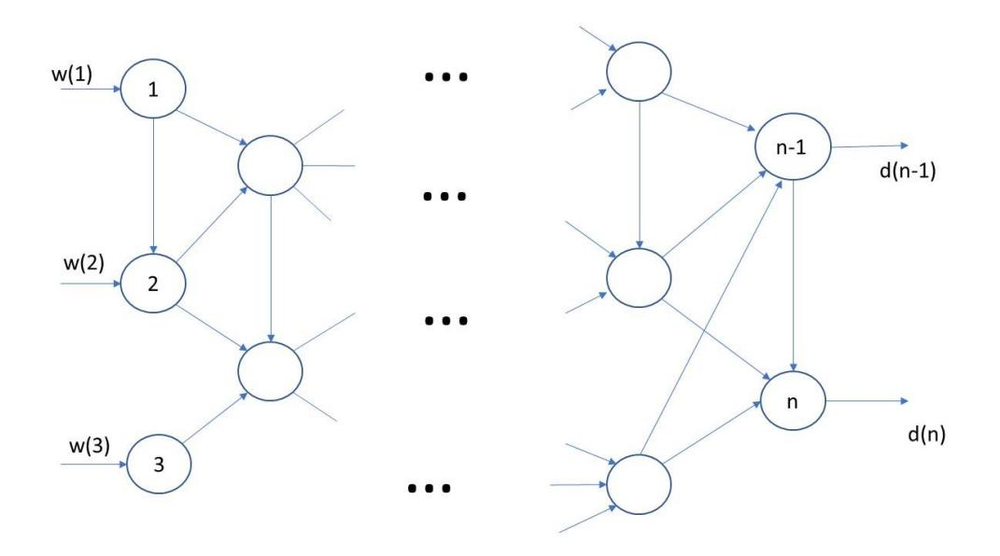

## **Oppgave 1 (20%)**

En liten forhandler har en butikk som kun selger én produkttype i hver periode. Produktene er bedervelige og kan ikke lagres mellom periodene. Produkttypene kan være fisk, kjøtt, grønnsaker eller andre typer mat. Vi angir settet med potensielle produkttyper med J={1,2,...,m}. Vi antar (for enkelhets skyld) at enhver mengde etterspørsel kan tilfredsstilles i hver periode av forhandleren (det fins igjen kapasitetsbegrensning). Videre antar vi at prisen forhandleren kan kreve for hver produkttype er uavhengig av perioden og eksogent bestemt (det vil si at forhandleren ikke kan bestemme prisen). Vi angir prisen som forhandleren krever som dj for produkt j.

Vi antar at periodene tilsvarer uker, dvs. vi betegner periode settet med  $T = \{1,...,52\}$  for ukene i det kommende året. Forhandleren observerer at det er sesongvariasjoner i etterspørselen etter produkttypene og anslår at sannsynligheten for å selge n enheter av en produkttype j i periode t er  $0 \le p_{jnt} < 1$ .

Ved slutten av hver periode bestemmer forhandleren hvilken produkttype som skal selges fra butikken i neste periode. Det er imidlertid en overgangskostnad ved å skifte salg fra ett produkt i til et produkt j. Overgangskostnaden tilsvarer kostnaden for å endre oppsettet av butikken og nødvendig ekstra rengjøring. Vi betegner denne overgangskostnaden  $c_{ij}$ . Vi antar at det er ingen overgangskostnad dersom forhandleren fortsetter med samme produkttype, dvs.  $c_{ii}$ =0 for all i, mens det er en strengt positiv kostnad dersom forhandleren velger en ny produkttype, dvs.  $c_{ij}$ >0 for all  $i \neq j$ .

Forhandleren er interessert i å maksimere forventet fortjenesten til butikken gjennom hele året. Det observeres at en beslutning tatt i en periode kan påvirke den lønnsomheten i de neste periodene. Derfor vil forhandleren gjerne modellere dette som en Markov-beslutningsprosess, og du kommer til å hjelpe.

- a. Diskuter hvordan du definerer en tilstand,  $S_t$ , en beslutning,  $x_t$ , og utfallsrommet for den eksogene informasjonen  $\Omega_t$ , for forhandlerens problem. Definer den direkte kostnadsfunksjonen,  $C_t$  ( $S_t$ , $x_t$ ), for å ta en spesifikk beslutning  $x_t$  i tilstanden  $S_t$ .
- b. Forklar hvordan du vil sette opp verdirekursjonen ved å være i en gitt tilstand  $S_t$  på tidspunktet t.
- c. Diskuter hvordan du setter opp postbeslutningstilstanden i forhandlerens problem og forklar hvorfor dette er viktig når du løser Markov-beslutningsprosessen når du bruker **tilnærmet** dynamisk programmering (Approximate Dynamic Programming).

# **Oppgave 2 (12%)**

I denne oppgaven ser vi på «chance constraints» (det vil si betingelser på sannsynlighetsform).

- a. Oppgi to eksempler på ulike situasjoner der det kan være fornuftig å bruke «chance constraints». Forklar kort hvorfor det er fornuftig i disse sammenhengene. (Bruk maksimalt 50 ord på hver situasjon.)
- b. Er det noen potensielle problemer med å bruke slike betingelser i disse to sammenhengene du har gitt i deloppgave 2.a. (bortsett fra rene numeriske utfordringer.)

### **Oppgave 3 (23%)**

Se på nettverket i figuren. Det er tre tilbudsnoder til venstre og to etterspørselsnoder til høyre. Etterspørselen i node n-1 er null med sannsynlighet p og 5 med sannsynlighet 1-p.

Etterspørselen i node n er null med sannsynlighet q og 6 med sannsynlighet 1-q. I mellom disse to nodemengdene finnes et sammenhengende nettverk med noder og kanter, og kantene har kjente kapasiteter, der c(i,j) er kapasiteten på kanten fra node i til node j.

Du skal bestemme produksjonskapasitetene i noden 1, 2 og 3, og disse må bestemmes FØR du kjenner etterspørselen i nodene n-1 og n. Kostnaden per enhet kapasitet i node i er f(i) for i=1,2,3. Det er tillatt å ha en løsning der det er en viss sannsynlighet for ikke å tilfredsstille etterspørselen. For hver enhet som ikke blir tilfredsstilt, påløper en kostnad k(i) for i=n-1,n.

- a. Hvis etterspørselen i nodene n-1 og n er uavhengige av hverandre, hvor mange scenarier har vi, hva er deres sannsynligheter, og hvordan ser de ut?
- b. Formuler dette som et to-stegs stokastisk optimeringsproblem, der førstestegsvariablene er produksjonskapasitetene, og andrestegvariablene er transportmønsteret mellom tilbuds- og etterspørselsnodene, bestemt etter at etterspørselen er blitt kjent.
- c. Anta som et alternativ for produksjonskapasitetene at det koster g(i) + f(i)w(i,s) å etablere en kapasitet w(i,s) i node i i scenario s, men slik at g(i) må betales i førstesteget mens man kan velge selve kapasiteten etter at etterspørselen er blitt kjent, altså slik at w er en andrestegsvariabel. Man kan ikke etablere kapasitet i andresteget dersom man ikke har betalt den faste kostnaden g(i) i førststeget. Hvordan endrer modellen seg?

## **Oppgave 4 (15%)**

Du skal løse et planleggingsproblem hvor det skal produseres et helt antall av to ulike produkter. Det er et krav om at det skal produseres minst 1 og 2 enheter av henholdsvis produkt 1 og 2, samt at det maksimalt kan produseres 6 enheter til sammen av de to produktene. Det er også en begrensning på tilgang av en råvare som brukes i begge produktene på 8 enheter. For hver enhet som produseres av produkt 1 og 2 inngår det henholdsvis 2 og 1 enhet av denne råvaren.

En ønsker å *maksimere profitten* fra denne produksjonen, hvor hver enhet av produkt 1 og 2 gir henholdsvis 3 og 1 i bidrag til profitten. I tillegg ønsker en også å *minimere produksjonstiden* som utelukkende er bestemt av antall enheter som produseres av produkt 1 (det antas altså at produksjonstiden for produkt 2 er neglisjerbar i forhold til den for produkt 1).

- a. Formuler dette som et bi-objektiv optimeringsproblem med de tallene oppgitt i oppgaveteksten over.
- b. Skisser «decision space» og «objectiv space» for dette problemet. Forklar sammenhengen mellom disse.
- c. Skisser paretofronten for problemet. Er noen av de mulige løsningene for dette problemet såkalt «svakt paretooptimale»?

## **Oppgave 5 (10%)**

I Oslo har kommunale myndigheter innført regulering av markedet for elektriske sparkesykler som blant annet innebærer begrensning av totalt antall sparkesykler i markedet og forbud mot bruk på natten. Men reguleringen er neppe til hinder for at private låner bort sine egne elsparkesykler. Et naturlig spørsmål er da om det finnes en forretningsmulighet som går ut på å selge elsparkesykler som er forberedt for å kunne leies ut slik at eier kan leie ut ved hjelp av en app som tilbyr normal funksjonalitet som vi ser i delingsøkonomien.

- a. Diskuter kort hvorvidt vanlig utleie av elsparkesykler, som jo innebærer at samme kapitalgjenstand utnyttes av mange, er å regne som del av delingsøkonomien!
- b. Vil den mulige forretningsmuligheten beskrevet over passe inn delingsøkonomikonseptet? Hva vil være sentrale drivere for verdiskapning for et slikt konsept?

## **Oppgave 6 (20%)**

De følgende fire deloppgavene er relaterte til auksjonsteori, men kan besvares uavhengig av hverandre.

- a. I kombinatoriske auksjoner kan det såkalte «threshold problem» oppstå. Forklar kort hva det går ut på og hvordan ulike auksjonsformer påvirker problematikken!
- b. Diskuter kort hvordan risikoaversjon blant bydere sammen med effekten assosiert med «affiliated value» påvirker optimalt valg av auksjonsform!
- c. I noen kombinatoriske auksjoner aggregeres delmengder av objektene til såkalte produkter slik at det bys på antall enheter for hvert produkt i tidlige faser heller enn på ekte kombinasjoner. Forklar hva som er bakgrunnen for denne tilnærmingen og hva som er forutsetningen når det gjelder egenskap for objektene som aggregeres for at den skal fungere godt!
- d. Hva kan oppnås ved å bruke «Vickrey-nearest-core pricing» heller enn vanlige Vickrey-priser i en lukket kombinatorisk auksjon? Hva kan oppnås i tillegg i en åpen, iterativ, kombinatorisk auksjon? Hva er forutsetningen(e) for å oppnå fordelen(e) i størst mulig grad?