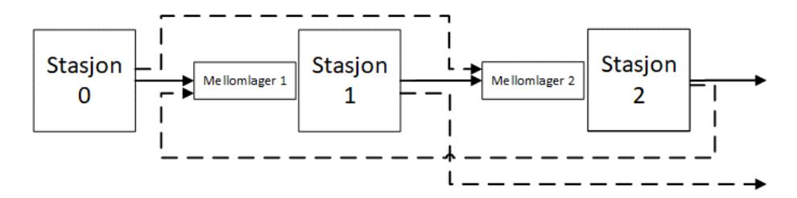

# Eksamen m. LF TI 4505 A O fordypningsemne, h st 2020

NB! I oppgaver i dette eksamenssettet hvor tallsvar skulle gis inn, var det lagt inn slakk rundt riktig svar for å ta høyde for eventuelle avrundingsforskjeller.

## Oppgave 1 a) (5 poeng av 100)

Anta at du er ansvarlig for elkraftproduksjonen i ei elv der det er en berømt foss med mye turister om sommeren. Du er derfor pålagt å slippe ut 10 kubikkmeter/sekund med vann i juni, juli og august slik at turistene har noe å se på. Du har forståelse for dette, men synes at det nok ville holdt med 7 kubikkmeter i sekundet. Anta at du har en optimeringsmodell for drift av elkraftproduksjonen i elva, der antall kubikkmeter som slippes ut per sekund er en deterministisk parameter. Anta også at det er et reservoar oppe i elva. Dette reservoaret er typisk tomt når snøsmeltingen starter, slik at for deg varer en sesong fra mars ett år til mars året etter. Se for deg to ulike situasjoner og svar på oppgave a) i tekstboksen nedenfor og b) i tekstboksen i neste oppgave.

Det er mars, og du venter fortsatt på svar fra myndighetene på om du kan få redusere antall kubikkmeter vann til 7 i inneværende år. Du håper på svar før turistsesongen starter i juni.

**Spørsmål**: Er det teoretisk korrekt å bruke optimeringsmodellen din i «what-if»-modus (bruke scenarioanalyse) for utslippskravet for å sette produksjonsplaner for inneværende år mens du venter på svar? Hvorfor / hvorfor ikke? Bruk maksimalt 50 ord. Det er begrunnelsen, ikke ja/nei som blir vurdert.

### Svar:

Nei. Det er ikke korrekt fordi i inneværende år er utslippskravet en stokastisk variabel. I what-if-modus vil du miste eventuelle beslutninger som skaper fleksibilitet relativt til det usikre beslutningskravet.

## Oppgave 1 b) (5 poeng)

Da du sendte søknaden til myndighetene tenkte du på et generelt år, ikke bare året i år, og du brukte optimeringsmodellen din med 7 og 10 kubikkmeter for å illustrere hva som ville skje om kravet ble redusert fra 10 til 7 kubikkmeter.

**Spørsmål**: Er det teoretisk korrekt å bruke optimeringsmodellen din i «what-if»-modus (bruke scenarioanalyse) for å argumentere for å redusere kravet til vann i fossen? Hvorfor / hvorfor ikke? Bruk maksimalt 50 ord. Det er begrunnelsen, ikke ja/nei som blir vurdert.

### Svar:

Ja. Det er korrekt fordi dette er en a priori-analyse, under usikkerhet, av et deterministisk beslutningsproblem (det vil si, problemet er deterministisk relativt til denne ene parameteren).

Kommentar: det er selvsagt mange måter å argumentere på, poenget som skal fram er at a) er en beslutning under usikkerhet, b) er det ikke.

## Oppgave 2 (20 poeng)

Ta utgangspunkt i et to-dimensjonalt ryggsekkproblem. Du skal fylle opp en ryggsekk med volum V og maksimal vekt C. Du kan velge mellom N gjenstander. Gjenstand i har volum v(i), vekt c(i) og verdi a(i). La x(i) være 0 om du ikke tar gjenstand i oppi sekken, 1 om du tar den.

a) Formuler en deterministisk modell for dette problemet det volum- og vektbetingelsene må være oppfylt og målet er å maksimere verdien av det du legger oppi. (5 poeng for helt riktig svar).

### Svar:

$$\max \sum_{i=1}^{N} a(i)x(i) \text{ slik at } \sum_{i=1}^{N} v(i)x(i) \leq V; \sum_{i=1}^{N} c(i)x(i) \leq C; \ x(i) \in \{0,1\}, i=1,\dots,N$$

b) Anta nå at volumet V av ryggsekken er usikkert, for eksempel fordi det finnes flere nesten like ryggsekker, og du vet ikke helt hvilken du får tildelt før etter at du har valgt gjenstander. Sett opp en modell der du velger de gjenstandene du vil ta med, og du krever at når volumet av ryggsekken blir avslørt MÅ alle gjenstandene få plass. I tillegg må selvsagt vektkravet være oppfylt. Målet er å maksimere forventet verdi av det du legger oppi. Hva blir utfordringen med hensyn til å beskrive usikkerheten i dette tilfellet? (7 poeng for helt riktig svar).

### Svar:

Her blir modellen som i a), bortsett fra av V må byttes ut med den minste mulige verdien av V. Så beskrivelsen av usikkerheten koker ned til å bestemme minste mulige verdi av V – som kan være både lett og vanskelig avhengig av tolkningen; ofte er det vanskelig. Mer at «forventet verdi» i spørsmålet egentlig forsvinner pga Worst-case oppsettet.

c) Ta de samme antagelsene som i spørsmål b. Men anta nå at dersom du velger gjenstander, og de ikke får plass, må du betale en straff d per volumenhet for volumet av de gjenstandene du ikke får plass til (du kan ikke ta deler av gjenstander, bare hele gjenstander). Hvilken beskrivelse av usikkerheten trenger du nå? Sett opp en modell for denne situasjonen. (8 poeng for helt riktig svar).

### Svar:

Nå trenger vi en sannsynlighetsfordeling for V. La p(s) være sannsynligheten for at V=V(s), for s=1,...,S. Her er utfordringen å forstå fordelingen for V, og så lage scenarier, hvis denne ikke allerede er diskret. Siden den er en-dimensjonal er direkte diskretisering beste metode om den er kontinuerlig. Sampling eller mer avanserte metoder gir lite mening i én dimensjon.

La z(s) være overskytende volum i scenario s. Det vi nå trenger å modellere er at om vi ikke får alt oppi ryggsekken, vil vi selvsagt fjerne så lite som mulig slik at straffen blir liten. La y(i,s) være 1 om vi tar ut gjenstand i i scenario s. Vi kan bare ta den ut dersom vi opprinnelig plukket den ut, så y(i,s)  $\leq$  x(i) for alle i og s. Vi får da:

$$\max \sum_{i=1}^{N} a(i)x(i) - d \sum_{s=1}^{S} p_s \sum_{i=1}^{N} V(s) y(i,s)$$

Slik at

$$y(i, s) \le x(i), \quad i = 1, ..., N, s = 1, ..., S$$

$$\sum_{i=1}^{N} v(i)(x(i,s) - y(i,s)) = V(s), \quad s = 1, ..., S$$

$$\sum_{i=1}^{N} c(i)x(i) \le C, \quad i = 1, ..., N$$

$$x(i) \in \{0,1\}, \quad i = 1, ..., N$$

$$y(i,s) \in \{0,1\}, \quad i = 1, ..., N, s = 1, ..., S$$

## Oppgave 3 a) (4 poeng)

Anta en produksjonslinje, som vist i figuren, for produksjon av to forskjellige produkter. Produksjonen av produkt 1 (heltrukne linjer i figuren) skjer ved at en enhet av en råvare blir sendt fra Stasjon 0 for behandling i Stasjon 1. Deretter sendes enheter videre fra Stasjon 1 til Stasjon 2 for ferdigbehandling. Produksjonen av produkt 2 (stiplede linjer i figuren) er litt annerledes ved at enhetene først behandles i Stasjon 2, før de ferdigbehandles i Stasjon 1. Stasjon 1 og Stasjon 2 kan kun behandle én enhet av gangen, slik at enheter som kommer når stasjonene er opptatt sendes til et mellomlager rett i forkant av hver maskin. Mellomlagrene har endelig kapasitet, og hvis de er fulle kan ikke enhetene forlate stasjonene slik at det stasjonene blir blokkert. Betjeningstidene i hver stasjon er stokastiske og ulike for hver stasjon og produkt.

Optimeringsproblemet er å bestemme hastighetene på Stasjon 1 og Stasjon 2 (fra en mengde med diskrete alternativer) og antall mellomlagerplasser i produksjonslinja, samtidig som man holder seg til innenfor et kostnadsbudsjett. Deretter er målet å finne løsningen (systemkonfigurasjonen) med minimum gjennomsnittlig produksjonstid. For å løse problemet er det utviklet en simulering-optimering-metode, som baserer seg på en metaheuristikk som søker etter bedre løsninger (for systemkonfigurasjonen) og en simulator av produksjonslinja. Simulatoren simulerer en angitt løsning basert på en strøm av tilfeldige tall og gir ut som resultat et estimat på forventet produksjonstid.

Hvilken av kategoriene fra pensumartikkelen til Figueira og Almada-Lobo (2014) vil overnevnte simulering-optimering-metode falle inn under?

(-1 poeng for feil svar, 0 for ubesvart, og 4 poeng for riktig svar)

## Velg ett alternativ:

- Løsningsgenerering
- Forbedring av analytiske modeller
- Løsningsevaluering
- Ingen av de nevnte

**Svar:** Riktig svaralternativ er uthevet over.

## Oppgave 3 b) (5 poeng)

Hva forteller kategoriseringen i forrige spørsmål om simulering-optimering-metoden?

(-1 poeng for feil svar, 0 for ubesvart, og 5 poeng for riktig)

## Velg ett alternativ:

- Hensikten med simulering-optimering-metoden
- Hensikten med simuleringen
- Hensikten med optimeringen
- Hvordan simuleringen og optimeringen er hierarkisk strukturert
- Ingen av de nevnte

**Svar:** Riktig svaralternativ er uthevet over.

## Oppgave 3 c) (6 poeng)

Tabellen under presenterer resultater fra å kjøre simulering-optimering-metoden for to ulike løsninger, A og B. Første kolonne angir simuleringsreplikasjonsnummer, mens de to neste kolonnene angir gjennomsnittlig produksjonstid i produksjonslinja i hver simuleringsreplikasjon for de to systemkonfigurasjonene. Differansen i gjennomsnittlig produksjonstid kan brukes som indikasjon på hvilken løsning som er best. Anta at *Common random numbers*-teknikken er benyttet for å skape positiv korrelasjon mellom ventetidene for A og B for samme simuleringsreplikasjonsnummer.

Bruk kjennskapen til dette for å beregne variansen til estimatet av differansen mellom produksjonstidene. Angi svaret med f.eks. tre desimaler.

(6 poeng for riktig svar og 0 for feil og ubesvart. Svaret vurderes som riktig om det er innen +/10% fra korrekt svar.)

| SIMULERINGS- REPLIKASJON | LØSNING A | LØSNING B |
|-----------------------------|-----------|-----------|
| 1                           | 1.79      | 1.50      |
| 2                           | 1.79      | 2.14      |
| 3                           | 1.15      | 0.99      |
| 4                           | 2.49      | 2.74      |
| 5                           | 3.11      | 3.49      |
| 6                           | 1.75      | 1.88      |
| 7                           | 1.30      | 1.16      |
| 8                           | 2.03      | 2.71      |
| 9                           | 2.35      | 1.92      |
| 10                          | 1.88      | 2.56      |

**Svar:** Svar mellom 0.13 og 0.17 godkjennes.

## Oppgave 4 (7 poeng)

Et fellestrekk for flere av plattformene i den såkalte delingsøkonomien er muligheten for å legge inn vurderinger av motpart i transaksjoner. Det kan hevdes at vurderingene både bidrar til å redusere markedssvikt og til å skape økonomisk ineffektivitet. Forklar hvilke mekanismer som ligger bak slike effekter!

### Svar:

I markeder for erfaringsgoder, der det ikke finnes korrigerende mekanismer, kan dårlig kvalitet fortrenge god kvalitet ettersom kjøper ikke kan observere kvalitet før kjøp og derfor ikke vil være villig til å betale for god kvalitet slik at selger heller ikke vil ha insentiv til å levere kvalitet. For plattformer i delingsøkonomien er det et sentralt poeng å motvirke denne effekten ettersom den vil begrense potensiell omsetning over plattformen. Vurderinger, sammen med ulike kontrollordninger og forsikring, er et sentralt virkemiddel. Vurderingene gir dels inntrykk av kvalitetsnivå som kan forventes og gir dels insentiver til å levere god kvalitet siden gode vurderinger gir høyere etterspørsel, eller dårlige vurderinger kan føre til utestengelse fra plattformen. Samtidig er informasjonsverdien i en enkelt vurdering begrenset. Først når det foreligger mange vurderinger framstår de som troverdige. Det betyr at akkumulerte vurderinger gir en førstemannsfordel. En eventuell nyetablert aktør vil ha problemer med å konkurrere ettersom potensielle deltakere på plattformen ikke vil ha samme tillit til transaksjonene som over plattformer med stor mengde vurderinger. Denne etableringsbarrieren gir etablerte aktører markedsmakt som kan forventes å bli brukt av plattformen til å ta svært høye marginer og dermed skape dødvektstap ved at prisingen blir langt over marginalkostnader.

## Oppgave 5 (7 poeng)

Flere av prosedyrene som er foreslått for kombinatoriske auksjoner inneholder mekanismer der informasjon om tilstand i auksjonsprosessen avsløres underveis og altså før budgivning er avsluttet. Beskriv kort slike mekanismer og forklar hva som er motivasjonen bak dem!

### Svar:

I clock proxy og combinatorial clock brukes prisklokker til å formidle prisnivået. I sistnevnt er det også en aktivitetsregel som er laget for å unngå at bydere holder tilbake informasjon om betalingsvillighet underveis. Mekanismene gir «price discovery» som vil bidra til oppjustering av verdsetting gitt at bydere opptrer noenlunde i tråd med «affiliated value». De vil også kunne bidra til at budsjetter oppjusteres, at budsjetter kan utnyttes i større grad og at bekymring for «winner's curse» reduseres. Bruk av andreprisregler, gjerne i form av «Vickrey Nearest Core», kan bidra til bud opp mot eget verdisignal (som blir oppdatert via den åpne prosessen). Åpenhet vil også typisk gi større tillit til prosessen hvilket kan bidra til større deltakelse. Disse effektene kan bidra til høyere verdi for selger.

## Oppgave 6 a) (3 poeng)

Hvilket av de følgende utsagnene virker klarest å bygge på feilaktig forståelse av litteraturen om auksjonsteori?

### Velg ett alternativ:

- Common value er egnet til å diskutere «winner's curse».
- Revenue equivalence for private value og common value kan vises også for "all pay auctions".
- Verdisignaler i affiliated value antas korrelert i strengere forstand enn ordinær statistisk korrelasjon.
- Affiliated value kan begrunne bruk av lukket andrepris også når bydere er risikoaverse.

### Svar:

Affliated value peker mot fordel av åpne, iterative auksjon slik som engelsk, der betalingsvillighet avsløres underveis. Det taler mot lukket andrepris. Det gjelder både med risikonøytrale og med risikoaverse bydere. Følgende utsagn er altså i strid med litteraturen: «Affiliated value kan begrunne bruk av lukket andrepris også når bydere er risikoaverse.»

## Oppgave 6 b) (3 poeng)

Betrakt følgende utsagn: «For selger er valg av førstepris framfor andrepris vinn-vinn.» I hvilken type situasjon er dette utsagnet mest naturlig?

## Velg ett alternativ:

- Private value med risikonøytrale bydere og risikoavers selger.
- Private value med risikoaverse bydere og risikoavers selger.
- Common value uansett om aktørene er risikonøytrale eller risikoaverse.
- Affiliated value uansett om aktørene er risikonøytrale eller risikoaverse.

### Svar:

Risikoaversjon gir mer aggressive bud i førsteprisauksjoner fordi bydere er villige til å ofre forventet gevinst med sikte på å redusere muligheten for null gevinst. I førsteprisauksjoner vil bud baseres på forventning om nest høyeste gitt egen seier hvilket vil innebære mindre variasjon enn faktiske vurderinger som blir bydd i andreprisauksjoner. Selger vil derfor oppnå både høyere forventet verdi og mindre risiko med førsteprisauksjoner. Affiliated value peker mot at iterativ, åpen auksjon, som blir en andreprisauksjon, kan likevel være å foretrekke i noen tilfeller. Av alternativene er det bare b som reflekterer teorien. Følgende alternativ er altså korrekt: «Private value med risikoaverse bydere og risikoavers selger.»

## Oppgave 6 c) (3 poeng)

Hvilket par av ordinær auksjon og kombinatorisk auksjon er nærmest beslektet?

### Velg ett alternativ:

- Hollandsk/Dutch og Vickrey-Clarke-Groves.
- Lukket førstepris og Combinatorial Clock Auction.
- Engelsk og Ascending Proxy Auction.
- Lukket førstepris og Simultaneous Ascending Auction.

### Svar:

Engelsk og Ascending Proxy Auction er svært like mekanismer. Begge er iterative med økende priser. Forskjellen ligger i at kompleksiteten, tidsbruken i en kombinatorisk auksjon søkes løst med proxyagenter i den ene. Begge ender med en form for andrepris ved at vinnere kan slutte å by når det ikke er flere konkurrenter igjen i auksjonen. Følgende alternativ er altså naturlig: «Engelsk og Ascending Proxy Auction.» De andre parene er mer fundamentalt forskjellige. Hollandsk er en førsteprisauksjon, mens Vickrey-Clarke-Groves bygger på andreprisprinsippet. Combinatorial Clock Auction er en åpen auksjon laget for å legge til rette for «price discovery» der prisingen til slutt er basert på andreprisprinsippet. Begge sentrale prinsipper er i direkte motsetning til en lukket førstepris. Lukket førstepris og Simultaneous Ascending Auction er forskjellige ved at førstnevnte er lukket og en førsteprisauksjon mens sistnevnte er åpen, iterativ som gir andreprising.

## Oppgave 6 d) (3 poeng)

Hva er <u>ikke</u> et naturlig argument for iterative, åpne auksjoner med stigende pris (ascending auctions)?

### Velg ett alternativ:

- Behov for å forhindre dannelse av koalisjoner av bydere.
- Tilrettelegge for utnyttelse av budsjetter.
- Redusere opplevd risiko for «winner's curse».
- Avsløre verdsettingsinformasjon som vil tendere til å bidra til justering av byderes verdsetting oppover.

### Svar:

Åpne auksjoner legger til rette for koalisjoner. Dersom noen bryter ut av koalisjonen i prosessen avsløres det og de andre kan tilpasse budgivning slik at utbrytere ikke vinner likevel. Det er blitt hevdet at åpen budgivning også kan utnyttes til å signalisere overfor andre budgivere uten formell dannelse av koalisjon. «Behov for å forhindre dannelse av koalisjoner av bydere» er altså ikke noe argument for, men heller mot, åpne, iterative auksjoner.

## Oppgave 6 e) (4 poeng)

Anta at det er fire aktive bydere i en kombinatorisk auksjon med tre objekter (A, B og C). Alle bydere har klar oppfatning av verdi av objekter eller kombinasjoner for seg selv (som i private value). De er risikonøytrale. Tabellen under viser verdier for hver byder og bud på dette trinnet i prosessen. Byder 1 og 2 har verdsetting som i tabellen under og er altså ikke interessert i noen kombinasjon av objekter. Byder 3 er heller ikke interessert i kombinasjoner og har verdsettingen x for objekt A og null for de to andre. Den fjerde er villig til å betale maksimalt 690 for kombinasjonen av de tre objektene og har bydd 600 for den, men er kun interessert i denne kombinasjonen. Hvilken minste verdi av x må antas å kunne gi selger grunn til å foretrekke en åpen prosess der budgivere kan indentifisere hverandre?

|         | A   | B   | C   | A,B,C |
|---------|-----|-----|-----|-------|
| Byder 1 | 0   | 0   | 200 | 0     |
| Byder 2 | 0   | 250 | 0   | 0     |
| Byder 3 | x   | 0   | 0   | 0     |
| Byder 4 | 0   | 0   | 0   | 690   |
| Bud     | 200 | 210 | 160 | 600   |

### Svar:

Ut fra opplysningen er den naturlige bekymringen det såkalte «threshold problem». Det kan oppstå dersom en kombinasjon av bydere samlet har høyere verdsetting for en kombinasjon av objekter som en annen byder har budt på, men der hver enkelt ikke vil kunne by så mye mer at byderkombinasjonen går over budet for objektkombinasjonen. Minste verdi for x som gir potensiale for at kombinasjonen av bydere 1, 2 og 3 skal ha høyere samlet verdsetting er 690-200-250=240. Svaret er altså 240. Merk at med gjeldende bud kan byder 1 og 2 gå opp innenfor egen verdsetting slik at kombinasjonsbudet på 600 slås. I dette stadiet av auksjonen er derfor ikke «threshold problem» til hinder for nye runder med bud.

NB! Svaret godtas innen intervallet [239, 241].

## Oppgave 7 (25 poeng)

Du har overtatt ansvaret for en liten kiosk ved en travel T-banestasjon på Oslos østkant. I det siste har profitten fra avissalget på virkedager (mandag til fredag) gått ned. Din første oppgave er derfor å finne antall aviser som skal bestilles hver dag for å maksimere profitten.

Etterspørselen etter trykte aviser er usikker, men du har lagt merke til at den er noe lavere på fredager. Du må bestille avisene før du kjenner til etterspørselen og det er ikke mulig å etterbestille flere aviser, dersom du finner ut av at du har bestilt for få. Avisene må kjøpes fra trykkeriet for C per avis og selges til kundene for R. Aviser som ikke selges i løpet av dagen leveres tilbake til trykkeriet. Kiosken får betalt S for hver avis, som leveres tilbake. Anta at R > C > S og at du kjenner etterspørselens sannsynlighetsfordeling for enhver dag.

a. Bør problemet formuleres som to-stegs eller fler-stegs stokastisk programmeringsproblem? Forklar hvorfor. (4 poeng for helt riktig svar).

### Svar:

Systemet nullstilles hver dag, dvs. det finnes ingen lagerbeholdning som overføres fra en dag til en annen. Problemet er derfor separabel i tidsperioder og vi kan benytte oss av en énperiodisk formulering (men forskjellig inputdata) til å finne optimal bestillingsmengde for hver dag. Selve problemet formuleres da som to-stegs stokastisk programmeringsproblem, der første steget inneholder beslutningen om hvor mange aviser som skal kjøpes. Antall solgte og tilbakeleverte aviser tilhører andre steg, siden disse avhenger av observert/realisert etterspørsel.

b. Formuler problemet som stokastisk programmeringsproblem. Husk å forklare modellen. (5 poeng for helt riktig svar).

### Svar:

Problemet kan formuleres på flere forskjellige måter. Presenterer først formuleringen med scenarioer:

$$\max -Cx + \sum_{S \in S} p^{S} (Ry_{S} + Sz_{S}) \tag{1}$$

gitt at

$$y_s \le D^s \quad s \in \mathcal{S},\tag{2}$$

$$y_s + z_s = x \quad s \in \mathcal{S},\tag{3}$$

$$x \ge 0 \tag{4}$$

$$y_{s}, z_{s} \ge 0 \quad s \in \mathcal{S}. \quad (5)$$

Første ledd i målfunksjonen (1) er kostnadene for alle aviser som kjøpes (x). Andre ledd er forventet inntekt over alle scenarioer fra regulær salg ( $y_s$ ) og tilbakelevering av usolgte aviser ( $z_s$ ). Begrensning (2) sørger for at vi antall solgte aviser ikke overstiger etterspørselen i scenarioet. Begrensing (3) sikrer at alle kjøpte aviser enten selges eller leveres tilbake. I tillegg har vi ikke-negativitetskrav ((4) og (5)).

En annen mulig formulering er

$$\max -Cx + Q(x) \tag{6}$$

$$x \ge 0 \tag{7}$$

med

$$Q(x) = E_{\xi}(Q(x,\xi))$$

oq

$$Q(x, \xi) = \max\{Ry(\xi) + Sz(\xi) | y(\xi) + z(\xi) = x, 0 \le y(\xi) \le D(\xi), z(\xi) \ge 0\}.$$
 (8)

Du har et svakt minne om at Soyster sitt paper fra 1973 betraktes som ett av de første paperne innen robust optimering. Ta utgangspunkt i settingen beskrevet i paperet.

c. Hvilke to forskjellige robuste løsningene kan tenkes for problemet skissert ovenfor? Hvordan tolker du disse løsningene økonomisk? (4 poeng for helt riktig svar)

### Svar:

Den første robuste løsningen vil alltids kunne tilfredsstille observert etterspørsel. Dette medfører at bestillingsmengden velges lik maksimal mulig etterspørsel. Den andre robuste løsningen innebærer at en aldri ikke trenger å levere aviser tilbake. Dette tilsvarer en løsning det bestillingsmengden er lik lavest mulig etterspørsel.

Den første løsningen vil gi mening når profittmarginen fra regulær salg er veldig høy, sammenlignet med tapet fra tilbakelevering (stor oppside). Den andre robuste løsningen er å foretrekke, dersom det er store tap knyttet til tilbakelevering, mens profitten fra regulær slag er forholdsvis lav (stor nedside).

d. Hvordan må parameterne R, C og S settes for å approksimere disse to robuste løsningene? (4 poeng for helt riktig svar).

### Svar:

Optimalitetskriteriet for Newsboy-problemet er gitt som

Optimalitetskriteriet for Newsboy-problemet er gitt som 
$$\Pr(D \le x) = \frac{R-C}{R-S} = \frac{R-C}{(R-C)+(C-S)}.$$

For å tvinge frem den første robuste løsningen (bestille maksimal etterspørsel) trenger vi  $\frac{R-C}{(R-C)+(C-S)}=1$ , dvs.  $C\approx S$ . Vi får den andre robuste løsningen (bestille minimal etterspørsel) for  $\frac{R-C}{(R-C)+(C-S)}=0$ , dvs.  $R\approx C$ .

En annen måte å håndtere usikkerhet på er probabilistiske begrensninger (chance constraints).

e. Diskuter hvorvidt du kan formulere problemet med probabilistiske begrensninger. (4 poeng for helt riktig svar).

### Svar:

Det finnes flere måter å bruke probabilistiske begrensninger på når Newsboy-problemet skal formuleres. Den (muligens) mest opplagte måten er å kreve at etterspørselen skal kunne tilfredsstilles med en viss sannsynlighet, dvs. sannsynligheten for at ordremengde overstiger etterspørselen må være større eller lik den gitte sannsynligheten. Dette kan betraktes som krav om en bestemt service level og er veldig lik optimalitetskriteriet (se også svar på

spørsmål f)). Et alternativ er å stille krav om at mengden tilbakeleverte aviser ikke overstiger en forhåndsbestemt mengde med en viss sannsynlighet.

f. Anta du har fått problemet formulert med en probabilistisk begrensing som krever at sannsynligheten for at du kan tilfredsstille etterspørselen er minst 0,5. Hva kan du si om den optimale løsningen? (4 poeng for helt riktig svar).

### Svar:

Hvorvidt den probabilistiske begrensningen vil være bindende avhenger at verdiene for R, C og S. Basert på optimalitetskriteriet er optimal løsning gitt som

$$\Pr(D \le x) = \max \left\{ \frac{R - C}{R - S}; 0, 5 \right\}.$$