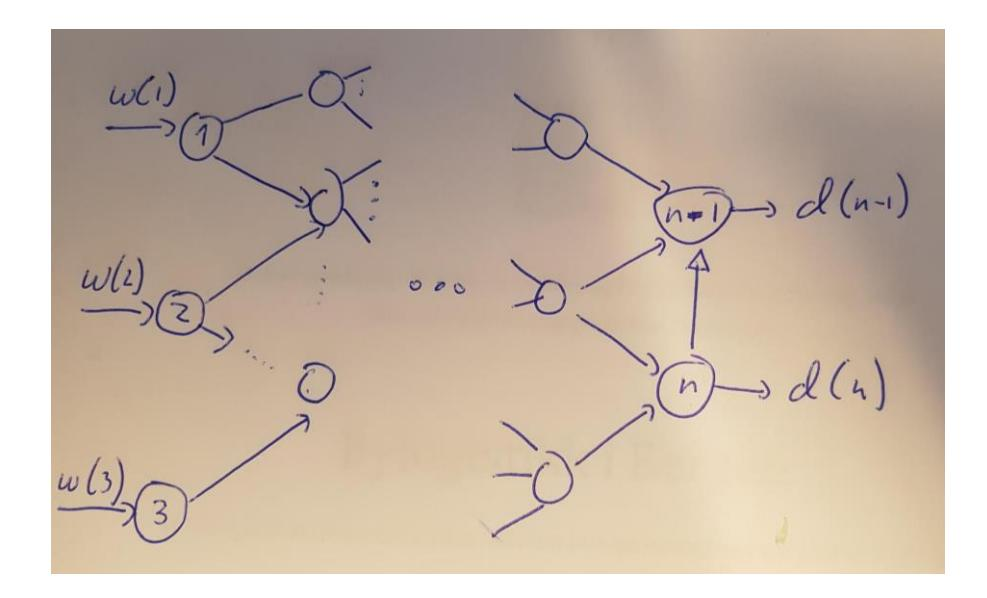
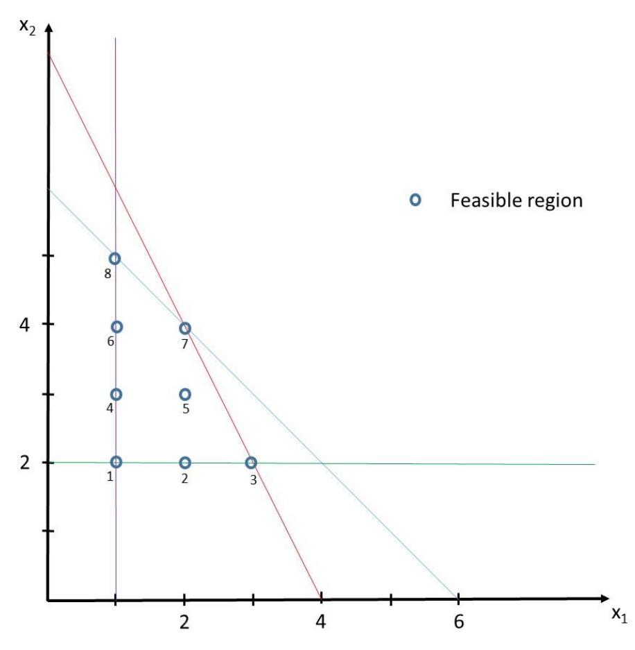
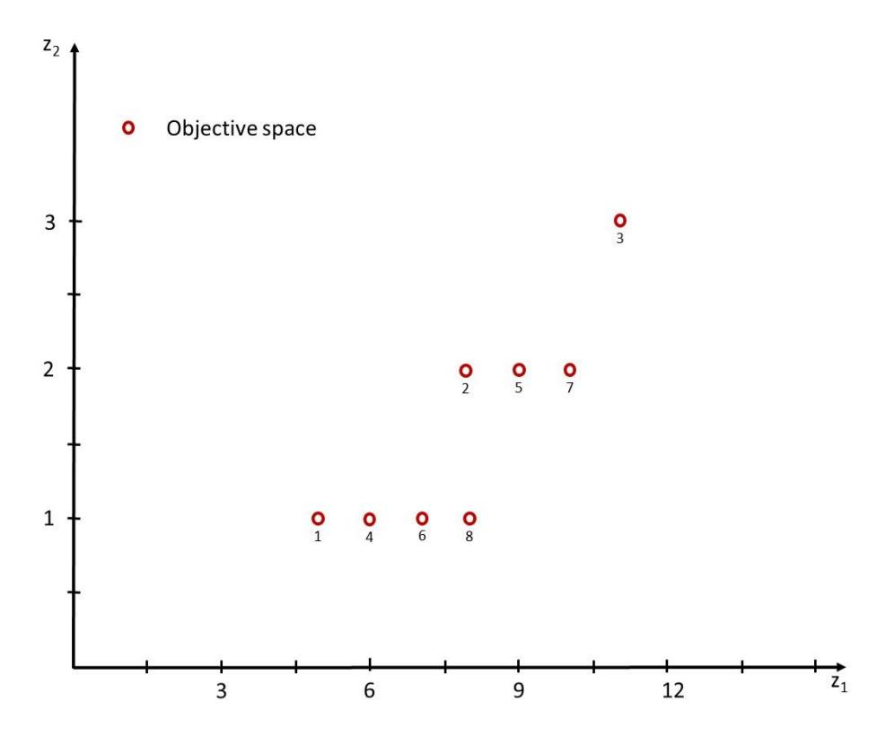

# Oppgave 1 (20%) sequential decision making

## En liten forhandler har en butikk

In each period  $t \in T$  we will denote the observed demand  $D_{it}$  for product  $j \in J$ .

- The state St = (j, D1t,..., Dmt) where j ∈ J is the current product the retailer is selling in the given period, and D1t,..., Dmt are the demands for each of the products that may be observed.
  - The decision to be made is the product the retailer is going to sell in the next period.
     Hence xt = (i) for i ∈ J.
  - The exogenous information corresponds to the demand for each of the products. Hence  $\omega_t = (\omega_{1t}, \dots, \omega_{mt})$  are realizations of the set of (discrete) stochastic variables  $W_t = (X_{1t}, \dots, X_{mt})$  having distributions given by the probabilities  $p_{jnt}$ . Note that  $p_{jnt}$  is the probability that  $X_{1t}$  is realized to the value n and we do not (in principle) have any upper bound on the demand. Hence  $\Omega_t$  may be infinitely large in principle. However, it may be assumed that there in practice is an upper bound,  $u_{jt}$ , to the demand of product j in period t in which case we have the magnitude of the outcome space  $\Omega_t$  becomes

$$\prod_{i=1}^{m} u_{it}$$

Either characterization should be accepted as a valid solution.

• The direct cost of making the decision  $x_t = (i)$  when being in the state  $S_t = (j, D_{1t}, \dots, D_{mt})$  is

$$C_t(S_t, x_t) = c_{ii} - d_i D_{it}$$

which is the cost of changing from product i to product i with the revenue subtracted.

2. The value recursion is in this case straight forward, as there is no special restrictions on how to make the decisions. We just have to observe that the decision space is Xt = J corresponding to the potential product types and that the discount factor γ could be set to a value in [0, 1] depending on how much weight we should put on future (expected) costs. Then we get

$$V_{t}(S_{t}) = \min_{x_{t} \in \mathcal{X}_{t}} \left( C_{t}(S_{t}, x_{t}) + \gamma \sum_{\omega \in \Omega_{t+1}} \mathbb{P}(W_{t+1} = \omega) V_{t+1}(S_{t+1} | S_{t}, x_{t}, \omega) \right)$$

The post decision state is a construct where we have made the decision but before new information arrives. Hence the post decision state will in our case be  $S_t^x = (i)$  if the decision was  $x_t = (i)$ .The post decision state space is typically significantly smaller than the state space for the ordinary states. This is due to not having the same amount (if any) of random information in the post decision state. In Approximate Dynamic Programming (ADP) we approximate the a post decision value function for each post decision state and use this a proxy for the real value function. In ADP we then use a Monte Carlo simulation to find realizations of the exogenous information. In the Monte Carlo simulation we make decisions based on the post decision value function (instead of the real value function) and then adjust the post decision value function (for the post decision states) with the future value obtained. Hence, we separate the decision we have to make from the randomness.

## Oppgave 2 (12%) chance constraints

- 2. I denne oppgaven ser vi på «chance constraints» (det vil si betingelser på sannsynlighetsform).
  - a. Oppgi to eksempler på ulike situasjoner der det kan være fornuftig å bruke «chance constraints». Forklar kort hvorfor det er fornuftig i disse sammenhengene.
  - b. Er det noen potensielle problemer med å bruke slike betingelser i disse to sammenhengene (bortsett fra rene numeriske utfordringer.)

### Mulig svar:

- a. En mulighet er å bruke det for å representere «verdien av liv». I alle byggeprosjekter er det en fare for uhell eller ulykker. Det van være politisk eller forretningsmessig bedre å si at «sannsynligheten for en ulykke er mindre enn 0.1%» enn å la menneskeliv verdsettes i kroner og legges inn i målfunksjonen. En annen mulighet er å bruke «chance constraints» som «service level» (servicenivå) i en bedrift. «Vi tilfredsstiller 95% av alle ordrer i løpet av maksimalt to dager». Dette er et alternativ til å legge en litt vilkårlig straff på utilfredsstilt etterspørsel.
- b. Da slike betingelser er harde, ikke bløte slik noen tror, må man passe seg for harde hjørneløsninger. Man kan risikere ekstremt høye kostnader om man går fra for eksempel 0,1% mulighet for en ulykke til 0,09999%, eller ved at servicenivået endres fra 95% til 95,0001%. Så litt sjekking av hva som skjer når man endrer sannsynlighetene bare litt, bør testes.

# **Oppgave 3 (23%)**

3. Se på nettverket i figuren. Det er tre tilbudsnoder til venstre og to etterspørselsnoder til høyre. Etterspørselen i node n-1 er null med sannsynlighet p og 5 med sannsynlighet 1-p. Etterspørselen i node n er null med sannsynlighet q og 6 med sannsynlighet 1-q. I mellom disse to nodemengdene finnes et sammenhengende nettverk med noder og kanter, og kantene har kjente kapasiteter, der c(i,j) er kapasiteten på kanten fra node i til node j.

Du skal bestemme produksjonskapasitetene i noden 1, 2 og 3, og disse må bestemmes FØR du kjenner etterspørselen i nodene n-1 og n. Kostnaden per enhet kapasitet i node i er f(i) for i=1,2,3. Det er tillatt å ha en løsning der det er en viss sannsynlighet for ikke å tilfredsstille etterspørselen. For hver enhet som ikke blir tilfredsstilt, påløper en kostnad k(i) for i=n-1,n.

- a. Hvis etterspørselen i nodene n-1 og n er uavhengige av hverandre, hvor mange scenarier har vi, hva er deres sannsynligheter, og hvordan ser de ut?
- b. Formuler dette som et to-stegs stokastisk optimeringsproblem, der førstestegsvariablene er produksjonskapasitetene, og andrestegvariablene er transportmønsteret mellom tilbuds- og etterspørselsnodene, bestemt etter at etterspørselen er blitt kjent.
- c. Anta som et alternativ for produksjonskapasitetene at det koster g(i) + f(i)w(i,s) å etablere en kapasitet w(i,s) i node i i scenario s, men slik at g(i) må betales i førstesteget mens man kan velge selve kapasiteten etter at etterspørselen er blitt kjent, altså slik at w er en andrestegsvariabel. Man kan ikke etablere kapasitet i andresteget dersom man ikke har betalt den faste kostnaden g(i) i førststeget. Hvordan endrer modellen seg?

### Mulig svar:

- a. Vi har fire scenarier, nemlig (0,0), (5,0), (0,6) og (5,6) med sannsynligheter, som vi kaller p(s) gitt ved: pq, (1-p)q, p(1-q) og (1-p)(1-q). Vi indekserer etterspørselen som (d(n-1,s),d(n,s)) for s=1,...,4.
- b. Se vedlagte modell. Det er implisitt at vi bare summerer over kanter som faktisk finnes.

Min 
$$\frac{3}{2}$$
 f(h)  $\omega(h) + \frac{7}{2}$  p(s)

Slik at

 $\frac{n}{2}$   $\times (\lambda_{1}, \lambda_{1}, s) = \omega(h)$ 
 $\frac{n}{2}$   $\times (\lambda_{1}, \lambda_{2}, s) = \omega(h)$ 
 $\frac{n}{2}$   $\times (\lambda_{1}, \lambda_{2}, s) = \frac{n}{2}$   $\times (\lambda_{1}, \lambda_{2}, s) = \frac{n}{2}$   $\times (\lambda_{1}, \lambda_{2}, s) = \frac{n}{2}$   $\times (\lambda_{1}, \lambda_{2}, s) = \frac{n}{2}$   $\times (\lambda_{1}, \lambda_{2}, s) = \frac{n}{2}$   $\times (\lambda_{1}, \lambda_{2}, s) = \frac{n}{2}$   $\times (\lambda_{1}, \lambda_{2}, s) = \frac{n}{2}$   $\times (\lambda_{1}, \lambda_{2}, s) = \frac{n}{2}$   $\times (\lambda_{1}, \lambda_{2}, s) = \frac{n}{2}$   $\times (\lambda_{1}, \lambda_{2}, s) = \frac{n}{2}$   $\times (\lambda_{1}, \lambda_{2}, s) = \frac{n}{2}$   $\times (\lambda_{1}, \lambda_{2}, s) = \frac{n}{2}$   $\times (\lambda_{1}, \lambda_{2}, s) = \frac{n}{2}$   $\times (\lambda_{1}, \lambda_{2}, s) = \frac{n}{2}$   $\times (\lambda_{1}, \lambda_{2}, s) = \frac{n}{2}$   $\times (\lambda_{1}, \lambda_{2}, s) = \frac{n}{2}$   $\times (\lambda_{1}, \lambda_{2}, s) = \frac{n}{2}$   $\times (\lambda_{1}, \lambda_{2}, s) = \frac{n}{2}$   $\times (\lambda_{1}, \lambda_{2}, s) = \frac{n}{2}$   $\times (\lambda_{1}, \lambda_{2}, s) = \frac{n}{2}$   $\times (\lambda_{1}, \lambda_{2}, s) = \frac{n}{2}$   $\times (\lambda_{1}, \lambda_{2}, s) = \frac{n}{2}$   $\times (\lambda_{1}, \lambda_{2}, s) = \frac{n}{2}$   $\times (\lambda_{1}, \lambda_{2}, s) = \frac{n}{2}$   $\times (\lambda_{1}, \lambda_{2}, s) = \frac{n}{2}$   $\times (\lambda_{1}, \lambda_{2}, s) = \frac{n}{2}$   $\times (\lambda_{1}, \lambda_{2}, s) = \frac{n}{2}$   $\times (\lambda_{1}, \lambda_{2}, s) = \frac{n}{2}$   $\times (\lambda_{1}, \lambda_{2}, s) = \frac{n}{2}$   $\times (\lambda_{1}, \lambda_{2}, s) = \frac{n}{2}$   $\times (\lambda_{1}, \lambda_{2}, s) = \frac{n}{2}$   $\times (\lambda_{1}, \lambda_{2}, s) = \frac{n}{2}$   $\times (\lambda_{1}, \lambda_{2}, s) = \frac{n}{2}$   $\times (\lambda_{1}, \lambda_{2}, s) = \frac{n}{2}$   $\times (\lambda_{1}, \lambda_{2}, s) = \frac{n}{2}$   $\times (\lambda_{1}, \lambda_{2}, s) = \frac{n}{2}$   $\times (\lambda_{1}, \lambda_{2}, s) = \frac{n}{2}$   $\times (\lambda_{1}, \lambda_{2}, s) = \frac{n}{2}$   $\times (\lambda_{1}, \lambda_{2}, s) = \frac{n}{2}$   $\times (\lambda_{1}, \lambda_{2}, s) = \frac{n}{2}$   $\times (\lambda_{1}, \lambda_{2}, s) = \frac{n}{2}$   $\times (\lambda_{1}, \lambda_{2}, s) = \frac{n}{2}$   $\times (\lambda_{1}, \lambda_{2}, s) = \frac{n}{2}$   $\times (\lambda_{1}, \lambda_{2}, s) = \frac{n}{2}$   $\times (\lambda_{1}, \lambda_{2}, s) = \frac{n}{2}$   $\times (\lambda_{1}, \lambda_{2}, s) = \frac{n}{2}$   $\times (\lambda_{1}, \lambda_{2}, s) = \frac{n}{2}$   $\times (\lambda_{1}, \lambda_{2}, s) = \frac{n}{2}$   $\times (\lambda_{1}, \lambda_{2}, s) = \frac{n}{2}$   $\times (\lambda_{1}, \lambda_{2}, s) = \frac{n}{2}$   $\times (\lambda_{1}, \lambda_{2}, s) = \frac{n}{2}$   $\times (\lambda_{1}, \lambda_{2}, s) = \frac{n}{2}$   $\times (\lambda_{1}, \lambda_{2}, s) = \frac{n}{2}$   $\times (\lambda_{1}, \lambda_{2}, s) = \frac{n}{2}$   $\times (\lambda_{1}, \lambda_{2}, s) = \frac{n}{2}$   $\times (\lambda_{1}, \lambda_{2}, s) = \frac{n}{2}$   $\times (\lambda_{1}, \lambda_{2}, s) = \frac{n}{2}$   $\times (\lambda_{1}, \lambda_{2}, s) = \frac{n}{2}$   $\times (\lambda_{1}, \lambda_{2}, s) = \frac{n}{2}$   $\times (\lambda_{1}, \lambda_{2}$ 

### c. Endringene er som følger.

Vi får tre nye 0/1 førstestegsvariabler y(i), i=1,2,3, med kostnadskoeffisient g(i). w-variablene får som oppgitt i oppgaven en scenarioindeks: w(i,s), og kostnaden flyttes inn i forventningen i målfunksjonen.

Vi får betingelsene  $w(i,s) \le M y(i)$ , i=1,2,3 og s=1,...,4 hvor M er et stort tall. Om en student ser at M=11 er OK er det bra.

# Oppgave 4 (15%) multi-objektiv planleggingsproblem

Du skal løse et planleggingsproblem hvor det skal produseres et helt antall av to ulike produkter. Det er et krav om at det skal produseres minst 1 og 2 enheter av henholdsvis produkt 1 og 2, samt at det maksimalt kan produseres 6 enheter til sammen av de to produktene. Det er også en begrensning på tilgang av en råvare som brukes i begge produktene på 8 enheter. For hver enhet som produseres av produkt 1 og 2 inngår det henholdsvis 2 og 1 enhet av denne råvaren.

En ønsker å *maksimere profitten* fra denne produksjonen, hvor hver enhet av produkt 1 og 2 gir henholdsvis 3 og 1 i bidrag til profitten. I tillegg ønsker en også å *minimere produksjonstiden* som utelukkende er bestemt av antall enheter som produseres av produkt 1 (det antas altså at produksjonstiden for produkt 2 er neglisjerbar i forhold til den for produkt 1).

- a) Formuler dette som et bi-objektiv optimeringsproblem med de tallene oppgitt i oppgaveteksten over.
- b) Skisser «decision space» og «objectiv space» for dette problemet. Forklar sammenhengen mellom disse.
- c) Skisser paretofronten for problemet. Er noen av de mulige løsningene for dette problemet såkalt «svakt paretooptimale»?

### Løsningsforslag:

a) Dette problemet er et heltallsproblem og har to objektiver: 1) maksimere profitt og 2) minimere produksjonstid. Om vi definerer  $x_1$  og  $x_2$  som antall enheter produsert av henholdsvis produkt 1 og 2, og  $z_1$  og  $z_2$  for henholdsvis objektiv 1 og 2, kan vi definere følgende bi-objektiv optimeringsproblem:

når

$$\max z_1 = 3x_1 + x_2$$

$$\min z_2 = x_1$$

$$x_1 + x_2 \le 6$$

$$2x_1 + x_2 \le 8$$

$$x_1 \ge 1 \text{ and integer}$$

$$x_2 \ge 2 \text{ and integer}$$

b) «Decision space» tilsvarer altså mulighetsområde. Siden det her er heltallskrav på begge variablene, vil «decision space» være et diskret antall punkter, angitt av de blå sirklene i følgende figur (lilla og grønn linje angir restriksjonen knyttet til kravet om minimum produksjon av de to produktene, den blå linjen angir den første restriksjonen, mens den røde linjen kommer fra råvarerestriksjonen):

«Decision space» består altså av 8 ulike løsninger. Disse har blitt nummerert i figuren over. «Objective space» angir det samme mulige mulighetsområdet, men da angitt med verdiene for de to objektivene  $z_1$  og  $z_2$ , som angitt i følgende figur:

Numrene for de 8 ulike løsningene henspeiler til de samme 8 løsningene angitt i «decision space», slik at for eksempel løsning 1, som har  $x_1 = 1$  og  $x_2 = 2$ , har  $x_1 = 5$  og  $x_2 = 1$ .

c) Siden vi ønsker å maksimere  $z_1$  og minimere  $z_2$ , ser vi av siste figur i oppgave b) at paretofronten består av punktene (løsningene) 3, 7 og 8. Dette er de tre løsningene som ikke er dominert av noen andre.

Punktene (løsningene) 1, 4, 5 og 6 er svakt paretooptimale, jfr. definisjonen angitt i forelesningsnotatene.

### Oppgave 5 (10%) markedet for elektriske sparkesykler i Oslo

I Oslo har kommunale myndigheter innført regulering av markedet for elektriske sparkesykler som blant annet innebærer begrensning av totalt antall sparkesykler i markedet og forbud mot bruk på natten. Men reguleringen er neppe til hinder for at private låner bort sine egne elsparkesykler. Et naturlig spørsmål er da om det finnes en forretningsmulighet som går ut på å selge elsparkesykler som er forberedt for å kunne leies ut slik at eier kan leie ut ved hjelp av en app som tilbyr normal funksjonalitet som vi ser i delingsøkonomien.

a) Diskuter kort hvorvidt vanlig utleie av elsparkesykler, som jo innebærer at samme kapitalgjenstand utnyttes av mange, er å regne som del av delingsøkonomien!

Elsparkesykkelutleie innebærer at konsumenter får midlertidig tilgang til fysiske gjenstander, men de eies av et selskap, heller enn å bli delt mellom konsumenter. Denne typen virksomhet faller utenfor definisjonen til Frenken og Schor (2017):

«consumers granting each other temporary access to under-utilized assets ("idle capacity"), possibly for money»

Utleie av fysiske gjenstander fra selskaper finnes det mange varianter av, slik som for ski, klær, verktøy, biler, båter etc. Ut fra definisjonen faller det utenfor når det er selskaper som kjøper inn og leier ut, men samme gjenstander leid ut fra konsumenter, som har ledig kapasitet, til andre konsumenter er klassisk delingsøkonomi.

b) Vil den mulige forretningsmuligheten beskrevet over passe inn delingsøkonomikonseptet? Hva vil være sentrale drivere for verdiskapning for et slikt konsept?

Forretningsmuligheten ligger i en gråsone i forhold til delingsøkonomibegrepet ettersom konsumentene skal stimuleres til kjøp via mulighet til utleie. Slik sett skapes ledig kapasitet nettopp på grunn av utleiemuligheten hvilket ikke er helt i tråd med klassisk delingsøkonomi der tanken er å utnytte ledig kapasitet som ville vært der uansett. Men det vil jo være deling av fysiske gjenstander mellom konsumenter når det evt. er i drift.

Reguleringen begrenser tilbudssiden i markedet hvilket må forventes å gi grunnlag for høyere priser enn uten regulering. Det gjør utleie mer attraktivt for konsumenter og vil være en viktig verdidriver for en plattform som skal tjene på omsetningen i appen. Førstemannsfordeler kan være svært viktige. Mens et utleieselskap kan kjøpe inn et stort antall elsparkesykler via en vanlig markedstransaksjon, vil plattformen her måtte rekruttere mange individer som skal eie og leie ut elsparkesykler og det blir attraktivt for brukere først når det er ganske mange elsparkesykler i systemet. Her kan det også være en teknisk tilknytning mellom plattform og utleiere slik at det vil være ekstra vanskelig for etterfølgere å rekruttere blant de som har knyttet seg til den første. Å være først med levedyktig volum er derfor kanskje ekstra viktig for verdiskapning her. Ellers vil det kunne være noe verdi i

vurderingsfunksjonalitet, lokaliseringsfunksjonalitet, forsikring osv. som i andre deler av delingsøkonomien.

## Oppgave 6 (20%) fire oppgavene relaterte til auksjonsteori

De følgende fire oppgavene er relaterte til auksjonsteori, men kan besvares uavhengig av hverandre.

a) I kombinatoriske auksjoner kan det såkalte «threshold problem» oppstå. Forklar kort hva det går ut på og hvordan ulike auksjonsformer påvirker problematikken!

Threshold problem har vi når en gruppe av bydere har samlet betalingsvillighet til å gå over et bud på en kombinasjon, men ikke har individuell betalingsvillighet til å gå over gitt den delmengden av kombinasjonen de ønsker å kjøpe. Problemet kan bare oppstå i auksjoner der avgitte bud ligger under reell betalingsvillighet. Det kan altså ikke oppstå i en lukket andreprisauksjoner, slik som i Vickrey-Clarke-Groves (VCG) eller i siste runde(r) av Combinatorial Clock Auction (CCA). En iterativ, åpen prosess i auksjoner av engelsk type kan legge til rette for koordinering slik at budet på kombinasjonen likevel kan brytes.

b) Diskuter kort hvordan risikoaversjon blant bydere sammen med effekten assosiert med «affiliated value» påvirker optimalt valg av auksjonsform!

Isolert sett peker risikoaversjon blant bydere i retning av førsteprisauksjoner. Med risikonøytralitet og private value eller common value har vi «revenue equivalence» mellom første- og andreprisauksjoner. Risikoaversjon betyr ikke noe for budgivning i andreprisauksjoner – det er uansett optimalt å by (opp til) egen verdsetting. Risikoaverse bydere er derimot villige til å ofre noe forventet gevinst for å sikre lavere risiko for å ikke få noe gevinst i førsteprisauksjoner. De byr derfor mer aggressivt enn under risikonøytralitet. Derfor er det heller ikke «revenue equivalence» med risikoaverse bydere slik at det er mer lønnsomt for arrangør å velge en førsteprisauksjon.

«Affiliated value» fanger opp en mekanisme der spredning av verdsettingsinformasjon tenderer til å bidra til at bydere øker sitt estimat på verdi. Da er det mer lønnsomt med iterative auksjoner av engelsk type. Men det er jo andreprisauksjoner. Risikoaversjon og effekten knyttet til «affiliated value» peker altså i motsatte retninger når det gjelder valgt av auksjonsform slik at optimalt valg av strategi må bygge på en vurdering av den relative styrken i de to effektene.

c) I noen kombinatoriske auksjoner aggregeres delmengder av objektene til såkalte produkter slik at det bys på antall enheter for hvert produkt i tidlige faser heller enn på ekte kombinasjoner. Forklar hva som er bakgrunnen for denne tilnærmingen og hva som er forutsetningen når det gjelder egenskap for objektene som aggregeres for at den skal fungere godt!

Aggregering til produkter reduserer kompleksitet i budgivning og i løsning av «winner determination problem». For at det skal fungere godt må objektene være tilnærmet perfekte substitutter. Selv om det gjennomføres kombinatorisk runde på objektene etter runder på produkter, kan selger gå glipp av verdi i komplementære egenskaper i rundene på produkter dersom disse egenskapene er sentrale mellom objektene i hvert produkt.

d) Hva kan oppnås ved å bruke «Vickrey-nearest-core pricing» heller enn vanlige Vickrey-priser i en lukket kombinatorisk auksjon? Hva kan oppnås i tillegg i en åpen, iterativ, kombinatorisk auksjon? Hva er forutsetningen(e) for å oppnå fordelen(e) i størst mulig grad?

Med Vickrey-priser kan summen av betaling for en kombinasjon bli lavere enn bud på kombinasjonen – dvs. når vinnende bud er på delmengder av kombinasjonen, vil andreprisene i sum kunne være

lavere enn et ikke-vinnende bud på kombinasjonen. Core er derimot avgrenset nedenfra av ikke-vinnende bud (og ovenfra av vinnende bud). Punktet i Core som ligger nærmest i euklidsk distanse fra Vickrey-prisene, og altså er Vickrey-nearest-core, tilfredsstiller prinsippet om at vinnende bud ikke påvirker endelige priser (utover å avgjøre hva som er vinnende bud). Dermed sikres at bydere har insentiver til å by egen verdsetting samtidig som selger får betalt for komplementære egenskaper til objektene.

I åpne, iterative auksjoner er det gjerne en målsetning å sikre at verdiinformasjon avsløres slik at effektene som fanges opp i «affiliated value» bidrar til høyere priser til slutt. Dersom det kjøres flere runder ekte kombinatorisk vil Vickrey-nearest-core heller en Vickrey-priser, kunne bidra til at priser som formidles underveis er høyere hvilket kan tenkes å bidra til at bydere oppjusterer sine verdianslag. Men effekten knyttet til «affiliated value» gir insentiver til å ikke delta aktivt i tidlige runder for så å by mye mer aggressivt til slutt og da oppnås ikke den tiltenkte effekten. Derfor er det gjerne en forutsetning for ønsket effekt at det er aktivitetsregler i auksjonen, som f.eks. bygger på et prinsipp om en fallende etterspørselskurve for hver byder slik at det ikke gis mulighet til å by på større mengde når priser øker i auksjonen.