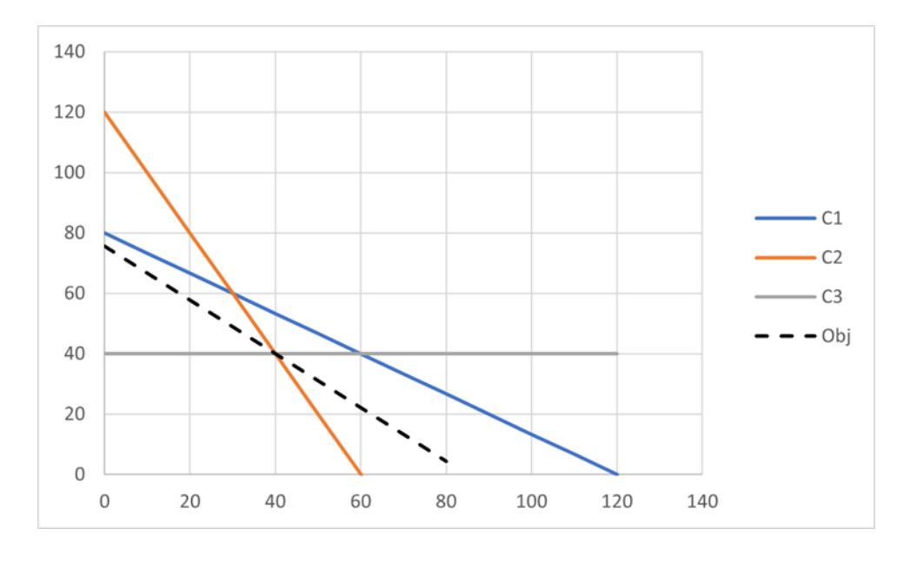
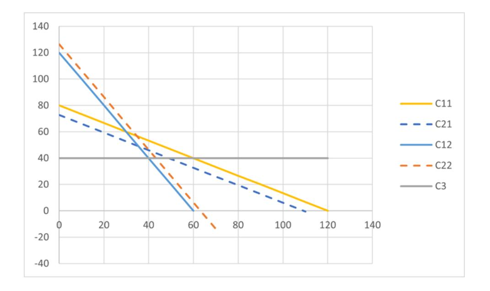

## Oppgave 1 (20 %)

- a) Anta at du ønsker å kontrollere servicegrad i et logistikknettverk, for eksempel at etterspørselen skal kunne dekkes i minst 95 % av tiden. Forklar kort (maks 100 ord til sammen)
  - a. Hvordan vil du uttrykke dette i modellen?
  - b. Har måten du valgte noen store farer eller svakheter?

#### LØSNINGSFORSLAG:

- a. Bør bruke *chance constraints* på ligningen med å tilfredsstille etterspørselen.
- b. Det er en hard betingelse slik at man bør passe seg for leveringsmønster som gir store kostnadshopp rundt den valgte sannsynligheten.
- b) Anta at noen skal løse et stokastisk to-stegs optimeringsproblem med en heuristikk de har utviklet. Anta at de allerede har et scenariotre. Heuristikken må initieres med at antall «rimelig gode» løsninger. De velger å finne disse ved å løse problemet deterministisk med ett scenario om gangen. Da får de potensielt like mange mulige løsninger som de har scenarier (men noen av disse kan jo være like). Argumenter for eller mot denne måten å starte heuristikken på, når kravet altså er at løsningene er «rimelig gode». Ca. 100 ord.

### LØSNINGSFORSLAG:

Dette er scenarioanalyse, og har derfor innebygd at alle løsningene er opsjonsfrie. De kan derfor ikke sies å være rimelig gode siden ingenting som koster noe (uansett hvor lite) og deretter gir fleksibilitet vil dukke opp som gode ideer.

- c) For hver av disse situasjonene, argumenter for eller imot bruk av risikoaversjon i målfunksjonen. (50 ord på hver.)
  - a. Et aksjeselskap som står overfor en svært stor varians i totalinntekten på grunn av usikre råvarepriser.
  - b. Et privateid selskap (med bare én eier) som vurderer å kjøpe opp en konkurrent av omtrent samme størrelse.
  - c. Et transportselskap har besluttet å lage en ny modell for daglig godsdistribusjon i en by. På grunn av vanskelige trafikkforhold er det stor variasjon fra dag til dag med hensyn til framkommelighet i byen.

### LØSNINGSFORSLAG:

- a. Her er det rimelig å argumentere mot risikoaversjon selv om selskapet er utsatt for alvorlig usikkerhet fordi det er aksjeeierne som skal styre risikohåndteringen gjennom porteføljestyring.
- b. Her kan man argumentere for risikoaversjon fordi man ikke kan anta at selskapet inngår i en større portefølje, og at eieren som enkeltperson nok er risikoavers.
- c. Her er det ikke rimelig å bruke risikoaversjon fordi dette er en gjentatt operasjon der variasjonen fra dag til dag ikke er viktig.

## Oppgave 2 (10 %)

De følgende to oppgavene er relaterte til delingsøkonomi, men kan besvares uavhengig av hver-andre.

- a) Web-teknologi kan brukes til å redusere transaksjonskostnadene i mange markeder. Her skal du vurdere om hver av fire typer markedsplasser passer inn i pensumdefinisjoner for delingsøkonom, eller om andre begreper passer bedre. De fire markedsplasstypene er som følger:
  - Markedsplass for tilbydere og etterspørrere av underholdningstjenester for barn (f.eks. klovner, ballongartister...).
  - Markedsplass for tilbydere og etterspørrere av brukte gjenstander, slik som FINN og eBay, der hensikten er at gjenstandene selges og kjøpes.
  - Markedsplass for tilbydere og etterspørrere av verktøy der hensikten er at privatpersoner leier ut sitt verktøy for kortere perioder til andre privatpersoner.
  - Markedsplass for tilbydere og etterspørrere av transporttjenester med bil der hensikten er at personer som disponerer en bil skal kunne tilby taxi-tjenester som bestilles og betales via en app (slik som Uber og Lyft).

Diskuter kort hvorvidt de nevnte markedsplassene passer inn i pensumdefinisjoner for de-lingsøkonomi eller heller passer bedre med andre markedskategorier diskutert i pensum!

#### LØSNINGSFORSLAG:

Frenken og Schor (2017) som er i pensum foreslår følgende definisjon:

"consumers granting each other temporary access to under-utilized assets ("idle capacity"), possibly for money"

Ifølge definisjonen handler delingsøkonomi om konsumenter som lar andre konsumenter låne gjenstander. Definisjonen peker mot deling av fysiske gjenstander, dvs. "assets", slik at tjenester som i den førstnevnte markedstypen faller utenfor. Det er tjenestebestilling, "on-demand economy", heller enn delingsøkonomi. Markedsplasser for omsetning av brukte gjenstander faller utenfor ettersom disse markedsplassene ikke legger opp til midlertidighet i disponeringen av gjenstandene. Det er ikke delingsøkonomi, men bruktøkonomi ("second-hand economy"). Den sistnevnte markedskategorien kombinerer bruk av fysisk gjenstand med tjeneste, og faller også utenfor definisjonen. Den fysiske gjenstanden lånes egentlig ikke bort fullt ut, og det blir en produkt-tjeneste-kobling, slik at det er "product-service economy" heller enn egentlig delingsøkonomi. Den tredje markedskategorien er derimot helt innenfor definisjonen. Det er underutnyttede, fysiske gjenstander som lånes fra konsumenter til konsumenter.

b) I delingsøkonomien, slik som i en del andre deler av økonomien, kan det finnes sterke førstemannsfordeler. Det vil si at bedrifter som etablerer seg tidlig i markedet kan opparbeide seg fortrinn som gjør det vanskeligere for andre bedrifter å etablere seg og ta markedsandeler. Beskriv kort de ulike mekanismene som bidrar til førstemannsfordeler i delingsøkonomien!

#### LØSNINGSFORSLAG:

Nettverkseffekter som primært går mellom tilbuds- og etterspørselsside gir sterke førstemannsfordeler. Poenget er at for de som etterspør deling er det en fordel at det er mange som tilbyr mens det for de som tilbyr er en fordel at mange etterspør på plattformen.

Brukervurderinger bidrar til å redusere effekten av asymmetrisk informasjon som kan begrense omsetning via plattformene, jf. Akerlofs "market for lemons". Verdien av brukervurderinger øker med den akkumulerte mengden av dem hvilket gir førstemannfordel siden de nødvendigvis akkumuleres først hos de(n) første.

Andre førstemannsfordeler som kan være naturlige å nevne er knyttet til byttekostnader og konsumentusikkerhet. Byttekostnader går ut på at brukere som har registrert seg og tilpasset sin profil på én plattform, vil måtte gjøre en ny innsats for å bytte. Det gir de(n) første fordeler. Personer som vurderer å bruke en delingsplattform vil ikke være helt sikre på kvaliteten som kan forventes. Det vil til en viss grad være erfaringsgoder. Risikoaversjon trekker da i retning av å foretrekke plattformer de har kjennskap til, har hørt om og vet et utbredte, selv om nyere, mer ukjent alternativer kan være noe bedre. Igjen er det en fordel for de(n) første.

## Oppgave 3 (20 %)

De følgende fire oppgavene er relaterte til auksjonsteori, men kan besvares uavhengig av hver-andre.

a) I kombinatoriske auksjoner oppstår det såkalte «winner determination problem». Gi en formulering av dette optimeringsproblemet! Det er ikke nødvendig med veldig formell matematisk notasjon, men definer symbolene du bruker, bruk gjerne ord for å beskrive osv. slik at det blir entydig for kompetent leser. Beskriv kompleksiteten til optimeringsproblemet ved å oppgi sammenhengene mellom antall bydere og objekter på den ene siden og antall variable og begrensninger på den andre!

### LØSNINGSFORSLAG:

Formuleringen diskutert i forelesning er som følger:

$$Max \quad \sum_{j \in N} \sum_{S \subseteq M} b^{j}(S) \cdot y(S, j)$$

$$S.T. \quad \sum_{S : i \in S} \sum_{j \in N} y(S, j) \le 1 \qquad \forall i \in M$$

$$\sum_{S \subseteq M} y(S, j) \le 1 \qquad \forall j \in N$$

$$y(S, j) \in \{0, 1\}$$

Her er N er mengden bydere. M er mengden objekter. S er delmengde av M.  $b^{j}(S)$  er budet fra byder j på kombinasjonen S. y(S,j) er lik 1 dersom kombinasjonen S tilordnes til byder j, og null ellers. Alle variable er altså binære.

Målfunksjonen maksimerer verdien av vinnerbud. Den første skranken sørger for ingen overlappende kombinasjoner i løsningen – hvert objekt selges bare én gang. Den andre skranken sikrer at ingen byder får mer enn én av kombinasjonene byderen har bydd på.

Med N bydere og M objekter er det  $N^M$  kombinasjoner en byder kan ha preferanser for. For å gi mulighet til å by på alle kombinasjoner for hver byder ville det gi  $N^{(M+1)}$  variabler. Dersom vi avgrenser slik at byderen bare får uttrykke preferanser for potensielle egne objekter blir det  $2^M$  mulige kombinasjoner og  $N \cdot 2^M$  variable. (Formuleringen over er i tråd med den vanlige forenklingen der bydere kun får by på kombinasjoner hen selv skal få.). Antall begrensninger er M+N, dvs. summen av bydere og objekter.

b) I kombinatoriske auksjoner med mange bydere og mange objekter kan tiden det tar å løse «winner determination problem» føre til behov for å tilpasse auksjonsprosedyren. Beskriv kort prosedyrer som er foreslått og som kan bidra til å redusere behovet for å løse dette optimeringsproblemet gjentatte ganger eller som bidrar til å redusere ulemper knyttet til tidsbruken!

### LØSNINGSFORSLAG:

I en Simultaneous Ascending Auction (SAA) auksjoneres objektene parallelt i engelske auksjoner. Det er ikke en egentlig kombinatorisk auksjon, men bydere kan ta noe hensyn til komplementære egenskaper. Denne auksjonsformen unngår WDP.

I Ascending Proxy Auction reduseres problemet med tidsbruk på WDP ved at det er dataroboter som byr i hver runde. I Clock-Proxy Auction er det først en runde med simultane klokkeauksjoner, dvs. at gjeldende pris for hvert objekt vises med prisklokker. Deretter er det en kombinatorisk proxy-auksjon der bud må slå budene vist etter siste runde med

klokkeauksjon. Dermed utelukkes svært mange potensielle bud i proxyauksjonen slik at WDP ikke må løses så mange ganger.

I *Vickrey-Clarke-Groves (VCG)* er det bare én runde. Det er den kombinatoriske varianten av lukket andre¬pris. Dermed må WDP bare løses én gang. Andreprisprinsippet gir insentiver til å by egen verdsetting. Lukket førstepris vil naturligvis også kun kreve at WDP løses én gang.

I Combinatorial Clock Auction (CCA) aggregeres gjerne objekter som er tilnærmet perfekte substitutter i de første fasene. Det er en runde med klokkeauksjon først og så én eller flere runder med kombinatoriske auksjoner. Aggregering av objekter og klokkefasen innebærer at WDP blir enklere å løse og må løses færre ganger. En aktivitetsregel begrenser muligheten til å holde tilbake bud i klokkefasen hvilket også bidrar til å begrense behovet for mange runder i den kombinatoriske fasen.

c) Forklar kort hvilke hensyn som gjerne peker i retning av bruk av åpne, iterative, kombinatoriske auksjonsformer heller enn lukkede! Er det hensyn som gjerne peker i motsatt retning?

#### LØSNINGSFORSLAG:

Dersom verdisignaler er "affiliated" som i Milgrom og Weber (1982) vil det være tendens til at avslø¬ring av verdiinformasjon underveis i auksjonsprosessen fører til at bydere oppjusterer sin verd¬setting slik at selger kan forvente høyere verdi i en åpen iterativ auksjon. Faren for "the winner's curse" blir mindre hvilket kan gi mer aggressiv budgivning fra risikoaverse bydere som er usikre på reell verdi som i "affiliated value" eller "common value".

I noen tilfeller kan en åpen prosess bidra til at budsjettbegrensninger relakseres. Den åpne prosessen som gjør at bydere vet mer om hva de vil måtte betale gitt at de vinner, legger til rette for at de kan utnytte budsjetter bedre.

Visse former for juks kan unngås: Falske bud i lukket andrepris; budgiver får informasjon om høyeste bud i lukket førstepris og legger inn et bud rett over.

Åpne, iterative auksjoner vil imidlertid sikre at koalisjoner av bydere vil være mer stabile enn i lukkede auksjoner. (Avvik vil avsløres underveis slik at det ikke vil være gevinst ved avvik.) Det hevdes også at åpne auksjoner legger til rette for at bydere kan signalisere til hverandre i prosessen. Dersom det er vesentlig asymmetri mellom potensielle interessenter, vil åpne prosesser kunne føre til lavere deltakelse. (Mange vet at de ikke vil vinne i en slik åpen prosess. I en lukket prosess derimot, er det en mulighet for at de med høyere verdsetting blir for grådige og byr så lavt at aktører med lavere verdsetting likevel kan vinne.)

d) I den såkalte Combinatorial Clock Auction (CCA) er det en prisingsregel av andrepristypen kalt «Vickrey-nearest-core» og det er en aktivitetsregel. Forklar kort hva som er hensikten bak bruk av andreprisprinsippet sammen med aktivitetsregelen i denne auksjonsprosedyren! Forklar så hva «Vickrey-nearest-core» bidrar med sett opp mot vanlige Vickrey-priser!

## LØSNINGSFORSLAG:

I CCA er "price discovery" et viktig poeng med sikte på å ta ut mye av den potensielle verdien som ligger i "affiliated value". Andreprisprinsippet bidrar i retning av at bydere strekker seg opp til sitt eget verdianslag. Aktivitetsregelen skal sikre at de i vesentlig grad avslører sin verdiinformasjon i tidlige faser, i stedet for å vente helt til slutt med sikte på å minimere effekten av at verdiinformasjon avsløres. Vanlige Vickrey-priser kan gi betaling under ikke-vinnende bud gitt for kombinasjoner. "Vickrey-nearest-core" eliminerer dette problemet. "Core" er avgrenset nedenfra av tapende bud inkludert bud på kombinasjoner. At punktet nærmest Vickrey-prisene i euklidsk distanse velges, sikrer at endelige priser er

uavhengige av vinnende bud – vinnende bud avgjør hvem som vinner, og hvem som ikke vinner, men gitt den inndelingen vil ikke størrelsen til vinnende bud påvirke prisene – slik at den ønskede egenskapen ved andrepris beholdes.

## Oppgave 4 (15 %)

Du eier en liten bedrift som produserer og selger to produkter, X og Y. Produktene bearbeides i to avdelinger. Kapasiteten i begge avdelinger er 2 400 timer. Det er ingen begrensninger i salget av de to produktene, men i produkt Y inngår et råstoff som er kun tilgjengelig i begrenset mengde. Forbruket per enhet er 1 kg og bedriften har bare klart å skaffe 40 kg av dette råstoffet.

For øvrig foreligger følgende informasjon om produktene

| Produkt                                    | X   | Y   |
|--------------------------------------------|-----|-----|
| Profitt                                    | 400 | 450 |
| Tidsforbruk pr. enhet i avdeling 1 [timer] | 20  | 30  |
| Tidsforbruk pr. enhet i avdeling 2 [timer] | 40  | 20  |

a) Formuler optimeringsmodellen og finn produktmiksen som maksimerer bedriftens profitt. Husk å forklare modellen.

### LØSNINGSFORSLAG:

Optimeringsmodellen blir

$$\max 400x + 450y \tag{Obj}$$

s.t.

$$20x + 30y \le 2400 \tag{C1a}$$

$$40x + 20y \le 2400$$
 (C2a)

$$y \le 40 \tag{C3a}$$

$$x, y \geq 0 \qquad (C4a)$$

Målfunksjonen (Obj) maksimerer profitt fra å produsere X og Y. Begrensningene (C1a) og (C2a) ivaretar at brukt tid ikke overstiger kapasiteten i hhv. avdeling 1 and 2. Begrensning (C3a) gjenspeiler begrenset tilgang på råstoffet som brukes til å produsere produkt Y. Den siste begrensningen er ikke-negativitetskrav for beslutningsvariablene.

Optimal løsning finnes grafisk

Optimal løsning er x = y = 40, målfunksjonsverdi er 34 000.

Du innser at tidsforbruket i de to avdelingene avviker fra den gitte tiden med  $\pm 10$  %.

b) Bruk tilnærmingen til Soyster (1973) til finne den optimale produktmiksen, som alltid kan produseres, uansett tidsforbruk i de to avdelingene. Formuler optimeringsmodellen først.

### LØSNINGSFORSLAG:

Den nye tidsbruken i de to avdelingene er nå gitt som

Tidsforbruk per enhet i avdeling 1  $20 \pm 2$   $30 \pm 3$   
Tidsforbruk per enhet i avdeling 2  $40 \pm 4$   $20 \pm 2$ Optimeringsmodellen, basert på Soyster (1973) blir

$$\max 400x + 450y \tag{Obj}$$

s.t.

$$22x + 33y \le 2400 \tag{C1b}$$

$$44x + 22y \le 2400 \tag{C2b}$$

$$y \le 40 \tag{C3b}$$

$$x, y \ge 0$$
 (C4b)

Det er også mulig å formulere begrensningene iht. til Soysters formulering:

$$\sum_{j} a_{ij} x_j + \sum_{j} \hat{a}_{ij} y_j \le b_i$$
$$-y_j \le x_j \le y_j$$

Men legg merke til at definisjonen av x og y endres sammenlignet med optimeringsmodellene gitt under a) og b). Det forventes at det enten brukes andre bokstaver i besvarelsen eller at besvarelsen er veldig tydelig på ny betydning av beslutningsvariablene dersom de samme bokstavene brukes.

Optimal løsning finnes igjen grafisk:

Optimal løsning er x = 34,5, y = 40, målfunksjonsverdi er 31 818.

Anta nå at tidsbruken i de to avdelingene kan beskrives ved hjelp av følgende scenarioer:

- Scenario 1: Tidsforbruk i begge avdelingene er som oppgitt.
- Scenario 2: Tidsforbruk i avdeling 1 er 10 % større enn oppgitt, mens tidsforbruk i avdeling 2 er 5 % mindre er oppgitt.
- Scenario 3: Tidsforbruk i avdeling 1 er 8 % mindre enn oppgitt, mens tidsforbruk i avdeling er 10 % større enn oppgitt.

Sannsynlighetene for de forskjellige scenarioene er gitt som 80~% for scenario  $1,\,12~\%$  for scenario 2~ og 8~% for scenario 3.

c) Formuler optimeringsproblemet med probabilistiske begrensninger. Finn den optimale produktmiksen, som holder seg innenfor kapasitetsbegrensningene i begge avdelingene med en sannsynlighet på 90 %.

### LØSNINGSFORSLAG:

Optimeringsproblemet med probabilistiske begrensninger kan formuleres som

$$\max 400x + 450y \tag{Obj}$$

s.t.

$$P\begin{pmatrix} h_x^1(\tilde{\xi})x + h_y^1(\tilde{\xi})y \le 2 \cdot 400 \\ h_x^2(\tilde{\xi})x + h_y^2(\tilde{\xi})y \le 2 \cdot 400 \end{pmatrix} \ge \alpha$$
 (C1)

$$y \le 40 \tag{C2}$$

$$x, y \ge 0 \tag{C3}$$

For å tilfredsstille kravet om å ikke bruke mer til enn tilgjengelig i avdeling 1 og 2, må vi tilfredsstille scenario 1 og scenario 2. (Vi kan gjerne tilfredsstille scenario 3 også, men uten å tilfredsstille 1 og 2 oppnår vi ikke 90 % sannsynlighet).

Problemet for scenario 1:

$$\max 400x + 450y \tag{Obj}$$

s.t.

$$20x + 30y \le 2400 \tag{C11}$$

$$40x + 20y \le 2400\tag{C12}$$

$$y \le 40 \tag{C3}$$

$$x, y \ge 0 \tag{C4}$$

Problemet for scenario 2:

$$\max 400x + 450y \tag{Obj}$$

s.t.

$$22x + 33y \le 2400 \tag{C21}$$

$$38x + 19y \le 2400\tag{C22}$$

$$y \le 40 \tag{C3}$$

$$x, y \ge 0 \tag{C4}$$

Vi ser at begrensning (C21) er strengere enn begrensning (C11) og at begrensning (C12) er strengere enn begrensning (C22). Vi løser derfor følgende problem:

$$\max 400x + 450y \tag{Obj}$$

s.t.

$$22x + 33y \le 2400$$
 (C1c)

$$40x + 20y \le 2400$$
 (C2c)

$$y \le 40 \tag{C3c}$$

 $x, y \ge 0$  
$$(C4c)$$

Vi vet fra før at begrensning (C1a) ikke var bindende. Den nye begrensningen (C1c) er heller ikke bindende for x = y = 40. Optimal løsning er derfor x = y = 40 med målfunksjonsverdi 34 000.

Det er selvfølgelig mulig å løse problemet grafisk:

## Oppgave 5 (10 %)

Anta følgende diskrete optimeringsproblem:

$$\min_{\mathbf{x} \in \Theta} g(\mathbf{x}) = E[Y(\mathbf{x}, \omega)]$$

Beslutningsvariabelene er representert som en vektor  $\mathbf{x} \in \Theta$ , og  $Y(\mathbf{x}, \omega)$  er en tilfeldig variabel, hvor  $\omega$  representerer tilfeldigheter. Fordelingen av  $Y(\mathbf{x}, \omega)$  er ukjent, men realiseringer av den kan bli observert gjennom simuleringer. I det videre dropper vi argumentet  $\omega$  for enkelhets skyld.

Under er det presentert en optimeringsalgoritme for dette problemet. Algoritmen er en form for lokalsøk som fokuserer søket etter nye løsninger i et lovende område  $\Theta_m \subseteq \Theta$  i iterasjon m.  $\Theta_m$  inkluderer alle løsninger som er nærmere beste løsning etter iterasjon m,  $\mathbf{x}_m^*$ , enn noen annen løsning som er simulert. I algoritmebeskrivelsen er  $\mathcal{V}_m$  mengden av alle løsninger simulert t.o.m. iterasjon m,  $N_m(\mathbf{x})$  er antall simuleringer av løsning  $\mathbf{x}$  t.o.m. iterasjon m, og  $\bar{Y}(\mathbf{x})$  er gjennomsnittet av de observerte målfunksjonsverdiene for løsning  $\mathbf{x}$ . Algoritmen itererer til et stoppkriterium er oppfylt, f.eks., basert på tidsbruk, antall iterasjoner eller antall simuleringer. Beste løsning returneres.

### Algoritme

Input: En mulig løsning  $\mathbf{x}_0$ .

- Steg 1. Sett m = 0,  $\mathcal{V}_0 = \{\mathbf{x}_0\}$ . Simuler  $n_0(\mathbf{x}_0)$  observasjoner for  $\mathbf{x}_0$ , sett  $N_0(\mathbf{x}_0) = n_0(\mathbf{x}_0)$ , og beregn gjennomsnitt  $\bar{Y}_0(\mathbf{x}_0)$ . La  $\Theta_0 = \Theta$ .
- Steg 2. La m = m + 1. Finn  $t_m$  kandidatløsninger  $\mathbf{x}_m^{(1)}, \mathbf{x}_m^{(2)}, \dots, \mathbf{x}_m^{(t_m)}$  fra  $\Theta_{m-1}$ . La  $\mathcal{V}_m = \mathcal{V}_m \cup \{\mathbf{x}_m^{(1)}, \mathbf{x}_m^{(2)}, \dots, \mathbf{x}_m^{(t_m)}\}$ . Bestem  $n_m(\mathbf{x})$  basert på simuleringsallokeringsregelen\* for hver  $\mathbf{x} \in \mathcal{V}_m$  og simuler  $n_m(\mathbf{x})$  replikeringer for hver  $\mathbf{x} \in \mathcal{V}_m$ . Oppdaterer  $N_m(\mathbf{x})$  og  $\bar{Y}(\mathbf{x})$  for hver  $\mathbf{x} \in \mathcal{V}_m$ .
- Steg 3. La  $\mathbf{x}_m^* = \arg\min_{\mathbf{x} \in \mathcal{V}_m} \bar{Y}_m(\mathbf{x})$ . La  $\Theta_m = \{\mathbf{x} : \mathbf{x} \in \Theta, \|\mathbf{x} \mathbf{x}_m^*\| \le \|\mathbf{x} \mathbf{y}\| \forall \mathbf{y} \in \mathcal{V}_m, \mathbf{y} \ne \mathbf{x}_m^* \}$ . Gå til Steg 2.
  - \* Simuleringsallokeringsregelen er en metode for å bestemme antall simuleringer som skal gjøres av hver løsning i iterasjon m av algoritmen. Antall simuleringer av en løsning i en iterasjon m,  $n_m(\mathbf{x})$ , kan antas å være økende med iterasjonsnummeret slik at  $n_m(\mathbf{x}) \to \infty$  når  $m \to \infty$ .
    - a) Jamfør klassifiseringen i pensumartikkelen av Figueira og Almada-Lobo (2014), hvordan vil du klassifisere optimeringsalgoritmen over basert på hensikten med å simulere? Grunngi svaret kort.

### LØSNINGSFORSLAG:

Hensikten med å simulere er her for å estimere målverdien til kandidatløsninger. I klassifiseringen til Figueira og Almada-Lobo (2014) kalles dette *løsningsevaluering*.

b) Beskriv kort hvordan common random numbers teknikken kan redusere variansen i de statistiske estimatene når man sammenlikner to eller flere løsninger?

### LØSNINGSFORSLAG:

Common random numbers (CRN) er en variansreduksjonsteknikk som bruker like strømmer av tilfeldige tall til simulering av to eller flere løsninger (konfigurasjoner). Dette gjør at enkeltsimuleringer av løsningene er positivt korrelerte, noe som igjen medfører at variansen i differansen mellom målfunksjonsverdiene til løsningene reduseres.

c) Beskriv kort hvordan bruk av common random numbers i simuleringene vil påvirke optimeringsalgoritmen over?

### LØSNINGSFORSLAG:

Common random numbers (CRN) kan brukes for å gjøre steg 3 av algoritmen mer effektivt fordi bruk av CRN vil øke sannsynligheten for at  $\mathbf{x}_m^*$  faktisk er den beste løsningen funnet så langt. Dermed vil man med en høyere sannsynlighet unngå å søke i dårligere områder, før man senere finner at en tidligere funnet løsning i  $\mathcal{V}_m$  var den beste så langt.

Kommentar til sensuren: Selv om det var effektiviteten til algoritmen det var tenkt spurt om, var oppgaveteksten litt uklar, og endel studenter har beskrevet hvordan CRN kan implementeres i optimeringsalgoritmen. Et godt svar om implementering gir dermed også full uttelling.

## Oppgave 6 (10 %)

I denne oppgaven skal vi studere et ruteplanleggingsproblem, et såkalt vehicle routing problem (VRP). En kant-rutingsformulering (arc flow formulation) er gitt under:

## VRP model (arc flow formulation):

#### Notation:

i, j - customer (i = 1, ..., n), i = 0 (depot)

k – vehicle (k = 1,...,K)

N - Number of customers

K - Number of vehicles

 $C_{ii}$  – Costs (distance) from customer i to j

B - Vehicle capacity

 $D_i$  – Demand from customer i

$$x_{ijk} = \begin{cases} 1, & \text{if vehicle } k \text{ drives directly from customer } i \text{ to } j \\ 0, & \text{otherwise} \end{cases}$$

$$y_{ik} = \begin{cases} 1, & \text{if customer } i \text{ is visited by vehicle } k \\ 0, & \text{otherwise} \end{cases}$$

$$y_{ik} =\begin{cases} 1, \text{ if customer } i \text{ is visited by vehicle } k \\ 0, \text{ otherwise } \end{cases}$$

$$\text{Min } z = \sum_{k=1}^{K} \sum_{i=0}^{N} \sum_{j=0}^{N} C_{ij} x_{ijk}, \qquad \text{Minimize total costs}$$
s.t.

$$\sum_{k=1}^{K} y_{ik} = K, \qquad i = 0, \qquad \text{All vehicles visit the depot}$$

$$\sum_{k=1}^{K} y_{ik} = 1, \qquad i = 1,....., N, \qquad \text{Each client visited by 1 vehicle}$$

$$\sum_{i=1}^{N} D_{i} y_{ik} \leq B, \qquad k = 1,....., K, \qquad \text{Each vehicle visit clients whose demand is under the capacity}$$

$$\sum_{i=0}^{N} x_{ijk} = y_{jk}, \qquad j = 0,1,....., N; k = 1,....., K, \qquad \begin{array}{l} \text{Flow} \\ \text{constraints,} \\ \text{couples x and y} \end{array}$$

$$\sum_{j=0}^{N} x_{ijk} = y_{ik}, \qquad i = 0,1,....., N; k = 1,....., K,$$

$$\sum_{i \in S} \sum_{j \in S} x_{ijk} \leq |S| - 1, \qquad 2 \leq |S| \leq N; k = 1,....., K, S \subseteq \{1,....., N\}$$

$$x_{ijk} \in \{0,1\}, \qquad i = 0,....., N; j = 0,....., N; k = 1,....., K,$$

$$y_{ik} \in \{0,1\}, \qquad i = 0,....., N; k = 1,....., K.$$

Det er utviklet en Large Neighborhood Search (LNS) algoritme for å løse problemet. LNS baserer seg på å iterativt ødelegge (destroy) og reparere (repair) en løsning til et bestemt stoppkriterium er nådd. I den utviklede LNS brukes det én operator for å ødelegge og én operator for å reparere. Ødeleggingsoperatoren innebærer å tilfeldig fjerne p % av kundene fra tildelt kjøretøy. Repareringsoperatoren innebærer å løse kant-rutingsformuleringen hvor kundene som ikke er fjernet er låst til sine respektive kjøretøy. Dette er implementert ved å fiksere  $y_{ik} = 1$  for de gitte kombinasjonene av kunde i og kjøretøy k.

a) Beskriv kort utfordringene med å bruke en slik repareringsoperator i LNS-en.

### LØSNINGSFORSLAG:

Det er flere utfordringer med LNS-en som skisseres. Under nevnes to utfordringer knyttet til repareringsoperatoren, men begge utfordringer må også sees i sammenheng med designet av ødeleggelsesoperatoren. Det gis full uttelling om én av de følgende utfordringene nevnes:

- Optimal løsning på problemet som repareringsoperatoren løser er minst like god som løsningen man ødela, og har en sterkt intensifiserende effekt. Men man vil ofte kunne ende opp med å sette tilbake kunder i samme rute som tidligere, og man risikerer dermed å bli fanget i et lokalt optimum. Om man gjør det eller ikke avhenger også av ødeleggingsoperatoren og andelen kunder som fjernes (p).
- Siden det er utviklet en metaheuristikk for problemet, kan man kanskje anta at det ønskes kort løsningstid. Å bruke en repareringsoperator som baserer seg på å løse en heltallsmodell (som kant-rutingsformuleringen) kan være tidkrevende. Løsningstiden på operatoren kan være svært sensitiv for andelen kunder som er fjernet fra rutene i ødeleggingsoperatoren. En mulighet til å redusere løsningstiden er å sette en maksimal løsningstid og dermed godta suboptimale løsninger i operatoren. I relasjon til forrige punkt ser vi at man ved å fjerne få kunder i hver iterasjon risikerer å sitte fast i et lokalt optimum, mens man ved å fjerne mange kunder i hver iterasjon risikerer å bruke veldig lang tid på å reparere løsningen.
- b) Formuler matematisk et krav om at den reparerte løsningen skiller seg fra den forrige, men hvor antall kunder i hver rute er det samme. Definer all ny notasjon. Modellen skal fortsatt holdes lineær.

### LØSNINGSFORSLAG:

Det er flere måter å formulere dette kravet på. En måte er som følger.

Definer:

$$\mathcal{N} = \{1,\ldots,N\} \text{ mengden kunder.}$$
 $\mathcal{N}=\{1,\dots,N\}$ mengden kunder.  $\bar{\mathcal{N}}_k=\{i:y_{ik}^*=1\} \text{ dvs mengden av kunder tilordet kjøretøy/rute } k \text{ før ødelegging.}$   $\bar{E}_k=\text{ antall kunder i rute } k \text{ før ødelegging.}$ 

$$\bar{F}_{k} = \text{antall kunder i rute } k \text{ før ødelegging}.$$
Følgende restriksjoner sikrer at rutene er endret, men hvor antall kunder er det samme.

$$\sum_{k=1}^{K} \sum_{i \in \bar{\mathcal{N}}_{k}} (1 - y_{ik}) + \sum_{k=1}^{K} \sum_{i \in \mathcal{N} \setminus \bar{\mathcal{N}}_{k}} y_{ik} \ge 2$$
 (1)

$$\sum_{i \in \mathcal{N}} y_{ik} = \bar{E}_{k}, \quad k = 1,\dots,K$$
(2)

c) Hvordan påvirker formuleringen i b) utfordringene som nevnt i a)?

#### LØSNINGSFORSLAG:

Kravet i b) hindrer at man ender opp i samme løsning etter reparering. Dette kan dermed redusere risikoen for å bli fanget i et lokalt optimum.

Kravet vil også redusere mulighetsrommet i søke hvilket kan redusere løsningstiden. Samtidig får man også en mer kompleks modell, og avhengig av hvor stor forskjell på løsningene man krever (i vårt tilfelle ett bytte av kunder), kan problemet bli umulig, hvilket kan ta tid å bevise for løsningsmetoden. Det er altså vanskelig å konkludere på effekten på løsningstid uten å teste modellene mot hverandre.

## Oppgave 7 (15 %)

En møbelprodusent ønsker å balansere profitt og miljøbevissthet. Produsenten har utviklet et beslutningsstøttesystem for å hjelpe den med å ta bedre beslutninger. Programvaren har kommet frem til et sett med gjennomførbare produksjonsplaner og vurdert dem med hensyn til to mål: profitt p og miljøbevissthet e. Produsenten ønsker å maksimere både profitt og miljøbevissthet. Målfunksjonsverdiene til løsning s er gitt som henholdsvis  $p_s$  og  $e_s$ . Verdiene for de 15 løsningene beslutningsstøttesystemet kom frem til er samlet i tabellene nedenfor

| Løsning nr. | $p_s$ | $e_s$ |
|-------------|-------|-------|
| 1           | 961   | 12    |
| 2           | 732   | 23    |
| 3           | 513   | 31    |
| 4           | 714   | 9     |
| 5           | 485   | 25    |
| Løsning nr. | $p_s$ | $e_s$ |
| 6           | 336   | 25    |
| 7           | 117   | 30    |
| 8           | 78    | 43    |
| 9           | 47    | 48    |
| 10          | 386   | 47    |
| Løsning nr. | $p_s$ | $e_s$ |
| 11          | 685   | 15    |
| 12          | 994   | 3     |
| 13          | 443   | 36    |
| 14          | 912   | 18    |
| 15          | 281   | 26    |

a) Anta at du bruker vektet-sum-metoden for å finne en tilnærming til Pareto-fronten. Hvilke løsninger finner du?

### LØSNINGSFORSLAG:

The solutions found by the weighted sum method are 1, 9, 10, 12, 14

b) Diskuter kort ulempene med å benytte seg av vektet-sum-metoden. Vis til eksempler fra møbelprodusent-caset.

### LØSNINGSFORSLAG:

The solutions either have high profit and low awareness (1, 12, 14) or low profit and high awareness (9, 10). If both objectives are important, these are probably not very good solutions.

c) Oppgi alle Pareto-optimale løsninger og forklar kort hvordan en løsningsmetode som klarer å finne alle disse løsningene kan løse problemene diskutert i b).

### LØSNINGSFORSLAG:

All Pareto optimal solutions are 1, 2, 3, 9, 10, 12, 13, 14. The solutions not found by the weighted sum method (2, 3, 13) gives a better balance between the objectives.

d) Produsenten anser miljøbevissthet som litt viktigere enn profitt og foreslår derfor at du bruker vektene  $W^e = 0.6$  og  $W^p = 0.4$  når du optimerer, dvs. de vil at du skal bruke max  $W^e e + W^p p$ . Forklar kort hvorfor denne tilnærmingen kanskje ikke gir produsenten det den ønsker.

### LØSNINGSFORSLAG:

Even though  $W^e$  is higher than  $W^p$ , the magnitude of p (maxs  $p_s = 994$ ) is much higher than the magnitude of e (maxs  $e_s = 48$ ). This means that only the high profit solutions will be considered. The same relative change will have different effects on the objective value.