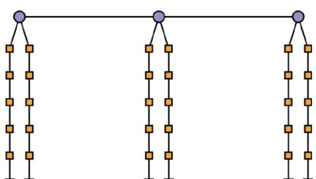
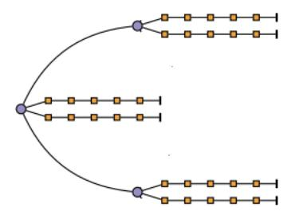
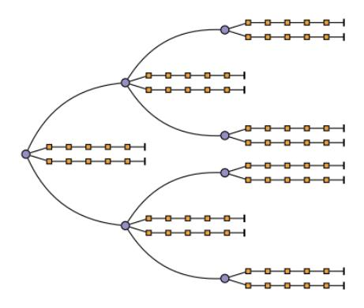

# Eksamensoppgaver med LF TIØ4505 AØO fordypningsemne høst 2023 Oppgave 1 (10 %)

a) Selskapet Über har vært knyttet til delingsøkonomien. Forretningsidéen er å legge til rette for at konsumenter skal bruke egen bil til å tilby persontransport i konkurranse med drosjer. Tjenesten formidles via en app som inneholder bestillingsfunksjonalitet, betalingsløsning og funksjoner for brukervurderinger. Navigasjonsfunksjoner for sjåfører reduserer behovet for å være godt kjent. Hvilke egenskaper ved virksomheten til Über beskrevet over, er det som klarest peker i retning av delingsøkonomi? Forklar! Ifølge en ganske streng definisjon av delingsøkonomi i pensum, faller Über utenfor. Forklar!

#### LØSNINGSFORSLAG:

Egenskapene til appen, utenom navigasjonsfunksjonaliteten som jo er spesifikk for denne nisjen, er typisk for flere virksomheter i delingsøkonomien, men det er særlig at tjenesten innebærer deling av en fysisk gjenstand, det vil si bil, som peker i retning av delingsøkonomi. Den strenge definisjonen lyder som følger: «consumers granting each other temporary access to under-utilized assets ("idle capacity"), possibly for money». Ut fra definisjonen faller Uber utenfor selv om det er en form for deling av kapitalgjenstand, fordi det reelt sett er snakk om en tjeneste, det vil si kjøp av arbeidskraft, som jo er en vanlig markedstransaksjon.

b) Asymmetrisk informasjon knyttet til erfaringsgoder kan både utgjøre en fare for verdiskapningen til selskap i delingsøkonomien og danne etableringsbarrierer som gir grunnlag for markedsmakt for de etablerte selskapene i en bestemt nisje. Forklar!

#### LØSNINGSFORSLAG:

Asymmetrisk informasjon om erfaringsgoder kan innebære at dårlig kvalitet fortrenger god kvalitet slik at dårlig kvalitet blir dominerende (jf. Akerlofs «market for lemons»). Hvis det skjer i en nisje i delingsøkonomien blir verdiskapningen dårligere enn dersom ulike mekanismer sørger for at også goder av god kvalitet deles. En viktig mekanisme som kan begrense fortrenging av god kvalitet er brukervurderinger. Men verdien av brukervurderinger er akkumulativ slik at jo flere vurderinger av hver tilbyder, og til dels også hver på etterspørselssiden, desto større er bidraget til å motvirke effekten av asymmetrisk informasjon. Dermed vil det være en førstemannsfordel ved at plattformen som kommer i gang tidlig, og akkumulerer mange vurderinger, vil ha en fordel framfor de som evt. prøver seg senere. Denne førstemannsfordelen blir en etableringsbarriere som kan bidra til dominans for én eller noen få aktører i bestemte nisjer slik at de(n) får markedsmakt.

## Oppgave 2 (20 %)

a) I en såkalt Simultaneous Ascending Auction (SAA) auksjoneres flere objekter simultant. Forklar hvorfor det ikke heller er simultane auksjoner på kombinasjoner av objekter! Forklar så hva som er sentrale fordeler og ulemper knyttet til SAA sett opp mot naturlige alternativer!

#### LØSNINGSFORSLAG:

Simultane auksjoner på kombinasjoner fungerer ikke ettersom samme objekt er del av flere kombinasjoner og det ville altså være simultan budgivning på samme objekt i separate auksjoner. Fordelen med SAA er at den er svært enkel. Den unngår «winner determination problem». Åpen, iterativ prosedyre sikrer «price discovery», som kan gi større verdi dersom gitt «affiliated value», som kan bidra til relaksering av og mer effektiv utnyttelse av budsjettbegrensinger, redusert fare for «winner's curse» etc. Ulempen er at det ikke er en ekte kombinatorisk auksjonsform. Ettersom det ikke er perfekt friksjonsfrie markeder og ikke perfekt informasjon, vil da ikke den fulle verdien av komplementære egenskaper mellom objekter bli reflektert i bud. Det igjen kan gi tap for selger og mindre effektiv allokering av objektene for samfunnet.

**b)** Hva menes med «proxy» i forbindelse med kombinatoriske auksjoner? Forklar hva som er fordelen ved bruk av «proxies»! Hva er naturlige innvendinger?

#### LØSNINGSFORSLAG:

En proxy, eller proxy-agent, i denne sammenhengen, vil typisk være en datarobot som byr på vegne av en byder. (Kan også være et menneske.) Tanken er at proxyagenten får verdiinformasjon fra byderen og så byr slik at byderen selv ikke må bruke tid på å følge auksjonen. I en kombinatorisk auksjon kan «winner determination problem» ta lang tid å løse og det kan være nødvendig med mange iterasjoner, slik at tidsbruk er et mye større problem enn i ordinære auksjoner. Bruken av proxies reduserer altså dette problemet. Den naturlige innvendingen er at det kan være uoverkommelig å gi proxi-agenten all informasjon som er nødvendig for optimal budgivning. For eksempel, dersom det er elementer av «affiliated value», kan det være tilnærmet umulig å gi korrekt informasjon om hvordan budgivning skal justeres basert på informasjon som avsløres i prosessen.

c) I den såkalte Combinatorial Clock Auction (CCA) er det en første fase med prisklokker fulgt av én eller flere kombinatoriske iterasjoner. Det brukes en aktivitetsregel og et andreprisprinsipp kalt «Vickrey-nearest-core». Forklar hva som er hensikten med kombinasjonen av aktivitetsregel og andreprisprinsipp! Forklar hvilke egenskaper «Vickrey-nearest-core» har som ikke oppnås med såkalte Vickrey-priser!

## LØSNINGSFORSLAG:

I CCA er «price discovery» et viktig poeng med sikte på å ta ut mye av den potensielle verdien som ligger i «affiliated value». Andreprisprinsippet bidrar i retning av at

bydere strekker seg opp til sitt eget verdianslag. Aktivitetsregelen skal sikre at de i vesentlig grad avslører sin verdiinformasjon i tidlige faser, i stedet for å vente helt til slutt med sikte på å minimere effekten av at verdiinformasjon avsløres. Vanlige Vickrey-priser kan gi betaling under ikke-vinnende bud gitt for kombinasjoner. «Vickrey-nearest-core» eliminerer dette problemet. «Core» er avgrenset nedenfra av tapende bud inkludert bud på kombinasjoner. At punktet nærmest Vickrey-prisene i euklidsk distanse velges, sikrer at endelige priser er uavhengige av vinnende bud – vinnende bud avgjør hvem som vinner, og hvem som ikke vin-ner, men gitt den inndelingen vil ikke størrelsen til vinnende bud påvirke prisene – slik at den ønskede egenskapen ved andrepris beholdes.

**d)** I pensum er det flere gode argumenter for åpne, iterative auksjonsformer. Men potensielt samarbeid mellom bydere og stor grad av asymmetri når det gjelder betalingsvillighet, hevdes det, kan trekke i retning av lukkede auksjoner. Forklar hvorfor!

#### LØSNINGSFORSLAG:

Asymmetri i verdsetting kan føre til at aktører som vet de har lavere verdsetting enn andre, velger å ikke delta i en åpen iterativ auksjon, ettersom den gir objektet til budgiver med høyest verdsetting med sikkerhet. I en lukket førsteprisauksjon vil bydere by basert på hva de forventer er nest høyeste verdi gitt egen seier. Det gir en mulighet for at bydere som ikke har høyest verdsetting likevel vinner. Det er dermed insentiv til å delta også når aktøren vet at det er andre som har høyere betalingsvilje. Og flere deltakere tendere til å gi fordel for selger.

Bydere kan samarbeide med sikte på at én skal få objektet til en lav pris og så deles gevinsten mellom byderne i koalisjonen. I en åpen auksjon er det ikke sterke insentiver til å bryte ut av en slik koalisjon ettersom avvik blir oppdaget underveis. I en lukket auksjon derimot er det sterke insentiver til å bryte ut med hensikt å ta hele gevinsten av samarbeidet selv.

## Oppgave 3 (10 %)

Bedriften XY har et optimeringsproblem der det er tre objektiver som alle skal minimeres: 1) kostnader, 2) utslipp, og 3) antall for sent leverte ordrer. XY har leid inn konsulentselskapet GMPK som har benyttet en algoritme som igjen har produsert følgende seks alternative løsninger:

| Objektiv                       | Løsning 1 | Løsning 2 | Løsning 3 | Løsning 4 | Løsning 5 | Løsning 6 |
|--------------------------------|-----------|-----------|-----------|-----------|-----------|-----------|
| Kostnad                        | 320       | 280       | 280       | 300       | 310       | 350       |
| Utslipp                        | 72        | 70        | 75        | 82        | 73        | 71        |
| # ordrer<br>for sent<br>levert | 66        | 62        | 55        | 71        | 58        | 63        |

a) Hvilke av disse seks løsningene tilhører settet av Pareto-optimale løsninger?

#### LØSNINGSFORSLAG:

Sjekker om noen av løsningene er dominerte av andre:

Løsning 1 domineres av Løsning 2, og er følgelig ikke med i settet av Pareto-optimale løsninger.

Løsning 2 domineres ikke av noen andre løsninger (og er best av alle på utslipp og delt best på kostnad), og er dermed med i settet av Pareto-optimale løsninger.

Løsning 3 domineres ikke av noen andre løsninger (og er best av alle på for sent leverte ordrer og delt best på kostnad), og er dermed med i settet av Pareto-optimale løsninger.

Løsning 4 domineres av Løsningene 2 og 3, og er følgelig ikke med i settet av Pareto-optimale løsninger.Løsning 5 domineres ikke av noen andre løsninger, og er dermed med i settet av Pareto-optimale løsninger.

Løsning 6 domineres av Løsning 2, og er følgelig ikke med i settet av Pareto-optimale løsninger.

Oppsummert: Settet av Pareto-optimale løsninger består av løsningene 2, 3 og 5.

**b)** Forklar kort leksikografisk metode. Hvilken av løsningene ville en ha valgt dersom en hadde brukt denne metoden og objektivene var sortert i rekkefølgen oppgitt innledningsvis i oppgaven?

#### LØSNINGSFORSLAG:

I leksikografisk metode løses problemet først for det viktigste objektivet, og om det er flere løsninger som er like her, løses det deretter med det neste viktigste objektivet gitt at verdien for objektiv 1 skal holdes lik verdien funnet i første iterasjon, osv. Dette kan matematisk oppsummeres som følger:

minimize

$$\begin{array}{ll}
f_1(\mathbf{x}) & \rightarrow z_1 \Rightarrow
\end{array}$$
subject to

$$\mathbf{x} \in \mathcal{X}$$
minimize

$$\begin{array}{ll}
f_2(\mathbf{x}) \\
f_1(\mathbf{x}) \leq z_1 \rightarrow z_2 \Rightarrow \cdots
\end{array}$$
subject to

$$\mathbf{x} \in \mathcal{X}$$

Om en bruker denne metode i oppgaven ovenfor, ville en rett og slett bare velge den løsningen med lavest kostnad, som her er både løsningene 2 og 3. Da må vi deretter se på neste objektiv, som er utslipp, og her er Løsning 2 best av disse to. Følgelig er det Løsning 2 som velges med bruk av leksikografisk metode.

## Oppgave 4 (25 %)

Ta utgangspunkt i et deterministisk ryggsekkproblem (knapsack problem). La  $\mathcal G$  være settet av alle gjenstander. Variabelen  $x_g,g\in \mathcal G$ , blir 1 dersom gjenstand g tas med og er 0 ellers. La videre  $N_g$  og  $V_g$  være henholdsvis nytte og vekt av gjenstand g. Ryggsekkens kapasitet er gitt som K.

Problemet kan da formuleres som

$$\max \sum_{g \in \mathcal{G}} N_g \cdot x_g$$

gitt at

$$\sum_{g \in \mathcal{G}} V_g \cdot x_g \le K,$$

$$x_g \in \{0,1\} \ g \in \mathcal{G}.$$

Du skal nå ta hensyn til usikkerhet.

a) Omformuler optimeringsmodellen med en probabilistisk restriksjon (chance constraint) slik at sannsynligheten for at gjenstandene ikke passer i ryggsekken er mindre enn  $\alpha$ .

## LØSNINGSFORSLAG:

Vi får følgende modell:

$$\max \sum_{g \in G} N_g \cdot x_g$$

gitt at

$$\Pr\left(\sum_{g \in \mathcal{G}} V_g \cdot x_g \le K\right) \ge 1 - \alpha,$$

$$x_g \in \{0,1\} \ g \in \mathcal{G}.$$

**b)** Hvilken grunnleggende forutsetning er nødvendig for du skal kunne benytte deg av probabilistiske restriksjoner for å håndtere usikkerheten?

#### LØSNINGSFORSLAG:

For å kunne bruke probabilistiske restriksjoner må vi ha kunne beregne sannsynligheter. Som følge av dette må vi sannsynlighetsfordelingen(e) til de usikre parametere.

c) Hvilke parametere vil i din formulering kunne være usikre? Hva er konsekvensene for hvordan du kan løse problemet dersom alle eller bare noen av parametere er usikre?

#### **LØSNINGSFORSLAG:**

I utgangspunktet vil alle parametere, dvs.  $N_g$ ,  $V_g$ , K, kunne være usikre. Men dersom hverken vekten,  $V_g$ , eller kapasiteten, K, er usikker, vil vi ikke ha en probabilistisk restriksjon. Vi ser derfor bort fra usikkerhet i nytte i resten av besvarelsen.

Dersom kun ryggsekkens kapasitet K er usikker, vil vi kunne forenkle den probabilistiske restriksjonen ved å beregne  $(1-\alpha)$ -persentilen av fordelingen for kapasiteten K. Vi kan så løse en deterministisk ryggsekk med ny kapasitet lik den beregnede kapasiteten.

Dersom vekten  $V_g$  er usikker kan den probabilistiske restriksjonen ikke forenkles på en lignende måte. Men dersom vi kan representere usikkerheten ved hjelp av et sett med scenarier, kan vi bruke binære indikatorvariabler for å beregne sannsynligheten av scenariene der restriksjonen holder.

Du skal nå håndtere usikkerheten gjennom robust optimering.

d) Hvordan endres forutsetningene sammenlignet med probabilistiske restriksjoner?

#### LØSNINGSFORSLAG:

Robust optimering krever ikke sannsynligheter for å håndtere usikkerhet. Usikkerheten representeres gjennom «uncertainty» eller «ambiguity sets». Det er ikke mulig å tilordne en sannsynlighet til elementene i uncertainty settet. Det er derfor heller ikke mulig å regne på forventet verdi.

**e)** Basert på prinsippene presentert i Soyster (1973), hvilke parametere vil i en robust formulering kunne være usikker og hvordan påvirker dette hvordan du løser problemet?

## L

Soyster bruker kolonnevis usikkerhet, dvs. koeffisientene på venstre side i restriksjonen er usikre. Legg merke til at dette også inkluderer kapasiteten (siden det er lett mulig å overføre kapasiteten fra høyre til venstre side). Når all usikkerhet er representert som intervall-usikkerhet kan problemet løses som deterministisk problem ved å bruke høyeste vekt på alle gjenstander og laveste kapasitet på ryggsekken.

## Oppgave 5 (15 %)

Firmaet Ida driver en matvarebutikk hvor de leverer matvarer hjemme hos folk. De skal etablere seg i et nytt område og trenger derfor å planlegge hvor de skal sette opp depotene sine for å maksimere forventet profitt ved å betjene fremtidige kunder. For å svare på dette har de laget seg en nabolagsheuristikk. En løsning  $x \in \{0,1\}^D$  er en binær streng som sier om depot  $d \in \{1, ..., D\}$  er åpent eller ikke, og en nabolagsoperator N(x) som gir et sett av naboløsninger til en mulig depotløsning x. For hver løsning x' i nabolaget til x, trekker algoritmen n ulike scenarioer av kunder som har bestilt matvarer, og løser deretter et «multi-depot vehicle routing»-problem (MDVRP) for hvert av disse scenarioene. Når alle naboene er evaluert, velger algoritmen den naboløsningen med høyest forventet profitt, og gjentar prosessen til den allokerte tiden er brukt opp. Se algoritmen nedenfor:

```
x^* \leftarrow \text{initial solution}
while time < MaxTime do
  for x' \in N(x^*) do
     for j \in 1,...,n do
        randomly draw a set of customers: \omega_i
        L(x',\omega_i) = objective value of MDVRP for depot solution x' and customer set \omega_i
     end for
     f(x') = \sum_{j=1}^{n} \frac{L(x', \omega_j)}{n}
  end for
  if max\{f(x')|x' \in N(x^*)\} > f(x^*)\} then
     x^* \leftarrow argmax\{f(x')|x' \in N(x^*)\}
  else
     break;
  end if
end while
return s
```

a) I denne algoritmen har vi erstattet den egentlige evalueringen av objektivet  $\mathbb{E}_{\omega}[L(x',\omega)] \bmod \sum_{j=1}^n \frac{L(x',\omega)}{n}.$  Forklar begrepet simuleringsbudsjett og diskuter fordeler og ulemper ved å velge stor og liten verdi på parameteren n (antallet simulerte kundescenarioer) i denne algoritmen.

#### LØSNINGSFORSLAG:

Med simuleringsbudsjett mener vi den totale mengden tid som er satt av til å simulere løsninger. I algoritmen ovenfor innebærer det hvor mye tid som benyttes inne i den innerste for-løkken hvor vi trekker/simulerer kunder, og deretter løser et MDVRP. I dette tilfellet tilsvarer dette verdien «MaxTime». Siden vi estimerer verdien av  $\mathbb{E}_{\omega}[L(x',\omega)]$  med n simuleringer, vil en høy n-verdi føre til et mer nøyaktig estimat av denne verdien. Dermed er det høyere sannsynlighet for at  $\max\{f(x')|x'\in N(x^*)\}=\max\{\mathbb{E}_{\omega}[L(x',\omega)]|x'\in N(x^*)\}$ . Ulempen med høy n-verdi, er at vi bruker mye av simuleringsbudsjettet til å evaluere hvert flytt i nabolaget, og dermed vil vi gjøre få flytt før tiden går ut. Dermed er det sannsynlig at vi ender opp med en dårligere løsning i heuristikken.

b) Hvordan kan algoritmen endres slik at simuleringsbudsjettet utnyttes bedre, samtidig som man unngår (noen av) ulempene ved lav n-verdi? Foreslå to forbedringer av algoritmen, basert på pensum, som gjør at simuleringsbudsjettet utnyttes bedre.

#### LØSNINGSFORSLAG:

Her har pensum mange mulige løsninger, og vi forklarer kort hver av de nedenfor.

- 1) «Common random numbers». I algoritmen over trekkes kundescenarioene n ganger hvor hver løsning evalueres med forskjellige kundescenarioer. Hadde vi i stedet trukket ut n kundescenarioer og så testet naboløsninger x' på de samme kundescenarioene, hadde vi trengt en lavere n for å konkludere med en viss sikkerhet at  $f(x') > f(x^*)$ .
- **2)** Vi kunne kjørt alle naboløsninger x' gjennom  $n_1$  kundesett, og brukt dette til å grovsortere ut åpenbart dårligere nabo-løsninger. Deretter kunne vi kjørt  $n_2$  nye simuleringer for å konkludere mellom de resterende. Da unngår vi å bruke like mye tid av simuleringsbudsjettet på åpenbart dårlige løsninger, som på (potensielt) gode.
- 3) Vi kan bruke KN-metoden (se slides for utfyllende info).
- c) Ida har brukt mye tid på å utvikle en kunstig intelligens (KI) algoritme som kan predikere verdien  $L(x',\omega_j)$  uten å løse det tidkrevende MDVRP-problemet. De anslår at denne KI-algoritmen aldri bommer med mer enn  $\pm 5$  % på riktig verdi. Hvordan kan man bruke denne KI-algoritmen til å bedre bruken av simuleringsbudsjettet i nabolagsheuristikken ytterligere?

## LØSNINGSFORSLAG:

Denne KI-en kan vi bruke som en *metamodell* til å gjøre en grovsortering mellom alle naboene. F.eks. kan man kjøre alle naboene gjennom KI-en. Alle naboer som er mer enn 10 % dårligere enn den beste naboen, kan umiddelbart forkastes. Deretter kan man kjøre simuleringer for å sammenligne de resterende naboene.

### Oppgave 6 (20 %)

- a) The Energy system planner of a small European country faces the challenge of planning how to meet projected energy demand over two time periods. Currently, there are two major exhaustible energy resources available:
  - Resource 1 costs  $C_1$  per unit and has a total current availability of  $S_1$  units
  - Resource 2 has a cost of  $C_2$  per unit and a total current availability of  $S_2$  units

Additionally, there is an external resource (resource 3) accessible at a cost of  $C_3$  per unit. All three resources can be used in any combination to satisfy the demand.

Investments, with fixed costs of  $F_1$  and  $F_2$ , are being considered to explore new sources which can give an unlimited supply for resources 1 and 2, respectively. The effect of this investment for resource 1 is uncertain. It is estimated that the resource has a 50% probability that it will cost  $C_1^H$  per unit for the additional units from this investment (in addition to the fixed investment cost) and an equal probability that it will cost  $C_1^L$  per unit. For resource 2, investments are well understood, and it will (with full certainty) give a cost of  $C_2^N$  per unit.

The total demand for the current time period is projected to be  $D_1$ , while the second time period has a demand of  $D_2$  units. The ministry aims to minimize total expected costs over the two time periods. Any investments are made in the first period, while the outcome will be known at the end of the current period and affect the demand satisfaction in the second period.

Formulate the stochastic program for the outlined problem. Present and define all notation (indices, sets, parameters and decision variables) included in your formulation. The formulation must be linear.

#### LØSNINGSFORSLAG:

First, we define the additional notation used in the mathematical formulation:

- *i*: index for resources
- t: index for time periods
- R: number of resources (= 3)
- $x_{i1}$ : how much of resource i is used in time period 1
- $x_{i2}^L$ ,  $x_{i2}^H$ : how much of resource i is used in time period 2 (excluding the explored resources). L and H indicate whether the price for resource 1 is low or high in time period 2, respectively
- $\delta_i$ : binary variable indicating whether we invest in the opportunity to explore additional sources of resource  $i \in \{1, 2\}$
- $y_i^L$ ,  $y_i^H$ : how much additional resources are used after exploration of new sources of resource  $i \in \{1, 2\}$ . L and H indicate whether the price for resource 1 is low or high in time period 2, respectively

Using the given and additional notation, we can get the following mathematical formulation:

$$\min z = \sum_{i=1}^{R} C_{i}x_{i1} + \sum_{i=1}^{2} F_{i}\delta_{i} + 0.5 \left( C_{1}^{H}y_{1}^{H} + C_{1}^{L}y_{1}^{L} + \sum_{i=1}^{R} C_{i}(x_{i2}^{L} + x_{i2}^{H}) + C_{2}^{N}(y_{2}^{L} + y_{2}^{H}) \right)$$

s.t.

$$\begin{aligned} x_{i1} + x_{i2}^{L} &\leq S_i, i = 1, 2 \\ x_{i1} + x_{i2}^{H} &\leq S_i, i = 1, 2 \\ \sum_{i=1}^{R} x_{i1} &\geq D_1 \\ \sum_{i=1}^{R} x_{i2}^{L} + \sum_{i=1}^{2} y_i^{L} &\geq D_2 \\ \sum_{i=1}^{R} x_{i2}^{H} + \sum_{i=1}^{2} y_i^{H} &\geq D_2 \\ y_i^{L} &\leq D_2 \delta_i, i = 1, 2 \\ y_i^{H} &\leq D_2 \delta_i, i = 1, 2 \\ x_{i1}, x_{i2}^{L}, x_{i2}^{H} &\geq 0, i = 1, \dots, R \\ y_i^{L}, y_i^{H} &\geq 0, i = 1, 2 \\ \delta_i &\in \{0, 1\}, i = 1, 2 \end{aligned}$$

The objective function minimizes the expected total costs, which include the costs of using the available resources in time period 1, the investment decision costs for exploring new sources of resources 1 and 2, and the expected costs related to whether the price for the additional units of resource 1 is low or high.

The first two constraints ensure that we do not use more than  $S_i$  units of resources 1 and 2 in any of the scenarios. Afterwards, the three next constraints dictate that the demand has to be satisfied in both time periods in any scenario (it is also possible to use equalities instead of inequalities in these constraints). Then, the next two constraints ensure that we cannot have additional units of resources 1 and 2 if no investment decisions are made. In this case, we let the demand parameter  $D_2$  be the big-M parameter. The last three constraints are non-negativity and binary constraints.

**b)** Describe the difference between a two-stage stochastic program and a multi-horizon stochastic program.

#### LØSNINGSFORSLAG:

Two-Stage Stochastic Programming: the decision-making process is divided into two distinct stages or periods. The first stage represents decisions made at the beginning of the planning horizon, often referred to as the "first-stage decisions." These decisions are typically strategic or long-term in nature and are made without perfect knowledge of future events. The second stage represents decisions made later in the planning horizon, usually after the realization of uncertain parameters. These are referred to as "second-stage decisions" and are made based on the actual outcomes of random variables or scenarios. The two stages are connected through decision variables in the first stage that affect the second-stage decisions

Multi-Horizon Stochastic Programming: Structure: Decisions are made at several points in time, and at each stage, new information about uncertainties is revealed. That is, a multi-horizon stochastic program extends the planning horizon into multiple time periods, and decisions are made sequentially over these periods. Each time period can be seen as a stage, and the decision variables and objectives for each period are interrelated. The optimization problem is solved over the entire planning horizon, considering the sequential nature of decisions and the evolving information about uncertain parameters. Multi-horizon stochastic programs are more suitable for modeling problems where decisions made in one period can affect future periods, such as in dynamic resource allocation or investment planning.

The key difference is that a two-stage represents two main decision points while a multi-horizon program involves several decision points. The multi-horizon program has multiple stages where uncertainty is revealed. A multi-horizon is a type of multi-stage stochastic program with the distinctive feature that uncertainty is considered in the overall time frame of the decision-making process. So, a multi-horizon does not necessarily emphasise sequential decision points (e.g., commonly assumed in a multi-stage framework), but rather assumes a set trajectory (horizon) with simplicity (deterministic) in the strategic nodes.

c) What are the criteria on selecting the number of scenarios for a two-stage stochastic program? How many scenarios and why? Does it affect the value of the stochastic solution?

#### LØSNINGSFORSLAG:

More scenarios can provide a better representation of the uncertainty, but beyond a certain point, introducing additional scenarios will create computational challenges. Hence, there should be a balance between the accuracy (more scenarios) and the computational feasibility (fewer scenarios). The criteria on selecting the number of scenarios is guided by:

- The effects on the objective function. Measuring the stability of the objective function by increasing the number of the scenarios. The objective function might change with the number of scenarios, however as the number of scenarios grows there should be a point where increasing the number of scenarios does not affect the value of the objective function. This is a key criterion to determine the number of scenarios.
- The quality on how the scenarios capture the range and nature of uncertainties adequately. The scenarios should be selected to provide a statistically reliable representation of uncertainty. Here good sampling methods like Monte Carlo sampling can be used to generate statistically representative scenarios. That is, good sampling (quality) representing the uncertainty can bring a trade-off on the number of scenarios required (quantity).

Impact to on the Value of Stochastic solution:

- Inadequate scenario representation might underestimate the VSS. The VSS is sensitive to the number and quality of scenarios.
- Varying numbers of scenarios can help assess the impact on VSS and identify a point where increasing scenarios doesn't significantly change the VSS.

d) A given model (e.g., the EMPIRE model) takes into consideration uncertainty in the operations of the power system (i.e., scenarios on short-term variations of renewable energy and demand, illustrated in the scenario tree in the figure). How can the formulation be adapted if uncertainty is introduced also in the capacity expansion costs (e.g., cost of power plants investment costs, which is long-term uncertainty)? Will the problem structure change?



## L

Uncertainty in the strategic nodes will affect the structure of the model. It will create this structure:



Also, if the uncertainty at the strategic node evolves overtime, another possible answer would be:

