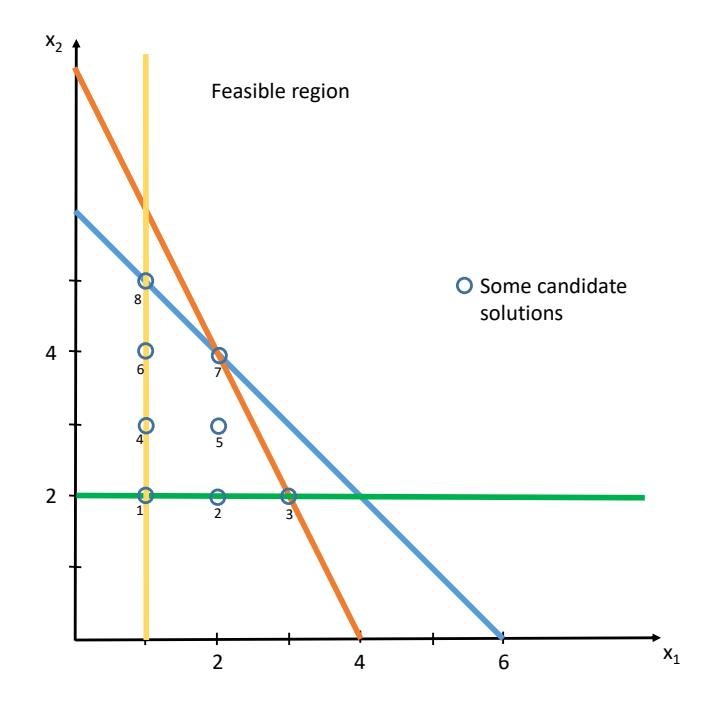
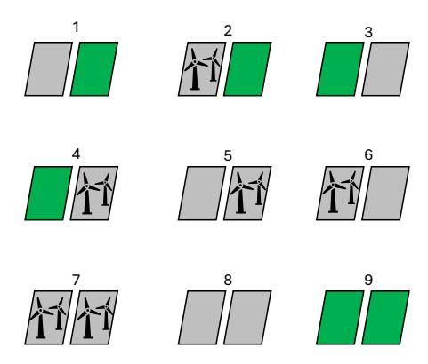
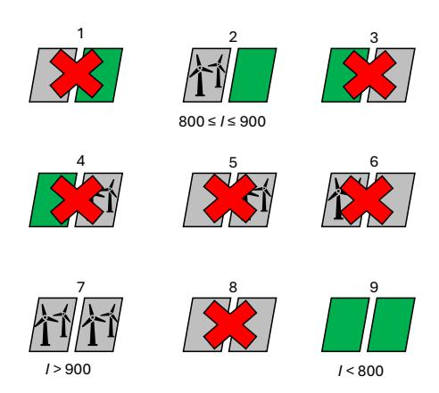
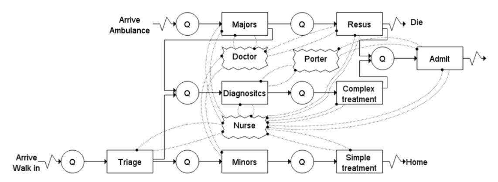
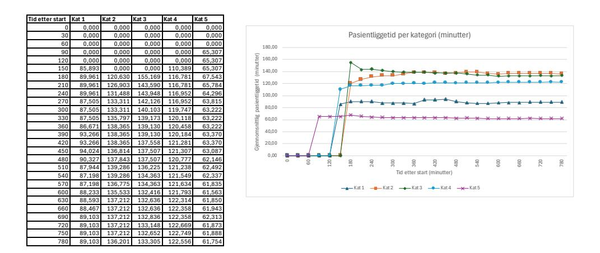

# Oppgave 1 (10 %)

a) Coop, som blant annet driver dagligvarekjedene Extra, Prix, Mega og Obs!, har brukt slagord som «delingsøkonomi siden 1867» i markedsføringen. Poenget er at medlemmer får såkalt kjøpeutbytte. Det vil si at de én gang i året får utbetalt et beløp tilsvarende en bestemt prosentandel av sine kjøp i Coop sine butikker. Ifølge en ganske streng definisjon av delingsøkonomi i pensum er ikke virksomheten til Coop delingsøkonomi. Det er heller ikke kjøp og salg av brukte gjenstander via Finn.no, bilutleie via selskaper som Hertz og Avis, eller leie av klovner til barnebursdag. Forklar hva det er som gjør at de nevnte fenomenene ikke passer inn i den strenge definisjonen og gi eksempler på virksomheter som passer inn i den!

### LØSNINGSFORSLAG:

Den strenge definisjonen i pensum lyder som følger: «consumers granting each other temporary access to under-utilized assets ("idle capacity"), possibly for money». I denne definisjonen avgrenses delingsøkonomi til transaksjoner mellom konsumenter, som innebærer midlertidig tilgang til aktiva som er underutnyttet. COOP er en bedrift og deling av overskudd innebærer ikke midlertidighet (og er ikke så veldig forskjellig fra utbytter gitt av aksjeselskap). Salg av brukte gjenstander innebærer at eiendomsrett overføres og er altså ikke midlertidig. Bilutleie som nevnt er fra bedrifter, ikke utlån fra konsumenter. Klovnutleie er tjenesteleveranse, ikke utlån av aktiva. Nabobil, som er en tjeneste der private bileiere stiler sine biler til disposisjon for utlån til andre er ett eksempel som vil passe inn. Tilsvarende for verktøy og delen av Airbnb som gjelder eiendommer som vanligvis brukes av private passer også inn.

b) I delingsøkonomien kan førstemannsfordeler gi betydelig markedsmakt som plattformer kan utnytte. En type førstemannsfordel kan knyttes til asymmetrisk informasjon. En annen er et spesialtilfelle av nettverkseffekter. Forklar!

# LØSNINGSFORSLAG:

Brukervurderinger kan motvirke tendensen til at dårlig kvalitet fortrenger god kvalitet, jf. Akerlofs «market for lemons». Men verdien av brukervurderinger øker med akkumulert mengde brukervurderinger slik at plattformen som er først ute får et fortrinn ift. de som evt. kommer senere inn i samme nisje.

For de som er på etterspørselssiden er den fordel med mange tilbydere mens for de som er på tilbudssiden er det en fordel med mange etterspørrere. Dermed får plattformen som er først ute en fordel ved at den akkumulerer brukere på både tilbuds- og etterspørselsside før andre evt. kommer etter. Dette er ikke en vanlig form for nettverkseffekt ettersom den går fra mellom tilbuds- og etterspørselsside mens ordinære nettverkeffekter jo går mellom etterspørrere, slik som når telefon blir mer attraktivt fordi flere har telefon.

# Oppgave 2 (20 %)

a) Anta at det er ett objekt som skal selges via auksjon. Selger vurderer enten en lukket andreprisauksjon eller en såkalt engelsk auksjon. Forklar hvilken av de to auksjonsvariantene som vil gi høyest forventet salgspris under følgende forutsetninger: 1) Private value og risikonøytrale bydere. 2) Private value og risikoaverse bydere. 3) Common value og risikoaverse bydere. 4) Affiliated value og risikonøytrale bydere.

### LØSNINGSFORSLAG:

Begge nevnte auksjoner er andreprisauksjoner, ettersom vinner i Engelsk auksjon ikke betaler mer enn marginalt over høyeste bud andre har avgitt. Med private value påvirkes ikke verdsetting av evt. informasjon relatert til andre byderes verdsetting. Siden det er andreprisauksjoner, er det en dominant strategi å by (opp til) egen verdsetting. (Eget bud betyr ikke noe for hva betalingen blir og avvik fra egen verdsetting kan føre til tap i form av å enten ikke vinne i situasjon egen verdsetting er høyest, eller vinne i situasjon der nest høyeste bud er over egen verdsetting.) Dette gjelder uavhengig av risikoholdning. Derfor vil forventet salgspris være lik for de to auksjonsformene i tilfelle 1 og 2. Risikoaversjon i common value med andreprisauksjoner er kun knyttet til faren for «winner's curse», ikke faren ved å ikke vinne auksjonen i situasjon med høyest verdisignal. Avsløring av informasjon relatert til andres verdisignal kan påvirke budgivning, men det er ikke noe i pensum som peker mot systematisk høyere eller lavere bud under denne forutsetningen for andreprisauksjoner. Igjen er konklusjonen at forventet salgspris er den samme i begge auksjonsformer. I tilfelle 4, affiliated value som innebærer at avsløring av informasjon om andres verdsetting vil i gjennomsnitt trekke egen verdsetting oppover slik at Engelsk auksjon, der det vil blir avslørt verdiinformasjon underveis, vil tendere til å gi høyere salgspris enn en lukket andreprisauksjon der det ikke er noen slik avsløring av informasjon.

b) Anta at en kombinatorisk auksjon skal arrangeres. Selger vurderer enten en lukket andreprisauksjon, såkalt Vickrey-Clarke-Groves (VCG), eller en Combinatorial Clock Auction (CCA) som innebærer en klokkefase etterfulgt av en iterativ, kombinatorisk auksjon der betaling bestemmes via prinsippet kalt Vickrey-nearest-core. Forklar bruken av aktivitetsregler i CCA og logikken bak prisingsregelen opp mot den som brukes i VCG! Forklar så hvorvidt «threshold problem» vil spille en rolle i valg av auksjonsform, og diskuter fordeler og ulemper ved de to auksjonsformene under ulike forutsetninger!

### LØSNINGSFORSLAG:

Et sentralt poeng for CCA er at prosessen skal legge til rette for avsløring av prisingsinformasjon underveis, slik at verdiestimater vil tendere til å bli justert opp i tråd med teorien knyttet til affiliated value. Men det gir igjen insentiver til å holde igjen underveis for så å prøve å «kuppe» mot slutten av auksjonen. Aktivitetsregler skal forhindre det ved å f.eks. ta vekk muligheten for å by på større mengder etter hvert som priser stiger.

Vickrey-priser kan innebærer at betalingen blir lavere enn bud avgitt for kombinasjoner. Også Vickrey-nearest core bygger på et andreprisprinsipp slik at prisene ikke er direkte avhengige av vinnerbud, men sikrer at prisene settes slik at de ikke gir lavere betaling enn et tapende kombinasjonsbud.

Threshold problem går ut på at en gruppe av bydere hver for seg ikke kan bryte et gjeldende bud, men kan ha samlet betalingsvillighet til å bryte det. Men dette er et problem bare når bydere har insentiver til å by under eget estimat på verdi. I andreprisauksjoner er det altså ikke et problem og spiller ikke noen rolle i valg av auksjonsform i dette tilfellet.

Begge auksjonsformer er ekte kombinatoriske auksjoner slik at selger kan forvente å få ut en del av verdien av komplementære egenskaper. CCA er designet med sikte på å få ut

mest mulig prisinformasjon underveis. Først via klokkefasen, som ikke er ekte kombinatorisk, men som avslører noe prisinformasjon og setter nedre grenser for bud i påfølgende kombinatoriske iterasjoner, hvilket reduserer antall iterasjoner i det trinnet slik at det blir mindre tidsbruk på å løse CAP – combinatorial auction problem. Prisingsregel basert på andreprisprinsipp sammen med aktivitetsregel bidrar til avsløring av prisinformasjon underveis. Det er da et sentralt poeng å utnytte effekten av affiliated value, mulig relaksering av budsjettbegrensinger, bedre utnyttelse av budsjetter, redusere effekten av risikoaversjon sett mot winner's curse. Dette er fordeler sett opp mot VCG. I VCG legges bud inn og så løses CAP. Det er slik sett en relativt enkel prosedyre. En annen fordel ift. CCA er at koalisjoner ikke er så stabile i en lukket auksjon som i en åpen. I en åpen auksjon vil evt. avvik fra det koalisjonen har blitt enig om på forhånd, avsløres hvorpå den som avviker typisk vil ende opp med lavere payoff enn ved å forbli lojal til koalisjonen. I en lukket auksjon kan derimot avvik føre til stor gevinst.

# Oppgave 3 (15 %)

Du skal løse et planleggingsproblem hvor det skal produseres en mengde (oppgitt i kg) av to ulike produkter. Det er et krav om at det skal produseres minst 1 og 2 kg av henholdsvis produkt 1 og 2, samt at det maksimalt kan produseres 6 kg til sammen av de to produktene. Det er også en begrensning på tilgang av en råvare som brukes i begge produktene på 8 enheter. For hvert kg som produseres av produkt 1 og 2 inngår det henholdsvis 2 og 1 enheter av denne råvaren.

En ønsker å maksimere profitten fra denne produksjonen, hvor hvert kg av produkt 1 og 2 gir henholdsvis 3 og 1 i bidrag til profitten. I tillegg ønsker en også å minimere produksjonstiden som utelukkende er bestemt av antall kg som produseres av produkt 1 (det antas altså at produksjonstiden for produkt 2 er neglisjerbar i forhold til den for produkt 1).

a) Formuler dette som et bi-objektiv LP-problem med de tallene oppgitt i oppgaveteksten over.

### L INGSFORSLAG:

Dette problemet er et LP-problem og har to objektiver: 1) maksimere profitt og 2) minimere produksjonstid. Om vi definerer  $x_1$  og  $x_2$  som antall kg produsert av henholdsvis produkt 1 og 2, og  $z_1$  og  $z_2$ for henholdsvis objektiv 1 og 2, kan vi definere følgende bi-objektiv optimeringsproblem:

$$\max z_1 = 3x_1 + x_2 \tag{1}$$

$$\min z_2 = x_1 \tag{2}$$

når

$$x_1 + x_2 \le 6 \tag{3}$$

$$2x_1 + x_2 \le 8 \tag{4}$$

$$x_1 \ge 1 \tag{5}$$

$$x_2 \ge 2 \tag{6}$$

Figur 1 under viser mulighetsrommet for dette problemet, samt noen alternative lovlige løsninger.

b) Hvilke av disse løsningene vil en kunne finne dersom de to objektivene er leksikografisk sortert, med profittmaksimering som førsteprioritet og produksjonstid som andreprioritet? Hva om prioriteringene mellom de to objektivene er motsatt? Begrunn svarene ut fra hvordan leksikografisk metode fungerer.

# LØSNINGSFORSLAG:

Leksikografisk metode fungerer slik at en optimerer først mhp. det prioriterte objektivet, for deretter å optimere mhp. det andre objektivet, gitt at det prioriterte objektivet opprettholder sin optimale verdi, dvs. som følger:

$$\max_{\mathbf{x} \in \mathcal{X}} z_1 \to z_1^* \Rightarrow \min_{\substack{f_1(\mathbf{x}) \ge z_1^* \\ \mathbf{x} \in \mathcal{X}}} z_2 \to z_2^* \tag{7}$$

Her er altså mulighetsområde  $\mathcal{X}$  gitt av de fire restriksjonene i vår LP-modell fra oppgave a).

Figur 1: Mulighetsområdet samt enkelte lovlige løsninger for problemet.

Om vi maksimerer profitt, dvs.  $z_1$ , vil vi enkelt (f.eks. med grafisk løsningsmetode) finne at den ligger i løsning nummer 3, dvs.  $x_1 = 3$  og  $x_2 = 2$ , med  $z_1^* = 11$  (mens  $z_2 = 3$ ). Om vi snur om på prioriteringene av de to objektivene, dvs. minimerer  $z_2$ , vil vi finne at løsningene 1, 4, 6 og 8 alle gir  $z_2^* = 1$ . Om vi deretter løser for  $z_1$ , vil gi finne at den beste løsningen mtp.  $z_1$  gitt at  $z_2^* \le 1$ , vil være løsning 8, som vil være løsningen i dette tilfellet (med  $x_1 = 1$ ,  $x_2 = 5$  og  $z_1 = 8$ ).

c) En ulempe med leksikografisk metode er at objektiv som ikke har førsteprioritet kan få liten eller ingen betydning for valg av løsning, f.eks. dersom det fins bare én optimal løsning mhp. det første objektivet.Foreslå en tilpasning av leksikografisk metode der du gir objektivet som har andreprioritet litt større betydning.

Tips! Tenk selv i stedet for å forsøke memorere dette fra pensum.

### L INGSFORSLAG:

Etter å ha optimert først mtp. objektivet med førsteprioritet, la oss anta  $z_1$  her, kan en deretter i neste iterasjon der en optimerer mtp.  $z_2$  tillate en viss forverring av  $z_1$ , angitt med en parameter  $\alpha$  (f.eks. satt til å være 1 %). Dette kan beskrives matematisk som følger:

$$\max_{\mathbf{x} \in \mathcal{X}} z_1 \to z_1^* \Rightarrow \min_{\substack{f_1(\mathbf{x}) \ge (1-\alpha)z_1^* \\ \mathbf{x} \in \mathcal{X}}} z_2 \to z_2^* \tag{8}$$

Dette vil gi oss noe mer fleksibilitet til å finne en alternativ løsning som i litt større grad tar hensyn til det andre objektivet, samtidig som vi sikrer at de første objektivet ikke forverres med mer enn  $\alpha$ . En kan også tenke seg å løse dette for ulike verdier av  $\alpha$  for å se på en mulig trade-off mellom de to objektivene.

# Oppgave 4 (20 %)

Du har fått konsesjon til å bygge ut vindmølleparker i to forskjellige områder i Norge. Siden disse kun er konsesjoner, betyr dette at du fremdeles kan vente med å sette opp vindmøllene dine til en senere anledning.

For å kunne sette opp vindmøller i et område, må området prepareres først. Imidlertid kan det i årene som kommer bli innført strengere miljøreguleringsplaner for områdene hvor du har fått utbyggingskonsesjon. Du antar derfor at du ikke vil kunne preparere områdene dine i fremtiden, og at du må bestemme allerede nå om du vil preparere disse for i det hele tatt kunne sette opp vindmøllene dine enten nå eller i fremtiden.

Hver vindmøllepark vil kunne gi en nåverdiinntekt på I i fremtiden, men denne inntekten er fremdeles usikker. Valget står derfor på om du vil sette opp vindmøllene dine nå eller vente til du vet hva inntekten vil være. Hvis du velger å vente, vil vindmøllene bli satt opp raskere og til en høyere kostnad. Kun områder som er ferdig preparerte nå og som ikke har noen vindmøller ennå vil kunne få satt opp vindmøller i fremtiden. Se tabell 1 for en oversikt over nåverdi av kostnadene.

Tabell 1: Nåverdi av preparerings- og oppsettingskostnader for utbygging. Tallene er oppgitt i MNOK.

| Område   | Prepareringskostnad | Sette opp vindmøller nå | Sette opp vindmøller i fremtiden |
|----------|---------------------|-------------------------|----------------------------------|
| Område 1 | 500                 | 300                     | 360                              |
| Område 2 | 200                 | 700                     | 840                              |

a) Oppgi alle de mulige løsningene av beslutninger du kan ta nå på dette optimeringsproblemet. Hvilke løsninger vil du kunne finne ved å løse problemet deterministisk?

### L INGSFORSLAG:

Vi har tre forskjellige valg for hvert område. Vi kan la være å preparere området, vi kan preparere men vente med å sette opp vindmøller eller vi kan både preparere området og med én gang etterpå sette opp vindmøller. Vi får følgelig ni forskjellige mulige løsninger. Se figur 2 for en visualisering av løsningene.

**Figur 2:** Alle mulige løsninger på beslutningene som kan gjøres nå. Grønt betyr at området ikke prepareres, grått betyr at det prepareres. I tillegg kan vi se vindmøller i området hvis vi velger å sette opp disse med én gang.

La oss nå se på hvilke beslutninger vi vil ta avhengig av hvor mye I blir. Det billigste vil alltid å være at vi ikke gjør noe. Dette fører også til ingen inntekter. Av de beslutningene

Figur 3: Alle mulige løsninger vi kan finne ved å løse problemet deterministisk.

som fører til en investering kan vi komme frem til at de billigste vil være å preparere og bygge en vindmøllepark i område 1. Dette vil gi en totalkostnad på 800. Følgelig vil løsning 9 bli valgt så lenge I < 800. La oss nå undersøke hva løsningen blir hvis  $I \geq 800$ . I dette tilfellet vil vi i hvert fall ha lyst til å sette opp vindmøller i område 1. Siden det er dyrere å vente, vil det ikke gi mening å se på muligheten bare å preparere uten å bygge vindmøller nå. Som følge av at det vil koste 900 å bygge i område 2, vil vi kun preparere og sette opp vindmøller i område 1 når  $800 \leq I \leq 900$ . Dette tilsvarer løsning 2 i figur 2. Til slutt har vi når I > 900. Når inntekten nå har blitt høyere enn preparerings- og byggekostnadene for begge områdene, vil det optimale være å preparere og sette opp vindmøller i begge områdene, se løsning 7 i figur 2. En oppsummering av funnene våre er vist i figur 3.

b) Forklar hva som er utfordringen med sensitivitetsanalyse ved bruk av en deterministisk modell. Hva kan ikke avdekkes gjennom sensitivitetsanalyse? Hva kan likevel være nytten av sensitivitetsanalyse?

### L INGSFORSLAG:

- Sensitivitetsanalyse vil aldri utsette oppsettingen av vindmøllene med en deterministisk modell siden den allerede vet hva prisen er.
- Hvis du kjører modellen din med forskjellige scenarioer, for eksempel hva verdien I blir, vil du finne forskjellige optimale beslutninger avhengig av verdiene. Imidlertid vil ingen av disse beslutningene vurdere muligheten til å vente og se hva den parameteren blir.
- Sensitivitetsanalyse kan være en nyttig fremgangsmåte hvis du vil utføre en a-priorianalyse, under usikkerhet, hvor beslutningene vil bli tatt under usikkerhet. I tillegg kan sensitivitetsanalyse være til hjelp hvis vi endrer på deterministiske variabler.
- c) Modeller det stokastiske problemet i a) som en to-stegsmodell med forskjellige scenarioer. Definer all notasjon som du benytter.

# LØSNINGSFORSLAG:

La oss først innføre nødvendig notasjon.

- i: indeks for områder
- $-\omega$ : indeks for scenarioer
- A: mengden av forskjellige områder
- $-\Omega$ : mengden av forskjellige scenarioer

- $-I_{\omega}$ : inntekten vi vil få i scenario  $\omega$
- $P_{\omega}$ : sannsynligheten for at scenario  $\omega$  inntreffer
- $C_i^P$ : kostnader for å preparere område i
- $-C_i^N$ : kostnader for å sette opp vindmøller i område i nå
- $-C_i^L$ : kostnader for å sette opp vindmøller i område i i fremtiden
- $-x_i$ : binærvariabel som er 1 hvis vi velger å sette opp vindmøller i område i nå, 0 ellers
- $-y_{i\omega}$ : binærvariabel som er 1 hvis vi velger å sette opp vindmøller i område i senere hvis scenario  $\omega$  inntreffer, 0 ellers
- $-\delta_i$ : binærvariabel som er 1 hvis vi velger å preparere område i, 0 ellers

Med dette i boks kan vi gyve løs på modelleringen:

$$\max z = \sum_{\omega \in \Omega} P_{\omega} \sum_{i \in \mathcal{A}} \left( I_{\omega}(x_i + y_{i\omega}) - C_i^L y_{i\omega} \right) - \sum_{i \in \mathcal{A}} \left( C_i^P \delta_i + C_i^N x_i \right)$$
 $(9)$ 

s.t.

$$x_{i} + y_{i\omega} \leq \delta_{i},$$
 $i \in A, \omega \in \Omega$  (10)

$$x_i, \delta_i \in \{0, 1\}, \qquad i \in \mathcal{A} \tag{11}$$

$$y_{i\omega} \in \{0, 1\}, \qquad i \in \mathcal{A}, \omega \in \Omega$$
 (12)

La oss nå anta at det finnes tre mulige og like sannsynlige scenarioer for hva nåverdiinntekten vil være. Den vil være  $I_1 = 240$  MNOK,  $I_2 = 810$  MNOK eller  $I_3 = 1$  470 MNOK.

d) Anta at målfunksjonsverdien til den optimale stokastiske løsningen er på 50 MNOK. Hvor mye er du villig til å betale for å finne ut hva inntekten vil være i fremtiden?

# LØSNINGSFORSLAG:

Vi ønsker å finne den forventede verdien av perfekt informasjon (expected value of perferct information – EVPI). Det vi nå behøver i finne ut er hva optimal løsning i de forskjellige scenarioene blir. Vi vet allerede hva som bør gjøres for hvert av scenarioene fra a), så da blir det å beregne hva nettonåverdi blir ut fra kriteriene vi satte i figur 3. For scenario 1 vil den optimale løsningen være alternativ 9, så nettonåverdi i dette tilfellet blir 0 MNOK. Når det kommer til scenario 2, vil optimal løsning være alternativ 2, hvilket gir en nettonåverdi på 10 MNOK. Til slutt har vi scenario 3 som har den optimale løsningen som gitt i alternativ 7 med en tilhørende målfunksjonsverdi på 1 240 MNOK.

Hvis vi hadde hatt perfekt informasjon om hvilken inntekt det blir, ville vi fått en forventet netto nåverdi på

$$\frac{1}{3} (0 \text{ MNOK } + 10 \text{ MNOK } + 1\,240 \text{ MNOK}) = \frac{1\,250}{3} \text{ MNOK } \approx 416{,}67 \text{ MNOK}.$$

Du er derfor villig til å betale opptil 416,67 MNOK - 50 MNOK = 366,67 MNOK for å vite helt sikkert hva inntekten blir før du tar din førstestegsbeslutning.

# Oppgave 5 (30 %)

Pasienter ankommer akuttmottaket med ambulanse eller på egen hånd. De pasientene som kommer på egen hånd blir triagert av en sykepleier som vurderer alvorlighetsgraden til pasientens tilstand. Alvorlighetsgraden er delt opp i fem kategorier, hvor kategori 1 er den mest alvorlige, mens kategori 5 er den minst alvorlige. Hvis pasienten ankommer akuttmottaket med ambulanse, antas tilstanden å være i kategori 1 uten at pasienten blir triagert. Tabell 2 viser fordelingen av de forskjellige kategoriene.

| Kategori | Andel av pasienter |
|----------|--------------------|
| 1        | 5 %                |
| 2        | 15 %               |
| 3        | 25 %               |
| 4        | 30 %               |
| 5        | 25 %               |

**Tabell 2:** Andel av pasienter som havner i de forskjellige kategoriene.

Etter ankomst og triage venter pasientene på å bli undersøkt. Pasienter i kategori 1, 2 og 3 undersøkes av både lege og sykepleier. Kategori 1-pasienter venter ikke, og de har en dedikert kø som prioriteres over ventende kategori 2- og 3-pasienter. Kategori 4- og 5- pasienter blir undersøkt av en lege når det er deres tur.

Etter undersøkelse gjennomgår pasienter triagekategorispesifikke behandlingsløp. Kategori 5-pasienter trenger enkel behandling fra sykepleier og reiser hjem. Kategori 2–4-pasienter går til diagnostiske tester med sykepleier og portør, får mer kompleks behandling av sykepleier, deretter går 85 % av pasientene hjem og 15 % legges inn på sykehusavdeling og blir tatt hånd om av sykepleier og portør. Kategori 1 pasienter går til gjenopplivingsområdet hvor lege og sykepleier er til stede. Dessverre dør 5 % av kategori 1-pasientene, resten legges inn på sykehus og blir tatt hånd om av sykepleier og portør.

a) Identifiser entitetene, aktivitetene, hendelsene, ressursene og køene.

### LØSNINGSFORSLAG:

Additional entities, activities, events, resources and queues may have been identified, but answers should include:

- Entities: Patients
- Activities: Triage (no: triage), Majors (no: undersøkelse lege&sykepleier), Resus (no: gjenoppliving), Diagnostics (no: diagnostiske tester), Complex Treatment (no: kompleks behandling), Minors (no: undersøkelse lege), Simple Treatment (no: enkel behandling), Admit (no: innleggelse)
- Events: Arrive Walk in, Arrive Ambulance, Discharge Home, Discharge Dead,
   Start Triage, End Triage, Start Majors, End Majors, Start Resus, End Resus, Start
   Diagnostics, End Diagnostics, Start Complex Treatment, Start Complex Treatment,
   End Complex Treatment, Start Minors, End Minors, Start Simple Treatment, End
   Simple Treatment, Start Admit, End Admit
- Resources: Nurses, Doctors, Porters
- Queues: Triage, Majors, Resus, Diagnostics, Complex Treatment, Minors, Simple Treatment, Admit

b) Lag et aktivitetssyklusdiagram basert på a). Gjør rede for forutsetningene dine.

**LØSNINGSFORSLAG:** See image below for an example. Note, there are many ways one can design the ACD.

**Figur 4:** Aktivitetssyklusdiagram. Circles = Queues, Squares = Activities, Jagged shapes = Resources, solid arrow = flow of patients, dashed arrows = required resources.

c) Hvorfor trenger en modell som representerer akuttmottaket en oppvarmingsperiode og hvordan vil du bestemme den?

#### LØSNINGSFORSLAG:

Non-terminating systems need a warmup period to ensure the system is in a representative state. This run-in period is used to ensure the model has passed through the initial-transient state Several methods exist to determine the warmup period including but not limited to:

- Graphical methods
- Heuristic approaches e.g. marginal standard error rule (MSER)
- Statistical methods
- Combinations of the above methods
- And trial and error

Some detail of at least one of these methods are expected.

### Graphical approach

- The point the output appears to settle into a steady state should be identified.
- The point the data are neither consistently higher or lower than their 'normal' level and where there is no apparent upward or downward trend.

## Heuristic approach:

- MSER aims to minimises the confidence interval width about the mean of the simulation output data after deleting initial transient data
- $MSER(d) = \frac{1}{(m-d)^2} \sum_{i=d+1}^{m} (Y_i \bar{Y}(m,d))^2$
- MSER is calculated for all values of d from zero to m-5 (i.e. except for the last five values in the time-series) and the warm-up period is chosen as the value of d that minimises the MSER value.
- MSER is not calculated for the last five values in the time-series as it becomes unstable for small sample sizes.

- If the warmup period is in the second half of the time-series it is recommended that the conclusion is rejected, and that the simulation is run for longer until a warm-up period in the first half of the data can be found.
- d) Bruk én av metodene fra pensum til å bestemme oppvarmingsperioden for dette caset basert på informasjonen i figur 5.

### LØSNINGSFORSLAG:

Assuming that the graphical method is chosen, here is an answer:

- A warmup time between  $\sim 200-500$  minutes should be provided
- $-\approx 200$  minutes the model has progressed passed much of the initial transient state, apart from perhaps categories 2 and 1.
- If one considers categories 2 and 1, a warmup time of from 480 minutes could be justified.

Figur 5: Oversikt av gjennomsnittlig liggetid per pasient for hver triagekategori.

Anta at du ønsker å optimere gjennomstrømningen/minimere ventetiden i akuttmottaket med antall ansatte av ulike profesjoner (leger, sykepleiere, portører) og antall rom av ulike typer som beslutningsvariabler med et gitt lønns- og arealbudsjett. Du foreslår å bruke en tabusøk-algoritme for å søke gjennom løsningsrommet og simuleringsmodellen fra a) og b) til å evaluere løsninger.

e) Gi en kort beskrivelse av KN-metoden (Kim & Nelson) og hvordan man kan benytte denne i et tabusøk. Bruk pseudokode for å understøtte beskrivelsen.

### LØSNINGSFORSLAG:

KN-metoden er en metode for å velge ut den beste løsningen i en populasjon av I løsninger. KN-metoden krever at det defineres indifference zone  $\delta$  og konfidensnivå  $1-\alpha$ . Metoden fungerer sekvensielt hvor man etter hver simulering av en løsning tar en beslutning om å forsette simulering av denne og andre løsninger. I forelesningsnotatene er det presentert følgende pseudokode. Merk at det ikke kreves full pseudokode av KN-metoden for å få full uttelling på oppgaven.

#### KN-metoden

- 1. Spesifiserer  $\alpha$ ,  $\delta$  og antall initielle replikasjoner av hver løsning,  $n_0$ .
- 2. La  $\mathcal{I} = \{x_1, x_2, \dots, x_k\}$  være mengden med løsninger som skal sammenliknes. Simuler hver løsning  $n_0$  ganger for å få  $n_0$  observasjoner av  $L_j(x_i)$ ,  $j = 1, 2, \dots, n_0$  av hver løsning  $x_i \in \mathcal{I}$ . Beregn gjennomsnittsverdi i utvalget,  $\bar{L}(x_i; n_0)$ , og empirisk varianse (sample variance),  $S_{i\ell}^2$ , av forskjellen mellom hvert par av løsninger  $x_i$  og  $x_\ell$ . Sett  $r = n_0$ .
- 3. Sett  $\mathcal{I}^{old} = \mathcal{I}$ , og la:

$$\mathcal{I} = \{x_i : x_i \in \mathcal{I}^{old} \text{ and } \bar{L}(x_i; r) \geq \bar{L}(x_\ell; r) - W_{i\ell}(r), \forall \ell \in \mathcal{I}^{old}, i \neq \ell\}$$

hvor  $W_{i\ell}(r)$  er et distansemål basert på de empiriske variansene.

4. Hvis  $|\mathcal{I}| = 1$ , stopp og velg det gjenværende elementet i  $\mathcal{I}$  som beste løsning. Ellers simuler hver løsning  $x_i \in \mathcal{I}$  én gang til, sett r = r + 1 og gå til steg 3.

KN-metoden kan tenkes å benyttes når man skal evaluere alle naboene i et nabolag i tabusøk.

- 1. Velg en initiell løsning  $x^* \in \Theta$ , og initialiser en tom tabuliste.
- 2. Generer en mengde naboløsninger til  $x^*$  (basert på en nabolagsoperator) som ikke krever et tabuflytt.
- 3. Bruk KN-metoden for å sekvensielt simulere og evaluere naboløsningene. Dette innebærer å gradvis eliminere løsninger som er statistisk sett dårligere. La ny beste løsning være  $\hat{x}$ .
- 4. Hvis  $f(\hat{x}) > f(x^*)$ , sett  $x^* = \hat{x}$ ; dvs. nåværende beste løsning er  $\hat{x}$
- 5. Oppdater tabulista, og gå til Steg 2.

Merk at: Her er det også mulig å ta vare på statistikk over simulerte løsninger slik at hvis en løsning man har simulert tidligere dukker opp som en naboløsning på nytt, så kan man bruke denne informasjonen til å redusere antall simuleringer.

f) Er det mulig å benytte «Common random numbers» (CRN) i den kombinerte metoden i e), og i så fall hvordan? Begrunn svaret.

**LØSNINGSFORSLAG:** Ja, CRN kan benyttes i KN-metoden for å redusere antall simuleringer. På samme måte kan man benytte CRN i metoden over. Man må da holde rede på tidligere simuleringer og hvilke strømmer av input tall som benyttet i simulering av de ulike løsningene. Når man utfører sammenlikning basert på KN-metoden i steg 3. må man passe å sammenlikne replikasjoner mellom to løsninger i og  $\ell$  med samme strømmer av input tall. Da vil  $S_{i\ell}^2$  reduseres og man vil trenge færre simuleringer for å eliminere naboløsninger.

# Oppgave 6 (5 %)

Hva er hensikten med å inkludere en oversikt over relevant vitenskapelig litteratur i en akademisk oppgave?

## LØSNINGSFORSLAG:

Det er flere hensikter med å inkludere en oversikt over relevant vitenskapelig litteratur i en akademisk oppgave. I forelesningen om vitenskapelig rapportskriving har vi presentert følgende to hovedformål:

- Gi leseren en oversikt over hva litteraturen på området oppgaven omhandler
  - Hva er gjort på samme/lignende problem
  - Hvor er de aktuelle løsningsmetodene benyttet tidligere
- Posisjonere deres eget arbeid inn i litteraturen
  - Argumentere for at dere gjør noe nytt
  - Argumentere for at valgene dere har tatt mhp modellering og løsningsmetode er fornuftige