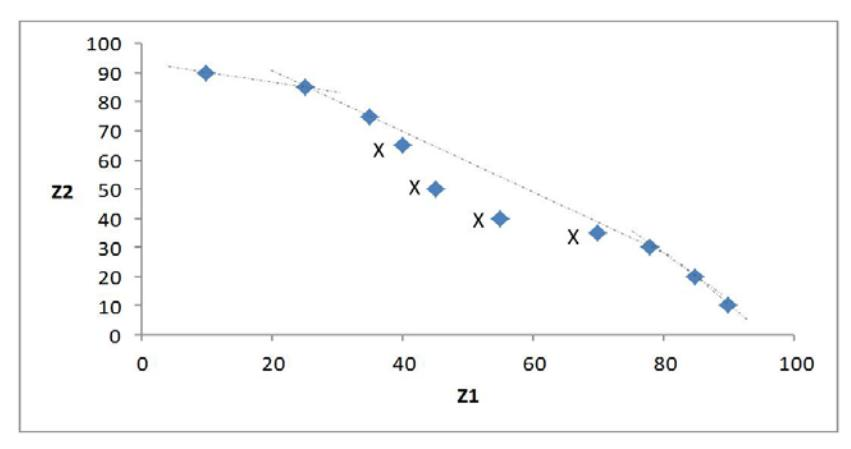

### **Oppgave 1 (10 %)**

a) For å evaluere verdien av mulige naboløsninger må vi kjøre simuleringer for hvert mulige flytt et antall ganger. Dette skiller seg fra et deterministisk optimeringsproblem ved at man ikke får en bestemt verdi av naboløsningen, men et estimat. Dette gjør det vanskeligere å vite hvorvidt naboløsningen faktisk er bedre enn nåværende løsning. Når vi sammenligner to løsninger i en slik sammenheng bruker vi gjerne en t-test, hvor formålet er å kunne si med en gitt sikkerhet at den ene løsningen er bedre enn den andre, eller at differansen mellom dem er forskjellig fra null.

#### Formelt:

- Vi kan definere  $Z_i=X_j-Y_j$ . Da er  $Z_j$  en iid random variabel med  $Eig[Z_iig]=\mu_x-\mu_y$
- Vi kan utføre en hypotesetest for å sjekk om  $\mu_x \neq \mu_y$
- Hypotesetest  $H_0$ :  $E[Z_j] = 0$ ,  $H_1$ :  $E[Z_j] \neq 0$
- To sample T-test for å sjekke om 0 ligger i konfidensintervallet
- b) Hovedproblemet med hypotesetestene skissert over er at man ofte må kjøre veldig mange simuleringer for å få smale nok konfidensintervall til å ekskludere 0 for alle par. Forslag til å gjøre dette mer effektivt inkluderer:
  - Variansreduksjon ved bruk av felles tilfeldige tall. Positiv co-varians gir mindre varians i dette tilfellet.
  - Kjør først et lite antall simuleringer n\_1 for å grovsortere bort de åpenbart dårlige naboene. Kjør deretter n\_2 simuleringer med de gjenværende "gode" naboene for å skille disse fra hverandre. Sparer da n\_2 \* #"dårlige naboer" simuleringer
  - Introdusere en meta-modell, en algebraisk modell som kjapt gir et grovt estimat på verdien av en simulering. Bruk denne til å sortere bort "dårlige naboer". Disse metamodellene kan f.eks være regresjoner, nevrale nettverk, eller helt enkle tommelfingerregler
  - Bruke resultatet fra "Large deviations theory" som sier at hvis vi tillater en feilmargin på "epsilon" i sammenligningen mellom X\_j og Y\_j så konvergerer verdien på simuleringsestimatet vårt eksponensielt. Ved å tillatte denne feilkilden, kan vi bruke færre iterasjoner til å få et estimat +- epsilon på verdien av en løsning. Kan deretter sammenligne løsningsverdiene.

# **Oppgave 2 (15 %)**

a) Scenario-tre benyttes til å beskrive realiseringen av de stokastiske variablene. Scenario-treet gjenspeiler også når hvilken informasjon blir kjent. «In-sample» stabilitet betyr at man skal ha tilnærmet lik løsningsverdi når man trekker nye scenario-tre med antatt samme egenskaper og finner optimal løsning for disse. «Out-of-sample» stabilitet krever at når man tar den optimale (førstestegs) løsningen fra ett av disse treene og setter inn i et av de andre treene, og deretter optimerer, er optimalverdien fremdeles tilnærmet lik. Dersom løsningen ikke har «in-sample» stabilitet eller «out-of-sample» stabilitet, bør man øke antall scenarier i treet for å oppnå begge typer stabilitet.

b)

- Feasibility cuts trenges ikke når det stokastiske problemet kjennetegnes av complete eller relatively complete recourse. I tilfellet complete eller relatively complete recourse finnes det lovlige løsninger i andre steg for hver lovlig første-stegs løsning. L-shaped metoden trenger derfor ikke generere kutt som tvinger første-stegs løsninger inn i det lovlige område.
- 2. Benders dekomponering kan betraktes som et spesialtilfellet av L-shaped metoden, dersom bare optimality cuts trenges.
- c) Stochastic Decomposition er en metode basert på sampling. I hver iterasjon samples én realisering av de stokastiske variablene. Dette samplet brukes til å løse andre stegsproblemet og til å generere kutt (tilsvarende L-shaped). Kutt fra tidligere iterasjoner svekkes, slik at de nyeste (som er basert på mest informasjon) har større betydning. Oppdatert første stegs-problem løses med de nye kutt. Prosedyrene stopper når et statistisk slutt-kriterium er oppfylt.

L-shaped metode er en deterministisk metode, som vil produserer de samme kutt og iterasjonene hver gang, mens Stochastic Decomposition er en stokastisk metode som (i teorien) ikke kan reproduseres.

# **Oppgave 3 (25 %)**

a) Tilleggsnotasjon:

Mengder

 $R_v$  – Et sett med alle ruter r som inneholder veistrekning v,  $R_v \subseteq R$ 

S – Et sett med alle scenarioer (antall passasjerer pr. dag)

Parameter

Tν – Kostand for å frakte en passasjer med taxi på veistrekning ν

 $P_{\nu}^{s}$  – Antall passasjerer pr. dag langs veistrekning  $\nu$  i scenario s

ps – Sannsynlighet for scenario s

Beslutningsvariabler

xr – 1 hvis rute r velges, 0 ellers

 $z_{\nu}^{s}$  – Antall passasjerer som må fraktes med taxi på veistrekning  $\nu$  i scenario s

To-stegs formulering (uten non-anticipativity):

$$\min \sum_{r \in R} C_r \cdot x_r + \sum_{s \in S} p^s \sum_{v \in V} T_v \cdot z_v^s$$

subject to

$$\sum_{r \in R_{v}} Q_{r} \cdot x_{r} + z_{v}^{s} \geq P_{v}^{s} \quad v \in V, s \in S$$

$$x_{r} \in \{0,1\} \quad r \in R$$

$$z_{v}^{s} \geq 0 \quad v \in V, s \in S$$

b) Tilleggsnotasjon:

Mengder

 $R_v$  — Et sett med alle ruter r som inneholder veistrekning v,  $R_v \subseteq R$  Beslutningsvariabler

xr – 1 hvis rute r velges, 0 ellers

Chance constraint formulering:

min

$$\sum_{r \in R} C_r \cdot x_r$$

subject to

bject to

$$\Pr(\sum_{r \in R_v} Q_r \cdot x_r \ge P_v^{s} \quad v \in V, s \in S) \ge 0.9$$

$$x_r \in \{0,1\} \quad r \in R$$

c) En joint chance constraint krever pålitelighet for et helt system, i dette tilfellet tilstrekkelig transportkapasitet i nettverket. Kapasiteten over alle ruter må være større enn etterspørselen med en sannsynlighet på 90%:  $\Pr(\sum_{r \in R_v} Q_r \cdot x_r \ge P_v^s \quad v \in V, s \in S) \ge 0,9.$  Det er derimot krevende å beregne sannsynlighetene for joint chance constraints.

Individuelle chance constraints ser bort fra systemet. For transportnettverket betyr dette at disse chance constraints krever at kapasitet pr. strekning er større enn etterspørselen med sannsynlighet 90%.  $\Pr(\sum_{r \in R_v} Q_r \cdot x_r \geq P_v^S) \geq 0,9 \quad v \in V, s \in S$ . Å oppnå dette for hver strekning garanterer derimot ikke at samlet kapasitet i nettverket (for alle strekningne) dekker all etterspørsel med en sannsynlighet som er større enn 90%. Individuelle chance constraints kan erstattes med en deterministisk beskrankning som representerer p-kvantilen i fordelingsfunskjonen av den stokastiske variablen.

- d) Robust Optimization-modellen vil finne den løsningen, som har den beste målfunksjonsverdien, mens løsningen samtidig tilfredsstiller alle mulige utfall i uncertainty-settene. I eksemplet over vil en RO modell (basert på Soyster, 1973) derfor velge bussrutene slik at kapasiteten for hver veistrekning er større enn den største observerte etterspørselen for denne strekningen. Dette innebærer bl.a. at selv om kun 1 passasjer skal reise én gang mellom to holdeplasser, så vil den optimale robuste løsningen inneholde en bussrute som forbinder disse to holdeplassene (uansett kostnad).
- e) Soyster (1973) betrakter bare kolonnevis usikkerhet. Dette innebærer bl.a. at den optimale løsningen tilfredsstiller den «mest ugunstige» kombinasjonen av koeffisientene i gitte uncertainty-sett. Denne tilnærmingen til Robust Optimization betraktes derfor også som «worst case»-analyse.

Bertsimas og Sim (2004) foreslår en generalisering, som tillater å justere robustheten til den optimale løsningen. Underliggende antakelse er at ikke alle koeffisienter endrer seg samtidig. Reformuleringen introduserer en parameter, som bestemmer hvor mange koeffisienter endres og som kan brukes til å justere den resulterende robustheten mellom den optimale løsningen av LP-problemet og den optimale løsningen av Soysters formulering.

# **Oppgave 4 (20 %)**

a) En løsning, x, kan sies å være Pareto-optimal dersom det ikke eksisterer en annen løsning, y, som dominerer x. For at y skal dominere x må 1) løsning y være minst like god som x målt med alle kriterier (objektiver), og at 2) y er strengt bedre enn x for minst ett av kriteriene,

dvs. 

 $y < ff \left\{\begin{array}{ll} f_i(y) \leq f_i(x), & \forall i \in 1,2,\ldots,k \\ \exists \ j \in 1,2,\ldots,k & f_j(y) < f_j(x) \end{array} \right\}.$ 

Det må altså ikke finnes noen slike løsninger y som tilfredstiller det over for at vi kan se at en løsning x er Pareto-optimal.

b) I  $\varepsilon$ -constrained-metoden velger vi å la én av objektivene bli igjen i målfunksjonen, mens de andre går inn som restriksjoner, én for hvert av de andre objektivene, hvor vi setter en øvre/nedre grense for hver av disse (angitt med  $\varepsilon$ ). Ved å løse problemet som en singel-objektiv-problem en rekke ganger for ulike verdier av  $\varepsilon$ , kan en generere en Pareto-front.

I dette problemet kan vi f.eks. velge å la  $z_1$  være igjen i målfunksjonen, mens vi legger til følgende restriksjon for  $z_2$  (sammen med de andre restriksjonene):

$$z_2 = R_1 x_1 + R_2 x_2 + R_3 x_3 \ge \varepsilon$$

Her blir det en  $\geq$ -restriksjon fordi vi ønsker å maksimere  $z_2$  i motsetning til i forelesningsnotatene hvor vi så på min-problem. Ved å løse dette for en rekke verdier av  $\varepsilon$ , vil en få generert en Pareto-front.

c) Vektet sum-metoden vil ikke være i stand til å finne løsninger i den konvekse delen av Pareto-fronten (den konvekse delen fordi vi ønsker å maksimere både  $z_1$  og  $z_2$ , mens dersom vi ønsket å minimere, ville det vært den konkave delen, som i forelesningsnotatene).

Figuren over illustrerer hvilke løsninger som ligger i den konvekse delen av Pareto-fronten, angitt med X, en ikke vil være i stand til å finne med vektet sum-metoden. Årsaken til dette er at vektingen som benyttes i denne metoden gjør at en i stedet vil finne løsningene i endene av de stiplede linjene i figuren over i stedet for de som ligger under (angitt med X).  $\varepsilon$ -constrained-metoden har ikke denne begrensningen, så en kan derfor fastslå at det er den metoden som er benyttet i denne oppgaven.

d) Evolusjonære (Genetiske) algoritmer har den fordelen, i motsetning til f.eks. både  $\varepsilon$ constrained-metoden og vektet sum-metoden, at den er populasjonsbasert. Det betyr at den

til enhver tid opererer med et sett av løsninger som endrer seg fra en iterasjon til en annen. Det betyr igjen at en kan generere en approksimasjon av Pareto-fronten med én kjøring av algoritmen, mens for de tidligere nevnte metodene må en ha flere kjøringer (f.eks. én for hver verdi av  $\varepsilon$  eller hver kombinasjon av vektene). Spesielt dersom det er mange objektiver vil det kreve mange kjøringer ved bruk av både  $\varepsilon$ -constrained-metoden og vektet summetoden for å får opp hele Pareto-fronten.

I motsetning til f.eks. vektet sum-metoden (men som for  $\varepsilon$ -constrained-metoden) er Evolusjonære (Genetiske) algoritmer mindre sensitiv til formen på Pareto-fronten. De krever gjerne også mindre kunnskap om selve problemet som løses, mens en i vektet sum-metoden og  $\varepsilon$ -constrained-metoden må vite en del om problemet for å kunne sette fornuftige verdier på hhv. vektene og verdiene på  $\varepsilon$ .

## **Oppgave 5 (10 %)**

U B E R tilbyr en app sammen med betalingstjenester, forsikringstjenester, veivisningstjenester og ikke minst kobling av passasjerer til sjåfører. Men i det disse tjenestene ville neppe være verdt mye i seg selv. U B E R kan skape verdi gjennom å utnytte ineffektiv offentlig regulering av taxi-næringen, utnytte nettverkseffekter til å skape dominans som gir mulighet til å i realiteten skattlegge sjåførene, utnytte ledige kapital- og humanressurser sammen med dynamisk prising til å øke verdiskaping i transport. Punktene under forklarer hver effekt:

- Reguleringen av taxi-næringen innebærer at tilbudssiden i markedet er begrenset. (Det utdeles færre løyver enn det er etterspørsel etter.) Det er gjerne også krav til utdanning, vandel og kanskje også til bilene som brukes. Samtidig er det mange som kan kjøre bil og har bil som kan ta passasjerer samtidig som de har behov for inntektsgivende arbeid. (En del av dem er eller har også vært aktive som pirattaxisjåfører.) En viktig bidrag til at det er attraktivt for sjåfører og passasjerer er at den offentlige reguleringen av taxi-næringen gjør at tilbudet er begrenset slik at priser i utgangspunktet ligger høyere enn en vanlig markedslikevekt ville tilsi, samtidig som passasjerer fra tid til annen opplever at det er vanskelig å få tak i taxi.
- Nettverkseffekten er en potensielt svært sterk førstemannsfordel som oppstår når verdien for brukerne av et gode øker når flere bruker det. I dette tilfellet oppstår nettverkseffekten via en vekselvirkning mellom de to gruppene som kobles sammen i appen. Verdien for potensielle passasjerer øker jo flere aktive sjåfører det er i området. Verdien for sjåfører øker jo flere potensielle passasjerer som bruker appen. Nettverkseffekter kan føre til en tilnærmet monopolsituasjon for aktøren som kommer tidlig opp i en kritisk masse. Dersom U B E R kommer i en slik posisjon, vil selskapet kunne ta inn svært mye mer i avgifter fra sine sjåfører enn kostnadene for drift av tjenestene. Selskapet kan bli dominerende sentral for denne typen transport-tjenester og avgiften kan nærmest fungere som en skattlegging av sektoren.
- En del av de som velger å kjøre har ledige ressurser med lave alternativkostnader for kapital og tidsbruk og lavere enn for ordinære drosjer. U B E R vil kunne høste noe gevinst ved å sysselsette disse relativt billige ressursene.
- U B E R driver dynamisk prising. Teknologien i appen identifiserer tilfeller der det er ekstraordinært høy etterspørsel og formidler det via prissignaler til sjåfører. Den offentlige

- reguleringen av taxi-næringen spesifiserer gjerne prisingsregimer som er mye mer rigide. Den dynamiske prisingen via appen vil kunne bidra til bedre markedsklarering enn det som gjerne er alternativet og via avgiftene får U B E R en del av gevinsten inn som kontantstrøm.
- For passasjerer kan det være en fordel å ikke måtte forholde seg til mange ulike taxisentraler. Det gjelder kanskje spesielt på reiser. U B E R tilbyr en felles plattform for ulike steder. Det gir litt lavere transaksjonskostnader for passasjerer.

#### **Oppgave 6 (20 %)**

- a) Verdier i kombinatoriske auksjoner i forhold til å auksjonere objektene hver for seg, ligger i en kombinasjon av komplementære egenskaper for objekter og markedsimperfeksjoner. I noen tilfeller vil en kombinasjon av objekter kunne ha større verdi enn objektene har hver for seg. En tilbyder av mobilnettjenester vil kunne se større verdi i å ha kontroll med frekvensbånd i to regioner, enn to bånd i én region. En kunne tenkt seg at det likevel kunne bli effektiv å auksjonere objektene hver for seg. Dersom byderne hadde rimelig grad av informasjon om verdien av kombinasjoner av objekter, ville de kunne by på enkeltobjekter med tanke på å eventuelt omsette dem senere dersom de ikke skulle få akkurat den kombinasjonen de ønsket. Et effektiv marked ville både sikre høye priser for selger og effektiv allokering av ressursene til slutt. Men det viser seg at det er vesentlige friksjoner i markedene som gjør at det vil være lønnsomt å selge kombinasjoner i første rundet. (Erfaring fra USA tilsier blant annet at prosesser som fordelte frekvensbånd på svært mange aktører, førte til en for stor grad av fragmentering og lite effektiv utnyttelse av frekvensressursene.)
- b) "Private value" bygger på at bydere har en verdi for objektene som de selv kjenner og at verdiene til de ulike byderne er trukket fra en fordeling som er felles kunnskap. Modellen peker mot "revenue equivalence" ved risikonøytralitet. Dersom bydere er risikoaverse vil selger forvente høyere fortjeneste på førsteprisauksjoner enn andreprisauksjoner. Byderne vil nemlig ofre noe forventet gevinst for å øke sannsynlighet for å få gevinst ved å by mer aggressivt. Samtidig vil selger ha mindre risiko siden byderne i førsteprisauksjoner baserer bud på forventede verdier mens salgspris i andreprisauksjoner ender på faktisk verdsetting for nest høyeste byder.

"Common value" bygger på at verdien er den samme for alle, men ikke kjent før budgivning. Byderne er da utsatt for "winner's curse". Tendens til at risikoaverse bydere er forsiktige i budgivning kan da modereres ved prosesser der andre budgiveres verdsetting (delvis) avsløres og andreprisauksjoner kan gi større forventet inntekt enn førsteprisauksjoner selv med risikoaverse bydere.

Det sentrale poenget i "affiliated value model" er at verdien av objektet er usikker for byderne, men verdisignalene er gjensidig avhengige slik at det er en sterk form for korrelasjon mellom dem. Dermed vil bydere oppdatere fordelingen for verdsetting når de får mer informasjon om andre byderes verdisignaler. I denne modellen vil prosesser som legger til rette for "price discovery" være å foretrekke for selger også når bydere er risikonøytrale.

Viktige implikasjoner av modellene for design av kombinatoriske auksjoner gjelder i særdeleshet verdien av "price discovery". En iterativ prosess der verdier avsløres kan være mer kompleks enn for eksempel VCG, men dersom det er vesentlig grad av usikkerhet om faktiske verdier og det er grunn til å tro at de ulike aktørenes verdsettinger vil komplementere hverandre slik at når de avsløres får aktører bedre estimater på faktisk verdi, vil det kunne være lønnsomt med de mer kompliserte prosessene som legger til rette for "price discovery".

c) VCG er den kombinatoriske varianten av lukket andreprisauksjon. Bydere legger inn prisbud på alle kombinasjoner de er interessert i. Vinnere bestemmes av et vanlig "winner determination problem", som maksimerer inntekten selger ville hatt dersom bydere betalte faktiske bud. Prisene som betales bestemmes imidlertid som alternativkostnaden til hver vinners seier. Det vil si de betaler det som ville vært vinnende bud for det de vinner hvis de ikke hadde deltatt i auksjonen. I en slik auksjon er det en dominant strategi gå by sin egen verdsetting.

CC er en iterativ auksjon i to hovedfaser. I første fase er det prisklokker for hvert produkt (som kan være kombinasjoner, men ikke nødvendigvis alle mulige kombinasjoner). Bydere melder inn kvantiteter de ønsker å kjøpe til prisen angitt av klokkene. Prisene øker for hver runde så lenge det er overskuddsetterspørsel. Det er en aktivitetsregel som skal hindre at noen spekulerer i å holde tilbake bud inntil slutten. Regelen skal tvinge fram budgivning i tråd med fallende etterspørselskurver – slik at du ikke skal kunne etterspørre mer når prisene totalt går opp. (Men det er utformet slik at det er mulig å etterspørre mer av en kombinasjon som følge av at prisene på andre er gått opp.) Prosessen tvinger fram informasjon om verdsetting slik at det legges til rette for "price discovery". Etter klokkefasen er det mulighet til å by på kombinasjoner som evt. kan endre allokering ift løsningen. (Etter klokkefasen er det ikke nødvendigvis balanse mellom tilbud og etterspørsel etter alle objekter.) Vinnere og betaling bestemmes tilsvarende som for VCG, men det er foreslått en løsning som kalles "Vickrey nearest core pricing". Den unngår problemet med at i VCG kan betalingen bli lavere enn totale bud gitt for objektene i kombinasjonen ved å kreve at løsningen er i "core" – kjernen. Og for å få unik løsning velges punktet nærmest VCG-punktet (i euklidsk distanse).

Selskapene har hatt store problemer med å finne gode estimater for verdier av frekvensbånd. Verdiene har variert mye selv blant rimelig like selskap. Den naturlige forklaringen på bruken av CC er at den legger til rette for en prosess der verdiene til andre selskaper avsløres i en iterativ prosess slik at selskapene kan oppdatere sine verdier. Vurderingen som ligger til grunn må antas å være at "affiliated model" passer relativt godt i dette tilfellet.