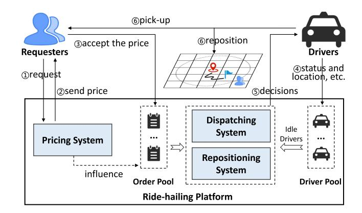
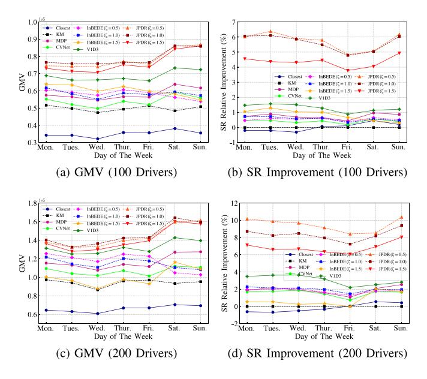
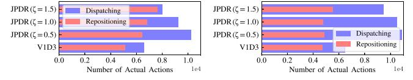
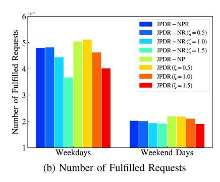
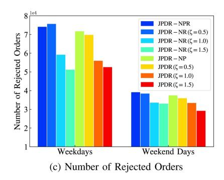
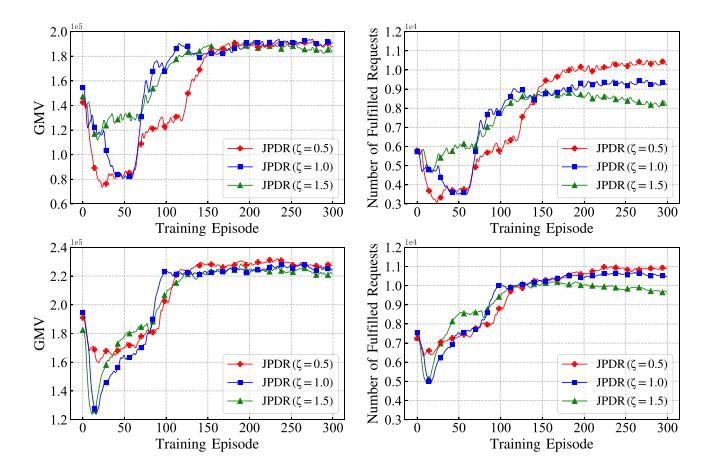

# Joint Optimization of Pricing, Dispatching and Repositioning in Ride-Hailing With Multiple Models Interplayed Reinforcement Learning

Zhongyun Zhang, Lei Yang <sup>10</sup>, Jiajun Yao <sup>10</sup>, Chao Ma <sup>10</sup>, Member, IEEE, and Jianguo Wang, Member, IEEE

Abstract—Popular ride-hailing products, such as DiDi, Uber and Lyft, provide people with transportation convenience. Pricing, order dispatching and vehicle repositioning are three tasks with tight correlation and complex interactions in ride-hailing platforms, significantly impacting each other's decisions and demand distribution or supply distribution. However, no past work considered combining the three tasks to improve platform efficiency. In this paper, we exploit to optimize pricing, dispatching and repositioning strategies simultaneously. Such a new multi-stage decision-making problem is quite challenging because it involves complex coordination and lacks a unified problem model. To address this problem, we propose a novel Joint optimization framework of Pricing, Dispatching and Repositioning (JPDR) integrating contextual bandit and multi-agent deep reinforcement learning. JPDR consists of two components, including a Soft Actor-Critic (SAC)-based centralized policy for dispatching and repositioning and a pricing strategy learned by a multi-armed contextual bandit algorithm based on the feedback from the former. The two components learn in a mutually guided way to achieve joint optimization because their updates are highly interdependent. Based on real-world data, we implement a realistic environment simulator. Extensive experiments conducted on it show our method outperforms state-of-the-art baselines in terms of both gross merchandise volume and success rate.

Index Terms—Ride-hailing, supply-demand imbalance, multi-stage decision-making, joint optimization, reinforcement learning.

#### I. INTRODUCTION

HE booming of information technology has prompted significant changes in business models in many industries as well as the emergence of popular online ride-hailing platforms such as DiDi, Uber and Lyft. With the support of these platforms,

Received 6 January 2024; revised 12 August 2024; accepted 10 September 2024. Date of publication 19 September 2024; date of current version 13 November 2024. This work was supported in part by NSFC and Hong Kong RGC Collaborative Research Scheme under Grant 62321166652, in part by the Guangdong Basic and Applied Basic Research Foundation under Grant 2022A1515010374, in part by the Hong Kong RGC Theme based Research Scheme (TRS) under Grant T43-513/23-N, in part by the Natural Science Foundation of Hubei Province under Grant 2022CFB012, and in part by Fundamental Research Funds for the Central University under Grant CXTD202406. Recommended for acceptance by Kai Zheng. (Corresponding author: Lei Yang.)

Zhongyun Zhang, Lei Yang, and Jiajun Yao are with the School of Software Engineering, South China University of Technology, Guangzhou 510641, China (e-mail: 202120146095@mail.scut.edu.cn; sely@scut.edu.cn; 201810102795@mail.scut.edu.cn).

Chao Ma is with the School of Cyber Science and Engineering, Wuhan University, Wuhan 430072, China (e-mail: chaoma@whu.edu.cn).

Jianguo Wang is with the Department of Computer Science, Purdue University, West Lafayette, IN 47907 USA (e-mail: csjgwang@purdue.edu).

Digital Object Identifier 10.1109/TKDE.2024.3464563



Fig. 1. Common process in the ride-hailing platform.

people receive far fewer restrictions on transportation and can travel and socialize more efficiently and conveniently. Such platforms provide instant services for passengers by matching them with drivers, i.e., dispatching their orders to suitable drivers. However, implementing a platform with high efficiency is extremely challenging due to two objective reasons: (i) The rejections of drivers may occur when orders are not attractive enough to drivers. This phenomenon usually stems from the discrimination and prejudice of drivers against passengers or orders [1]. (ii) The limited available drivers in the platform have trouble serving all dynamically incoming orders. Although tens of thousands of orders are served every day, the supply-demand mismatch persists.

In practice, the imbalance between pending orders and drivers makes it difficult to effectively utilize vehicle resources, and thus the number of completed orders is greatly reduced. Besides, the highly uncertain spatio-temporal dynamics of order occurrence and driver status, which are hard to coordinate, also pose great challenges. In an environment with high dynamics like the online ride-hailing marketplace, how to take advantage of rich real-time information to reduce the gap between limited supply and inconstant demand has received extensive attention [2], [3]. In this paper, we focus on alleviating the supply-demand imbalance to improve the efficiency of ride-hailing platforms by considering the joint optimization of pricing, order dispatching and vehicle repositioning, and propose a novel framework to realize this goal.

1041-4347 © 2024 IEEE. Personal use is permitted, but republication/redistribution requires IEEE permission. See https://www.ieee.org/publications/rights/index.html for more information.

As shown in Fig. 1, in a typical ride-hailing platform, when a potential passenger submits a trip request (i.e., specifies his/her origin and destination), he/she receives a quote and then chooses whether to accept it [4]. If not, it means the requester refuses to trade, and the request will not be converted into a pending order. Every once in a while, when there are pending orders and idle drivers, order dispatching and vehicle repositioning are performed. Pricing [5], [6], [7] is more than a means that controls the conversion from customer requests to platform orders through the price sensitivity of requesters. It has a significant impact on subsequent decisions because it changes the distribution of orders in the platform. Order dispatching [1], [2], [3], [7], [8], [9], [10], [11], [12], [13], [14], [15], [16], [17], [18], [19], [20], [21], [22], [23], [24], [25], [26] aims to assign orders to suitable idle drivers. Ideal dispatching decisions should be solved based on current supply and demand distributions and be beneficial in the long term. Vehicle repositioning [24], [25], [27], [28], [29], on the other hand, aims to guide surplus idle vehicles to specific locations with more potential passengers in the future. Intuitively, current dispatching and repositioning actions directly change the current locations and future spatial distribution of drivers, indirectly impacting the outcome of future decisions. Specifically, the resetting of drivers' locations will directly affect subsequent pricing decisions. A typical instance is the surge pricing mechanism [5] used by Uber.

Obviously, pricing, dispatching and repositioning are closely related. Their correlation is manifested in two ways explained above: one is that they all can regulate the relationship between supply and demand, and the other is that they influence each other's decision-making. Thus, joint optimization of multiple tasks is proposed. It expects to jointly optimize multiple related tasks to yield better decisions that cannot be achieved by optimizing a single task. However, previous works either optimized one of these tasks individually [3], [20], [21], [22], [27], [28], [29], [30] or jointly optimized dispatching and repositioning [2], [24], [25], [31] (or pricing [7]), ignoring the vital correlation of these three tasks. Therefore, there is inspiring room for optimization in present solutions. Motivated by this, we explore the joint optimization of pricing, dispatching and repositioning to improve the long-term efficiency of ride-hailing platforms. Note that prior works solved single-task optimization or two-task joint optimization problems while we are dealing with a three-task one, which is more comprehensive but also more complex and difficult because of the following challenges:

- First, although pricing, dispatching and repositioning are highly related, they are essentially different, so it is hard to find an effective way to connect them so that they are synergistically optimized towards a same goal. In other words, the joint optimization of pricing, dispatching and repositioning is difficult to be well modeled.
- Second, the execution of decisions is sequential and irreversible. Only after pricing has determined the orders in the platform can dispatching and repositioning be performed. Thus this problem involves both multi-stage decision-making and complex collaboration.
- Third, the whole decision-making process is highly spatiotemporally dynamic, which poses a great challenge to our


Fig. 2. Example of jointly optimizing pricing, dispatching and repositioning.

TABLE I EXAMPLE OF IDEAL OPTIMAL JOINT DECISIONS

| Request | Route                 | Pricing | Order    | Dispatching       | Repositioning           |
|---------|-----------------------|---------|----------|-------------------|-------------------------|
| $r_1$   | $H_1 \rightarrow H_2$ | $p_1$   | <b>√</b> | $\checkmark(d_1)$ | $d_1(\mathbf{X})$       |
| $r_2$   | $H_1 \to C_2$         | $p_2$   | Х        | Х                 | $d_2(X)$                |
| $r_3$   | $C_1 \to H_2$         | $p_3$   | ✓        | $\checkmark(d_2)$ | $d_3$ (uncertain)       |
| $r_4$   | $C_1 \to C_2$         | $p_4$   | ✓        | uncertain         | $d_4 (\rightarrow H_1)$ |

research. Besides, any decision must be made in milliseconds so as to respond to customers in real time.To further illustrate the difficulty and significance of jointly optimizing pricing, order dispatching and vehicle repositioning, we present a toy example below.

Example 1: As shown in Fig. 2, there are 4 requests  $r_1$ ,  $r_2$ ,  $r_3$  and  $r_4$  with the same base price and 4 idle drivers  $d_1$ ,  $d_2$ ,  $d_3$  and  $d_4$ .  $H_1$  and  $H_2$  are hot areas of undersupply, and  $C_1$ and  $C_2$  are cold areas of oversupply. The ideal optimal joint decisions are given in Table I. The second column provides directional information from the origin to the destination of each request. Naturally, pricing for the requests should lead to  $p_3 < p_1 < p_4 < p_2$ . Understandably,  $r_3$  is the best request because it has the best impact on the supply-demand relationship. Thus, offering a discount to facilitate its conversion into an order is better. In this way, the proportion of high-quality orders can be increased, which leads to better dispatching results and eases the supply-demand imbalance. We hope that  $r_1$  and  $r_3$  are converted into orders and dispatched to drivers  $d_1$  and  $d_2$ , respectively. However, careful consideration is needed to determine whether  $r_4$  should be dispatched to  $d_3$ . For  $d_4$  who is redundant, repositioning him/her to  $H_1$  is the best option. Hence, the distributions of supply and demand are closer, which can alleviate price differences caused by the supply-demand imbalance and reduce the number of repositioning drivers. Without considering the joint optimization,  $r_2$  and  $r_4$  may be converted into orders and dispatched to  $d_1$  and  $d_3$  , respectively. Excessive drivers may also receive poor repositioning instructions. Therefore, jointly optimizing pricing, order dispatching and vehicle repositioning is necessary. However, it is difficult to model the impacts of tasks. Besides, designing a method that leverages the deep inter-influences across different tasks to achieve joint optimization is challenging as it involves collaborating multiple decision-making components.

To address the complex joint optimization problem, we propose a novel  $\underline{J}$  oint optimization framework of  $\underline{P}$  ricing,  $\underline{D}$  is patching and  $\underline{R}$  epositioning (JPDR) which integrates multiple reinforcement learning (RL) models. In summary, the main contributions of this paper are listed as follows:

- We identify a new multi-stage decision-making problem in ride-hailing, namely the joint optimization of pricing, dispatching and repositioning. To our knowledge, this is the first work that proposes and explores to improve the long-term efficiency of ride-hailing platforms using such joint optimization.
- We propose a novel joint optimization framework, named JPDR, which (i) integrates contextual bandit (i.e., associative RL [32]) and deep RL to address the complex joint optimization problem and (ii) aims to ease the supplydemand mismatch and improve the long-term efficiency of ride-hailing platforms.
- Based on real-world taxi trip record data in New York City, we implement a realistic environment simulator. Extensive experiments conducted on the simulator show that JPDR outperforms state-of-the-art methods, demonstrating that the synergy of pricing, dispatching and repositioning is effective in improving system efficiency.

#### II. RELATED WORK

Pricing, order dispatching and vehicle repositioning are core modules of ride-hailing systems [\[4\]](#) and the major decision-making tasks that affect platforms' efficiency.

## A. Pricing

Pricing is a point of concern as it is closely related to the interests of the three parties (i.e., passengers, drivers and the platform) involved in ride-hailing services. Some works [6], [7], [33] provided analysis that pricing has significant impacts on coordinating supply and demand and improving platform efficiency. Due to the important role in regulating supply and demand, RL-based dynamic pricing has been widely discussed. Chen et al. [7] measured the value of a request by considering its base price and future effect and proposed a new framework that integrated contextual bandit with Temporal-Difference (TD) learning for pricing and dispatching. Differently, Chen et al. [33] only discussed the pricing problem and proposed a RL-based spatio-temporal pricing method.

## B. Order Dispatching

Order dispatching has always been a hot topic since the emergence of ride-hailing services. Prior studies focused on finding drivers with the shortest pick-up time [34], [35] for passengers. However, these real-time methods made the global optimization of the dispatching scheme unreliable. Considering this deficiency, Seow et al. [36] designed a cooperative multi-agent dispatching system, which processed orders in a globally optimized manner. Nevertheless, in the driver-select-order mode [8], [13], [14], these studies ignored the preference of drivers to orders, leaving many orders unfulfilled. To address this issue, Zhang et al. [13] constructed a combinatorial optimization based on a preference prediction model, optimizing the success rate of orders. Then, an extended work [8] proposed a many-to-many dispatching model to supplement it. However, they both did not constrain the pick-up distance, which may lead to long waiting

time for passengers and high costs for drivers. In terms of fairness [1], [15] and auction [17], [37], there are also many exploratory studies.

However, the impact of current decisions on future decisionmaking was ignored in the above works. Many later works attempted to take such long-term effect into account when solving dispatching decisions. For example, Shi et al. [16] pointed out that one of the shortcomings in [15] was the myopic nature. To refine the issues in [15], they proposed a novel RL-based fair dispatching method. Similarly, to ensure the long-term benefits of dispatching, Xu et al. [20] proposed a method that combined offline learning with online planning based on RL and centralized combinatorial optimization. In [21], a Double Q-learning Network (DDQN)-based method with Kullback-Leibler divergence optimization was developed. Tang et al. [3] introduced an extension of the method proposed in [20]. Memory-based neural networks and transfer learning were integrated to increase the robustness against adversarial perturbation and noises as well as the learning adaptability across cities. Liu et al. [23] proposed a forward-looking real-time dispatching method combined with global optimization.

## C. Vehicle Repositioning

Vehicle repositioning, also known as fleet management, has been extensively explored recently. Previous methods generally directed drivers to areas with high potential demand and dispatched orders to drivers in a simple way. Typically, Oda and Joe-Wong [27] proposed a novel model-free learning approach based on distributed Deep Q-Network for repositioning. Similarly, He et al. [28] developed a DDQN-based learning framework to solve the repositioning problem. However, these studies were defective because they overlooked the road network connectivity and did not well coordinate available divers. To address these limitations, Liu et al. [29] proposed a context-aware repositioning method. The above studies all utilized RL to learn to solve optimal repositioning decisions. However, they only used simple local and greedy heuristics like nearest dispatching to match orders and drivers. Thus, the order dispatching solutions yielded are usually suboptimal. Besides, these works always selected the optimal decision greedily, which easily leads to the over-reaction phenomenon [38]. Therefore, Jiao et al. [38] employed a value-based stochastic policy in their proposed new framework. In reality, drivers do not always follow relocation guidelines. Wei et al. [39] considered a more realistic scenario in which drivers might refuse repositioning instructions, presenting a RL and prediction-based lookahead policy for repositioning.

## D. Joint Optimization

Recently, some significant and noteworthy studies [2], [7], [10], [24], [25], [31] have proposed and explored the joint optimization of the above tasks. Jin et al. [24] studied the joint optimization of dispatching and repositioning, proposing a hierarchical RL-based decision-making framework. The framework employed two layers of agents, aiming at obtaining optimal decisions by collaborative learning. Chen et al. [7] explored the joint optimization of pricing and dispatching and proposed a

novel joint framework based on contextual bandit and TD learning. Considering the shortcomings of existing works in handling complex interactions between repositioning and dispatching as well as capturing real-time supply-demand information, Tang et al. [2] combined offline RL and online RL to optimize the decision-makings of both dispatching and repositioning, making outstanding contributions in terms of applicability and performance improvement. In addition, Sun et al. [10], Holler et al. [31] and Gao et al. [25] made meaningful efforts in the same aspect.

However, these works overlooked the correlation of pricing, dispatching and repositioning. Most existing studies focused on single-task optimization, and a few works involved two-task optimization. Thus, there is potential room for improvement. In this paper, we study a three-task optimization problem, the joint optimization of pricing, dispatching and repositioning, which is more complex but logically improvable. This is a new and meaningful research question that has not been discussed.

### III. PROBLEM STATEMENT

#### A. Preliminaries

In this paper, we consider an online ride-hailing system in a city, which includes a set of drivers  $\mathcal{K} = \{\kappa | \kappa = 1, 2, \dots, K\}$  in which the status of each driver changes constantly and a dynamically changing set of pending orders converted from customer requests. We divide the city into G uniform rectangular grids to obtain a grid map  $\mathcal{G} = \{g | g = 1, 2, \dots, G\}$ . Each grid  $g \in \mathcal{G}$  has unique supply and demand characteristics that change over time, thus influencing the decision-making for ride-hailing systems. Similarly, the time horizon of one day is discretized into T time slots of equal length, denoted as  $\mathcal{T} = \{t | t = 1, 2, \dots, T\}$ . At the end of each time slot  $t \in \mathcal{T}$ , the platform performs order dispatching or repositioning for idle drivers. Differently, pricing is ongoing. Trip information, including price and travel distance, etc., needs to be delivered to the customer immediately once the platform receives a trip request from a potential passenger. If the customer accepts the price, then the request will be turned into an order. As usual, an online drivers has two service states, i.e., occupied (on-service) and idle. Specially, if a driver is repositioning to a location, we assume he/she is serving a fake order and is occupied. Below, we introduce several important definitions.

Definition 1: (Request) A trip request i is converted into an order only after the requester confirms the deal. A request i is denoted as a tuple  $< o_i, d_i, p_i >$ , where  $o_i, d_i, p_i$  represent the origin, destination and base price of i separately.

The origin  $o_i$  and destination  $d_i$  are both binary tuples which consist of a longitude and a latitude. The base price  $p_i$  of each request i is related to i's trip distance and travel time. The specific calculation details are explained in Section III-B.

Definition 2: (Order) An order j converted from a request i is denoted as a tuple  $< o_j, d_j, p_j >$ , where the elements other than  $p_j$  are the same as those of i.  $p_j$  represents the price of j, which is the product of  $p_i$  and a pricing factor  $c_i$ .

After receiving a trip request i from a potential passenger, the platform selects a pricing factor  $c_i$  for the request i. The price of the request is set to  $c_ip_i$ . If the passenger accepts the price, the

request i will turned into a pending order j in the platform. In particular, there is a special class of orders, called virtual orders. They are used to guide drivers to do repositioning, and their valid characteristics consist only of origins and destinations.

Definition 3: (Driver) A driver  $\kappa$  is denoted as a tuple  $< \upsilon_{\kappa}^t, l_{\kappa}^t, \tau_{\kappa}^t >$ , where  $\upsilon_{\kappa}^t$  and  $l_{\kappa}^t$  represent the status and location of  $\kappa$  at time slot t, and  $\tau_{\kappa}^t$  represents the idle time since  $\kappa$  completed the last order.

Each driver has two statuses, i.e., occupied and idle. Only idle drivers can participate in the decision-making process. In particular, repositioning only applies to drivers whose cumulative idle time  $\tau_{\kappa}^t$  is greater than a threshold. The aim is to prevent drivers from repositioning frequently.

Definition 4: (Gross Merchandise Volume) Gross merchandise volume (GMV) is defined as the sum of the transaction prices of all fulfilled orders.

*Definition 5:* (Success Rate) Success rate (SR) is defined as the percentage of fulfilled requests over all requests.

GMV is closely related to the economic benefits of both the platform and drivers, and SR has significant impacts on the passenger experience and platform reputation. Our goal is to optimize GMV and SR from a long-term perspective. In other words, we aim to maximize the GMV and SR for a whole day rather than for a decision-making slot.

#### B. Problem Formulation

For the joint optimization problem of pricing, order dispatching and vehicle repositioning, we formulate it with the goal of optimizing the city-scale long-term GMV and SR. There are two decision variables in our problem: (i) The first is the pricing factor  $c_i$ . After a request i is submitted, the pricing strategy selects a pricing factor  $c_i$  from a discrete value set  $\mathcal{C} = \{0.85, 0.9, 0.95, 1, 1.05, 1.1, 1.15\}$  [7] according to i's contextual features. The final trip fee is the product of i's base price  $p_i$  and  $c_i$ . If the requester accepts the price, i then transforms into an order j. (ii) The second is the dispatching decision  $b_{j\kappa}$ , which is a binary variable that indicates whether the order j is dispatched to the driver  $\kappa$ . Repositioning can be viewed as a special type of dispatching that is performed between idle drivers and fake orders. For simplicity, we also use  $b_{j\kappa}$  to represent the repositioning decision.

Given a pricing factor  $c_i$  chosen from  $\mathcal{C}$  according to the request i's context feature vector  $x_i$ . Let  $F(x_i, c_i)$  denote the probability that a request i is converted into an order when the pricing factor is  $c_i$ , i.e., the probability that the requester accepts the price  $c_i p_i$ . Then, the expected immediate gain of the request i can be expressed as:

$$u(x_i, c_i) = F(x_i, c_i) c_i p_i$$

$$= F(x_i, c_i) c_i (\mu DIS_{i} + \omega DUR_{i}),$$
 (1)

where  $DIS_i$  and  $DUR_i$  represent the estimated trip distance and estimated travel time of i.  $\mu$  and  $\omega$  represent the unit distance fee and unit time fee, and  $c_ip_i$  is the transaction price of i, i.e., the price  $p_i$  of the order j converted from i.

On the other hand, we consider the future effect of each request which is mainly manifested in the change of the driver'slocation. In general, a request that can direct a driver to a high-demand area is better. Here, we use an advantage function to estimate the total gain of a request being fulfilled. If a request i successfully transforms into an order that is fulfilled by a driver  $\kappa$  at time slot t, the advantage is the sum of the immediate gain of fulfilling the request i and the future effect of repositioning the driver  $\kappa$ , being formulated as:

$$GAIN_{i\kappa} = c_i p_i + \gamma^{\Delta t} V_{\phi}\left(s\left(d_i\right)\right) - V_{\phi}\left(s\left(l_{\kappa}^t\right)\right), \quad (2)$$

where  $\Delta t$  is the trip duration of i, and its value indicates the number of time slots consumed.  $\gamma$  is a discount factor and satisfies  $0<\gamma\leq 1$ .  $V_\phi$  is a value function that can assess whether the environment the driver is in is good or bad. In our definition,  $V_\phi$  is equivalent to the state value function in RL. For any initial state s,  $V_\phi(s)$  is the expected cumulative reward that a driver can obtain from s to termination.  $s(d_i)$  is the destination state of the request i, and  $s(l_\kappa^t)$  indicates the current state of the driver  $\kappa$ . Such states contain spatio-temporal information and supply-demand features.

The advantage in (2) can be seen as the difference between the expected gain of serving the request i and the expected gain of rejecting to serve the request i [20]. Based on the definition of the advantage function, the calculation of the expected total gain of a request i served by a driver  $\kappa$  can be written as:

$$u'(x_{i}, c_{i}) = F(x_{i}, c_{i}) GAIN_{i\kappa}$$

$$= u(x_{i}, c_{i}) + F(x_{i}, c_{i}) \left(\gamma^{\Delta t} V_{\phi}(s(d_{i}))\right)$$

$$- V_{\phi}(s(l_{\kappa}^{t}))\right). \tag{3}$$

 $u'(x_i,c_i)$  incorporates the trip price and the future effect on drivers of the request i, which correspond to the two metrics GMV and SR, respectively. At each time slot, the goal of the joint optimization problem is to find the best joint decisions to optimize the expected global gain in a coordinated way, i.e.,

$$\underset{c_{i},b_{i\kappa}}{\operatorname{arg\,max}} \sum_{i\in\mathcal{I}_{t}} \sum_{\kappa\in\mathcal{K}_{t}} u'\left(x_{i},c_{i}\right)b_{i\kappa},\tag{4}$$

s.t. 
$$\sum_{i \in \mathcal{I}_t} b_{i\kappa} \le 1, \ \forall \kappa \in \mathcal{K}_t,$$
 (5)

$$\sum_{\kappa \in \mathcal{K}_{t}} b_{i\kappa} \le 1, \ \forall i \in \mathcal{I}_{t}, \tag{6}$$

$$euclidean(l_{\kappa}^t, o_i) \leq MD, \ \forall i \in \mathcal{I}_t, \kappa \in \mathcal{K}_t, \quad (7)$$

$$c_{i}p_{i}(1 - \eta) - \beta DIS_{i} \geq 0, \ \forall i \in \mathcal{I}_{t},$$
(8)

where  $b_{i\kappa} \in \{0,1\}$  and  $c_i \in \mathcal{C}.\mathcal{I}_t$  is the set of requests generated during time slot t, and  $\mathcal{K}_t$  is the set of idle drivers at time slot t. Constraint (5) indicates that a driver can get at most one request, and (6) indicates that a request can be assigned to at most one driver.  $euclidean(l_{\kappa}^t, o_i)$  is the euclidean distance between i and  $\kappa$ , i.e., the pick-up distance. MD is a threshold that prevents long waiting time for passengers and excessive pick-up costs for drivers.  $\eta$  indicates the percentage of bonus taken by the platform, and  $\beta$  is the unit trip cost such as fuel consumption and maintenance costs. Constraint (8) indicates that the profit of each dispatching should be greater than 0.


Fig. 3. Overall framework of JPDR. The framework provides instant pricing for requests that appear in real time and makes dispatching and repositioning decisions at the end of each time slot.

#### IV. METHODOLOGIES

In this section, we show how the joint problem is solved with contextual bandit and multi-agent deep reinforcement learning. Due to the irreversibility of the sequence in which the tasks are executed, we consider the whole problem from a two-stage perspective. The first stage is the feature-aware dynamic pricing, and the second stage is the batched dispatching that is fused with repositioning.

#### A. Overall Framework

As shown in Fig. 3, JPDR mainly consists of two modules. One is the contextual bandit for pricing, and the other is the action selector based on the Soft Actor-Critic (SAC) algorithm [40] for dispatching and repositioning. Once a new request emerges, the bandit  $\vartheta$  will choose a pricing factor according to the request's context features x. A price is then calculated and returned to the requester. If the quote is accepted, the request will then be converted into a pending order. The demand predictor and the supply estimation component are used to enrich the context information of requests. At the end of each time slot t, the actor policy  $\pi_{\psi}$  selects an action for each idle driver  $\kappa$  according to the observation  $o_{\kappa}^t$ . In the process, an invalid action mask vector is generated for each driver based on (7) and (8). Based on the taken action, a real or fake order is dispatched to the driver. Then, drivers who receive orders set off to pick up passengers or perform repositioning. The collected pricing records and driver trajectory experiences are stored and used to update the contextual bandit and SAC models, respectively.

The key idea of the solution is that multiple RL models learn towards a common goal in interaction. The future effect of pricing is estimated by a value function  $V_{\phi}$ , which is dependent on the dispatching model. As a result, the dispatching model influences the decision-making and training of the pricing model. Meanwhile, owing to the control for request conversion, the pricing model also impacts the outcome of dispatching. That is, in essence, these components learn in a mutually guided way to achieve joint optimization because their updates are highly interdependent. The details and training procedure of JPDR are given in the following parts.

## B. Feature-Aware Dynamic Pricing

In the ride-hailing marketplace, customer requests come in real time. Whenever a potential passenger initiates a trip request, information such as trip fee (i.e., quote) and estimated trip distance needs to be made available to the passenger immediately. Therefore, pricing should be carried out immediately by a consistent model rather than solving an optimization in real time. In our setting, the pricing strategy consists of two components: a base price and a pricing factor. The former is determined by the travel distance and travel time, while the latter is related to the the context features of the request.

a) Contextual Bandit for Pricing: In practice, pricing a request should be made based on the request's characteristics, because the context feature of the request determines its quality. In general, a request that can guide a driver from a grid where supply exceeds demand to a grid where demand exceeds supply is better. Inspired by a significant work [7], we regard the pricing for requests as a contextual bandit problem and adopt the LinUCB algorithm [32] to solve it. We emphasize that although JPDR follows the pricing practice of this work [7], our work diverges significantly from it in terms of both the research problem and method framework. Each pricing factor  $c \in \mathcal{C}$  is viewed as an arm which may be selected. Let  $x_i$  be the context feature vector of i. For any request i, we assume the expected payoff of an arm  $c \in \mathcal{C}$  is a linear function of the d-dimensional context feature  $x_i$ , i.e.,

$$\mathbb{E}\left[u'\left(x_{i},c\right)|x_{i}\right] = x_{i}^{\top}\vartheta_{c},\tag{9}$$

where  $\vartheta_c$  represents the true coefficients of the arm c.

After collecting a series of pricing records in the form of  $(x_i,c_i,u'(x_i,c_i))$  composed of context vectors, performed arms and corresponding expected payoffs,  $\vartheta_c$  of any arm  $c \in \mathcal{C}$  can be estimated. Let  $D_c$  be a feature matrix of dimension  $e \times d$ , whose rows correspond to the d-dimensional context feature vectors of e requests. The estimated coefficients  $\hat{\vartheta}_c$  of the arm c can be fitted by applying ridge regression, i.e.,

$$\hat{\vartheta}_c = \left(D_c^{\top} D_c + I_d\right)^{-1} D_c^{\top} u_c, \tag{10}$$

where  $u_c$  is a e-dimensional payoff vector, and each element of  $u_c$  corresponds to a row in  $D_c$ .  $I_d$  is an  $d \times d$  identity matrix. Furthermore, the optimal pricing factor  $c_i$  can be calculated by the following formula:

$$c_i = \operatorname*{arg\,max}_{c \in \mathcal{C}} \left( x_i^{\top} \hat{\vartheta}_c + \alpha \sqrt{x_i^{\top} A_c^{-1} x_i} \right), \tag{11}$$

where  $A_c = D_c^{\top} D_c + I_d$ , and  $\alpha = 1 + \sqrt{\ln(2/\delta)/2}$  is a constant with  $\delta > 0$ .

b) Context Features & Supply-demand Estimation: Each request i is characterized by a context feature vector  $x_i$ .  $x_i$  consists of the time slot i emerges, i's origin and destination grid indexes, i's estimated travel distance, i's trip duration, i's base price and supply-demand information around i's origin and destination. Most of these features can be calculated in real time, except for the supply and demand information around the destination, which involves complex prediction across space and time. Fig. 4(a) depicts the changing trend of green taxi requests


Fig. 4. (a) Green taxi trip demand pattern in New York City. (b) Structure details of the CNN-based demand predictor.

in New York City from 1/4/2016 to 1/10/2016. It is easy to find that the changing pattern of requests presents strong temporal regularity and consistency. The weekday demand curves almost exactly overlap, and the weekend demand curves also fit well.

To predict future demand distribution across the whole grid map  $\mathcal{G}$ , we build a predictor based on a convolutional neural network (CNN). Here, we use the number of requests to measure demand due to the lack of historical conversion data from requests to orders. The output of the CNN network is a  $47 \times 48$  matrix in which each entry is the amount of future requests within a grid in the next 10 minutes. The input is seven  $47 \times 48$  planes that contain important environment features and historical information. We capture the daily periodicity by integrating the day of the week, hour of the day and period of the hour. The environmental features include the weather type, temperature and wind speed. The historical information refers to the historical average demand distributions at different periods. Fig. 4(b) shows the structure details of the predictor.

Once obtaining the estimated number of future requests in any 10-minute interval, we can get the number  $\hat{N}_g^t$  of each grid's requests at each time slot t within this interval by averaging. For each grid g, the estimated number of idle drivers at time slot t is the sum of the number of surplus drivers at time slot t-1 and the number of drivers arriving in g at time slot t, i.e.,  $\hat{P}_g^t = P_{stay}^{t-1} + P_{arrive}^t$ . The number of surplus drivers at time slot t-1 is estimated by the formula:  $P_{stay}^{t-1} = \max(\hat{P}_g^{t-1} - \hat{N}_g^{t-1}, 0)$ . By iterating the calculation steps, the number of drivers in any future slot can be estimated.

# C. Dispatching Fused With Repositioning

a) Partially Observable Markov Decision Process: Dispatching and repositioning occur at the end of each time slot. For dispatching and repositioning problems, modeling the entire platform as an agent [27], [28], [29], [33] is a feasible solution, while this practice leads to the risk of facing complex definitions of actions, states and rewards because of the global view setup. To simplify the RL modeling and implementation, some admirable works [2], [26] adopt a multi-agent reinforcement learning setting, which is also applied to design JPDR. We treat each driver  $\kappa \in \mathcal{K}$  as an agent, and we consider the activity of each driver as a Partially Observable Markov Decision Process (POMDP). The definitions of other major components are listed as follows.

• Observation & State: At the end of each time slot t, the observation  $o_{\kappa}^{t}$  of each agent  $\kappa$  is a 4-dimensional vector,

i.e.,  $o_{\kappa}^t = [t, g_{\kappa}^t, n_{\kappa}^t, m_{\kappa}^t]$ , where the elements represent the time slot index, index of the grid where  $\kappa$  is located, number of idle drivers around  $g_{\kappa}^t$  and number of requests that emerges around  $g_{\kappa}^t$  during time slot t orderly. The fulfilling of an order always requires multiple time slots. Therefore, the observation of an agent who is serving an order is meaningless because the trip is not completed. For an agent whose number of time slots spent on serving an order is  $\Delta t$ , we denote its next observation as  $o_{\kappa}^{t+\Delta t}$ . The environment state  $s_t$  at time slot t consists of the time slot index, number of idle drivers and number of requests across the whole map  $\mathcal{G}$ .

- Action: Let  $K_t$  denote the set of idle agents at the end of each time slot t. Each agent  $\kappa \in \mathcal{K}_t$  performs an action  $a_{\kappa}^{t}$  selected by its own policy  $\pi_{\kappa}$  according to its current observation  $o_{\kappa}^{t}$ . Each rectangular grid is regarded as a candidate dispatching action for agents. If an agent  $\kappa$  takes a dispatching action  $a_{\kappa}$ , the destination of the order assigned to  $\kappa$  must be located in the grid  $a_{\kappa}$ . In addition, we set 9 repositioning actions for each agent  $\kappa$ , where each action indicates a neighboring grid that  $\kappa$  may reposition to. The neighboring grids include the grid where  $\kappa$  resides. Illustratively, each repositioning action does not specifically refer to a certain grid, but exists as an indicative action, such as the upper-right neighboring grid of  $\kappa$  or the lower neighboring grid of  $\kappa$ . We denote the repositioning actions as  $\mathcal{Z}_{\kappa}$ , and thus the action space  $\mathcal{A}_{\kappa}$  of each agent  $\kappa$  is  $\mathcal{G} \bigcup \mathcal{Z}_{\kappa}$  whose size is G + 9 in total.
- Reward: Each agent  $\kappa$  receives a reward  $r(o_{\kappa}^t, a_{\kappa}^t)$  (also written as  $r_{\kappa}^t$ ) after performing an action, and the reward is used to motivate or inhibit the action of the agent. Naturally, we set the reward as the price of an order. Specially, if the agent takes a repositioning action, the reward is 0. Considering the completion of an action is always a process spanning multiple slots, we discount the reward. Given a discount factor  $\gamma$ , the reward of fulfilling an order j which lasts for  $\Delta t$  time slots with transaction price  $p_j$  is  $\sum_{t=0}^{\Delta t-1} \gamma^t \frac{p_j}{\Delta t}$ .
- *Policy:* The policy  $\pi_{\kappa}$  of each agent  $\kappa$  helps generate the taken action for the agent  $\kappa$  according to  $o_{\kappa}^t$ .  $\pi_{\kappa}$  gives the probability  $\pi_{\kappa}(a_{\kappa}^t|o_{\kappa}^t)$  that each action is taken by  $\kappa$ . In our setting, all agents share a same centralized policy  $\pi$  deployed on the platform. The platform is seen as a metaagent [20] to help make decisions. This practice is more in line with the actual ride-hailing scene and can avoid the unfairness caused by heterogeneous policies [26].

b) Soft Actor-Critic for Dispatching Fused with Repositioning: Considering the correlation between the pricing stage and the dispatching stage, we design an Actor-Critic style method to help solve dispatching and repositioning decisions. We design our action selector algorithm based on Soft Actor-Critic [40] and add a new V-critic to correlate the two stages.

Maximizing the sum of the expected accumulative rewards of all agents is pursued. However, focusing only on maximizing the sum of rewards may lead to obtaining suboptimal solutions. By introducing the entropy of the policy  $\pi$  into the optimization

objective, SAC has advantages in exploration ability, learning speed and robustness because it strengthens the exploration nature. That's why we use the SAC algorithm.

Here, we introduce the details of the SAC-based action selector, which mainly depends on an actor policy. The actor is a policy network that gives the probability distribution of sampling actions. At each time slot t, the candidate actions of each agent  $\kappa$  is  $\mathcal{G} \cup \mathcal{Z}_{\kappa}$ , and thus the network's output dimension is fixed as G+9. In addition to the actor, there are two Q-critics and one V-critic. The purpose of having two Q-critics is to prevent overestimation. The V-critic is used to measure the request's future effect described in (2).

Let  $\psi$  denote the network parameter of the actor. Let  $\phi$  denote the network parameter of the V-critic. Let  $\varphi_1$  and  $\varphi_2$  denote the parameters of the two Q-critic networks, and let  $\bar{\varphi}_1$  and  $\bar{\varphi}_2$  denote the parameters of their corresponding target networks. The calculation of the soft state value is defined as:

$$V_{soft}\left(o_{\kappa}^{t}\right) = \pi_{\psi}\left(o_{\kappa}^{t}\right)^{\top} \left[\min_{e=1,2} Q_{\bar{\varphi}_{e}}\left(o_{\kappa}^{t}\right) - \lambda \log \pi_{\psi}\left(o_{\kappa}^{t}\right)\right],\tag{12}$$

where  $\pi_{\psi}(o_{\kappa}^t)$  is the sampling probability distribution of all actions at observation  $o_{\kappa}^t$ ,  $-\log(\pi_{\psi}(o_{\kappa}^t))$  is the entropy of the actor  $\pi_{\psi}$ , and  $\lambda$  is called the temperature parameter.

After randomly sampling a mini-batch of experiences from the replay buffer, the update of the actor network  $\pi_{\psi}$  can be achieved by maximizing the soft state value:

$$\max_{\psi} \frac{1}{|\mathcal{B}|} \sum_{\mathcal{B}} V_{soft} \left( o_{\kappa}^{t} \right). \tag{13}$$

The calculation of the target Q-value is shown in (14). Considering the service activity of each agent almost never finishes within a time slot, we discount the soft state value like the calculation of  $r_{\kappa}^t$ .

$$\bar{Q}\left(r_{\kappa}^{t}, o_{\kappa}^{t+\Delta t}\right) = r_{\kappa}^{t} + \gamma^{\Delta t} V_{soft}\left(o_{\kappa}^{t+\Delta t}\right), \tag{14}$$

where  $\Delta t$  is the number of slots required to complete the trip.

When updating the Q-critic networks, we can realize the optimization by minimizing the following mean square error:

$$\min_{\varphi} \frac{1}{|\mathcal{B}|} \sum_{\mathcal{B}} \left( Q_{\varphi_e}(o_{\kappa}^t, a_{\kappa}^t) - \bar{Q}\left(r_{\kappa}^t, o_{\kappa}^{t+\Delta t}\right) \right)^2, \forall e \in \{1, 2\}.$$
(15)

To reduce the instability during training and improve the convergence speed, a soft update manner is adopted to update the Q-critic target network:

$$\bar{\varphi}_e \leftarrow \varepsilon \bar{\varphi}_e + (1 - \varepsilon) \varphi_e, \forall e \in \{1, 2\}.$$
 (16)

Similar to the Q-critics, the optimization of the V-critic is achieved by minimizing the following mean square error:

$$\min_{\phi} \frac{1}{|\mathcal{B}|} \sum_{\mathcal{B}} \left( V_{\phi}(o_{\kappa}^{t}) - \bar{Q}\left(r_{\kappa}^{t}, o_{\kappa}^{t+\Delta t}\right) \right)^{2}. \tag{17}$$

Note that the output of the V-critic network is a value used to assist in pricing. The actor network outputs a probability vector for action selection. After sampling an action  $a_{\kappa}^{t}$  for an agent  $\kappa$ ,

# Algorithm 1: JPDR Training Algorithm.

```
1 Initialize the parameters of all bandit arms c \in \mathcal{C} and
     the SAC model, i.e., \hat{\vartheta}_c, \psi, \phi, \varphi_1, \varphi_2, \bar{\varphi}_1 and \bar{\varphi}_2;
 2 foreach episode n = 1, ..., N do
        foreach time slot t = 1, ..., T do
 3
 4
             foreach request i that emerges during t do
                  Predict the future supply-demand around d_i;
 5
                  Calculate the context x_i of the request i;
 6
 7
                  Select an arm c_i based on the bandit model;
                  if request i transforms into an order then
 8
                    Add i into the pending order set \mathcal{J}_t;
 9
             foreach agent \kappa that becomes idle in t do
10
                  Calculate the invalid action mask m_{\kappa}^t for \kappa;
11
                  Oberve the current observation o_{\kappa}^t of \kappa;
12
                  \mathcal{D} \leftarrow \mathcal{D} \cup (o_{\kappa}^{last}, a_{\kappa}^{last}, r_{\kappa}^{last}, m_{\kappa}^{last}, o_{\kappa}^{t}, m_{\kappa}^{t});
13
                  Sample an action a_{\kappa}^{t} based on \pi_{\psi};
14
                  if a_{\kappa}^{t} is a repositioning action then
15
                    Direct the driver \kappa to the grid a_{\kappa}^t;
16
                  if a_{\kappa}^{t} is a dispatching action then
17
                       Collect all orders with destination a_{\kappa}^{t};
18
                       Dispatch the highest price order to \kappa;
19
               Compute r_{\kappa}^t, and record r_{\kappa}^t, o_{\kappa}^t, a_{\kappa}^t and m_{\kappa}^t;
20
             foreach request i that emerges during t do
21
                  Use (3) to calculate u'(x_i, c_i) based on V_{\phi};
22
                  Update \vartheta_{c_i} with (x_i, c_i, u'(x_i, c_i));
23
         foreach training iteration w = 1, ..., W do
24
             Refer to (13), (15), (16) and (17) to update \psi,
25
              \varphi_e, \bar{\varphi}_e and \phi, respectively, where e \in \{1, 2\};
        if the remainder of n over \Delta n is 0 then
26
             Clear the replay buffer \mathcal{D}, and use a superior
27
               method to collect experiences in next episode;
```

the order with the destination in  $a^t_{\kappa}$  and the highest price near  $\kappa$  is dispatched to the agent  $\kappa$ . If the action is a repositioning grid, the agent will be directly guided to the grid. To avoid repeated repositioning of drivers and limit costs, we specify that the repositioning of an agent  $\kappa$  occurs only if its idle time  $\tau^t_{\kappa}$  exceeds a threshold (e.g., 10 minutes). Besides, when selecting an action for each agent  $\kappa$ , a mask vector is generated to mask invalid actions.

## D. Learning Algorithm

a) Algorithm Overview: Algorithm 1 describes the details of the JPDR training algorithm. First, the parameters of the contextual bandit, actor policy, V-critic and Q-critics are initialized (line 1). Then, the algorithm enters the iterative training loop (line 2-27). Each episode n consists of T time slots, usually spanning a day. At each time slot t, the algorithm first calculates the contextual features of each request t that emerges dynamically and makes a price for it based on the arm t0 selected according to the bandit model in real time (line 5-8). The calculation of each request t1 selected according to the training to the prediction of future

requests and idle drivers (line 5). If the requester accepts the price, i will be converted into a pending order and wait for dealing with (line 8-9). Then, the invalid action mask vector is generated to decrease wrong decisions (line 11). Specially, the repositioning actions of each agent is masked if the agent's accumulative idle time is less than 10 minutes to prevent drivers from repositioning frequently. After that, the observation  $o_{\kappa}^{t}$  is observed, and the experience  $(o_{\kappa}^{last}, a_{\kappa}^{last}, r_{\kappa}^{last}, m_{\kappa}^{last}, o_{\kappa}^{t}, m_{\kappa}^{t})$ is stored into  $\mathcal{D}$  (line 12-13).  $a_{\kappa}^{last}$  is the last performed action of  $\kappa$ .  $o_{\kappa}^{last}$  and  $m_{\kappa}^{last}$  are the corresponding observation and invalid action mask of  $\kappa$  before taking action  $a_{\kappa}^{last}$ , respectively.  $r_{\kappa}^{last}$ is the reward of performing  $a_{\kappa}^{last}$ . According to the observation  $o_{\kappa}^{t}$ , the centralized actor policy selects an action  $a_{\kappa}^{t}$  for  $\kappa$ , and a specific repositioning or dispatching operation is performed (line 14-19). After that, the algorithm calculates  $u'(x_i, c_i)$  for each request i that emerges during t via the V-critic  $V_{\phi}$ , and the parameter  $\hat{\vartheta}_{c_i}$  of the arm  $c_i$  is updated with the pricing feedback (line 21-23). In the end of each episode, the algorithm samples experiences from  $\mathcal{D}$  and updates the parameters  $\psi$ ,  $\varphi_1$ ,  $\varphi_2$  and  $\phi$  (line 26). Meanwhile, the target networks of Q-critics are updated. Every few episodes, the replay buffer  $\mathcal{D}$  is cleared, and new experiences obtained based on solving a combinatorial optimization are put into it (line 27). Specifically, in the next episode, an optimization is performed to collect experiences. Here, we use the Kuhn-Munkres (KM) algorithm [41], [42]. The purpose is to correct the training and prevent the whole method from large deviations or falling into a local optimum. This operation is carried out every other episode, i.e., the collection of experiences is done alternately by the SAC model and KM algorithm.

Practical application is a major test for any method. RL-based methods always spend time collecting experiences and learn online. This means they perform poorly in the initial learning stage, always making bad decisions. Therefore, it is imperative to ensure their good performance before deployment. There are two generally effective solutions: (i) Pre-train the target method in a sufficiently realistic simulator. (ii) Pre-train the target method using offline data, i.e., leverage offline RL techniques to pre-train. The obtained pre-trained method can then be deployed to an actual environment and fine-tuned online. When applying JPDR in practice, both methods are optional to avoid the cold start problem.

b) Detailed Parameter Settings: The hyper-parameters used are shared. We perform 300 training episodes, and each episode consists of 720 time slots. In each episode, the number of training iterations is 100, and the size of each batch is 64. The frequency  $\Delta n$  of emptying the replay buffer is 2. Except for the input and output layers, the actor and critic networks have three hidden layers with 256 neurons per layer. We use the Adam optimizer with the learning rate 0.0003, and the discount factor  $\gamma$  is 0.98.

## V. EXPERIMENT

## A. Experimental Setups

a) Datasets: We build our environment simulator and demonstrate the performance of the proposed approach using the public

New York City 2016 Green Taxi Trip Data dataset [43] from NYC OpenData.<sup>1</sup> The reason for using this dataset instead of the most recent one is that other recent datasets lack detailed GPS information such as pick-up and drop-off locations which can help estimate the distance and duration of each trip and completely simulate the ride-hailing environment. The primary data used include 3.8 million trip records generated between 1/1/2016 and 3/17/2016. Since the trip records lack information about requests' emergence time, we replace them with requests' pick-up time data. Besides, the Local Climatological Data dataset [44] from the National Centers for Environmental Information<sup>2</sup> is leveraged to help build the demand predictor and simulate the climate.

b) Simulator: In the simulator we built, the city is covered by 47×48 square grids. Each grid is around 1 km long and wide. Such a setting is a comprehensive trade-off made with reference to previous works [10], [22], [23], [24], [27], [30], [33]. The duration of each time slot is 2 minutes as with the setting in [10], and thus  $|\mathcal{T}|$  is 720. All requests are generated according to the trip dataset, and there are 300 drivers in the simulation referring to the work [25] using the same dataset. The initial locations of all drivers are randomly sampled from the pick-up locations of trip records. Based on previous works [7], [28], [31], the dispatching threshold MD is set to 3 km. In addition, a few simplifying assumptions are made. Idle drivers never reject decisions made by the platform, and they will not automatically move to other grids [7]. Besides, if an order is not matched in a time slot, it will be canceled by the passenger. This assumption stems from a general perception that passengers are likely to cancel their orders and switch to other platforms when they are tired of waiting. On the other hand, this practice can ensure that the simulation is more objective because unfulfilled and uncancelled orders will disrupt the real supply-demand law. The speed of vehicles is set to 15 km/h [29]. In terms of pricing, the probability of a potential passenger accepting a quote should be context-aware, i.e., related to  $x_i$ ,  $c_i$  and his/her personal characteristics. Using learning-based methods to fit the probability model is more reasonable. However, the need for relevant data is unsolvable. Referring to a previous work [7], we assume the conversion rate of requests to orders is a context-free linear function of the pricing factor. That is,  $F(x_i, c_i) = f_0 + \zeta(1 - c_i)$ , where  $f_0$  is the base conversion rate and is set to 0.5, and  $\zeta$  is the price elasticity of passengers.

## B. Experimental Results

a) Compared Methods: We introduce several classic methods and RL-based methods as compared methods to demonstrate the performance of our method.

- *Closest*: A simple heuristic dispatching method that dispatches the closest order to each driver in real time.
- KM: KM [41], [42] is a myopic global optimization method that obtains the matching between orders and drivers by solving the maximum weight matching of the bipartite

- graph composed of orders and drivers. The weight of each edge is the price of the order.
- *MDP*: MDP [20] is a multi-step method consisting of offline learning and online planning. A tabular value function is learned via policy evaluation in the learning step, and a combinatorial optimization problem is solved using the KM algorithm in the planning step.
- CVNet: CVNet [29] is a value-based method similar to MDP. The main difference is that CVNet uses a neural network to characterize the value function, and additional techniques such as coarse-coded embedding and Lipschitz regularization are adopted. This combination of a value network and the KM algorithm has also been adopted by some state-of-the-art studies [9], [11], [12]. Here, we implement a simplified version of CVNet.
- *InBEDE*: InBEDE [7] is a joint optimization approach of pricing and order dispatching that integrates contextual bandit with TD learning. It also uses the KM algorithm to solve the dispatching problem.
- V1D3: V1D3 [2] is a value-based dynamic learning framework for tackling both order dispatching and vehicle repositioning. It first leverages historical diver trajectories to perform offline policy evaluation and then does online learning based on the learned offline policy network.
- *JPDR*: The method proposed in this paper.

It is noteworthy that due to the lack of real driver trajectories, we implemented overall V1D3 based on the experiences generated by the simulator. However, we found that this practice did not improve the performance of V1D3, although it significantly solved the cold start problem. Similarly, we performed the same operation on JPDR and found the same phenomenon. Therefore, for simplicity, all experiments were conducted in the form of online RL, which is a fair operation.

b) Evaluation Metrics: The main metrics used to evaluate the performance of methods are GMV and SR as described in Section III-A. GMV is closely related to the economic benefits of the platform and drivers. SR has significant impacts on passenger experience and platform reputation. To highlight the differences in comparison, we present SR in terms of the number of fulfilled requests (orders) instead of calculating the rate in some experiments.

c) Overall Performance Comparison: As shown in Fig. 4(a), the distribution of weekday requests differs from that of weekends in the temporal dimension. In the spatial dimension, the distribution of requests also varies greatly. For example, on weekday mornings, there are many travel requests to go to factories and schools, while on weekend mornings, such requests are rare. Therefore, it is necessary to distinguish these differences during the training and evaluation stages. In all our experiments, we adopt a practical approach by dividing the data into weekday and weekend data for operational purposes.

The comparison results of metrics are presented in Tables II and III. The test data are generated based on the trip records that occurred during the week of 3/11/2016 to 3/17/2016. It can be found that all RL-based methods (i.e., MDP, CVNet, InBEDE, V1D3 and JPDR) are superior to classical methods (i.e., Closest and KM) in both GMV and SR. The reason is that RL-based

<sup>&</sup>lt;sup>1</sup>[Online]. Available: https://opendata.cityofnewyork.us/

<sup>&</sup>lt;sup>2</sup>[Online]. Available: https://www.ncei.noaa.gov/

 $185873 \pm 2125 | 190931 \pm 2467$ 

JPDR ( $\zeta$ =1.5)

| Method                 | GMV               |                   |                   |                   |                   |                   |                   |
|------------------------|-------------------|-------------------|-------------------|-------------------|-------------------|-------------------|-------------------|
|                        | Monday            | Tuesday           | Wednesday         | Thursday          | Friday            | Saturday          | Sunday            |
| Closest                | $92692 \pm 2502$  | $89014 \pm 3037$  | $88318 \pm 1336$  | $96089 \pm 1408$  | $97415 \pm 4496$  | $101505 \pm 5192$ | $98847 \pm 2972$  |
| KM                     | $134688 \pm 1615$ | $127336 \pm 2368$ | $124420 \pm 2235$ | $135278 \pm 1171$ | $138724 \pm 2469$ | $135469 \pm 5066$ | $138235 \pm 3532$ |
| MDP                    | $172302 \pm 2692$ | $168887 \pm 3157$ | $159474 \pm 3733$ | $168854 \pm 2283$ | $166089 \pm 5078$ | $193745 \pm 5050$ | $188985 \pm 7207$ |
| CVNet                  | $156334 \pm 3985$ | $150027 \pm 4536$ | $147345 \pm 2550$ | $153872 \pm 2728$ | $147192 \pm 3855$ | $162444 \pm 3130$ | $163038 \pm 2639$ |
| InBEDE ( $\zeta$ =0.5) | $157742 \pm 4531$ | $150650 \pm 3153$ | $146420 \pm 2190$ | $156240 \pm 3059$ | $152491 \pm 2354$ | $173688 \pm 5814$ | $172375 \pm 5042$ |
| InBEDE ( $\zeta$ =1.0) | $170166 \pm 3654$ | $163426 \pm 3825$ | $163846 \pm 2683$ | $170264 \pm 3896$ | $169531 \pm 1683$ | $163312 \pm 3603$ | $161768 \pm 2677$ |
| InBEDE ( $\zeta$ =1.5) | $154416 \pm 3580$ | $149074 \pm 3072$ | $140539 \pm 2980$ | $155186 \pm 3042$ | $148967 \pm 4082$ | $172034 \pm 5080$ | $170744 \pm 3353$ |
| V1D3                   | $184880 \pm 2446$ | $178705 \pm 4363$ | $178967 \pm 3497$ | $188221 \pm 3379$ | $185503 \pm 3670$ | $207166 \pm 4899$ | $205031 \pm 3335$ |
| JPDR ( $\zeta$ =0.5)   | $187081 \pm 2630$ | $180483 \pm 3151$ | $183287 \pm 1923$ | $189049 \pm 4127$ | $198134 \pm 2743$ | $227902 \pm 4243$ | $223427 \pm 2801$ |
| JPDR ( $\zeta$ =1.0)   | $191645 \pm 1131$ | $181140 \pm 2046$ | $185577 \pm 4417$ | $193668 \pm 2700$ | $198877 \pm 3652$ | $227366 \pm 4729$ | $220407 \pm 3897$ |

 $TABLE \ II \\ Comparison in \ GMV \ on \ a \ Week \ With the \ Setup \ of \ 300 \ Drivers$ 

Each value denotes the mean and standard deviation over 5 runs with different seeds. Bold values are optimal, and underline values are suboptimal.

 $173555 \pm 2083 | 174595 \pm 3321 |$ 

TABLE III
COMPARISON IN SR ON A WEEK WITH THE SETUP OF 300 DRIVERS

| Method            | SR (%)            |                   |                   |                   |                   |                   |                   |
|-------------------|-------------------|-------------------|-------------------|-------------------|-------------------|-------------------|-------------------|
|                   | Monday            | Tuesday           | Wednesday         | Thursday          | Friday            | Saturday          | Sunday            |
| Closest           | $-0.79 \pm 0.26$  | $-0.80 \pm 0.54$  | $-0.75 \pm 0.23$  | $-0.43 \pm 0.22$  | $-0.13 \pm 0.39$  | $+0.57 \pm 0.48$  | $+0.31 \pm 0.34$  |
| KM                | $+0.00 \pm 0.00$  | $+0.00 \pm 0.00$  | $+0.00 \pm 0.00$  | $+0.00 \pm 0.00$  | $+0.00 \pm 0.00$  | $+0.00 \pm 0.00$  | $+0.00 \pm 0.00$  |
| MDP               | $+3.84 \pm 0.20$  | $+4.49 \pm 0.49$  | $+3.19 \pm 0.24$  | $+2.76 \pm 0.27$  | $+1.81 \pm 0.28$  | $+3.61 \pm 0.47$  | $+4.09 \pm 0.40$  |
| CVNet             | $+3.30 \pm 0.46$  | $+3.64 \pm 0.46$  | $+3.16 \pm 0.16$  | $+2.73 \pm 0.24$  | $+1.43 \pm 0.33$  | $+3.63 \pm 0.34$  | $+3.72 \pm 0.31$  |
| InBEDE (zeta=0.5) | $+3.25 \pm 0.45$  | $+3.62 \pm 0.45$  | $+2.91 \pm 0.24$  | $+2.76 \pm 0.24$  | $+1.68 \pm 0.18$  | $+3.63 \pm 0.49$  | $+3.85 \pm 0.26$  |
| InBEDE (zeta=1.0) | $+4.41 \pm 0.45$  | $+4.84 \pm 0.45$  | $+4.58 \pm 0.14$  | $+3.99 \pm 0.26$  | $+3.07 \pm 0.21$  | $+3.29 \pm 0.24$  | $+3.41 \pm 0.38$  |
| InBEDE (zeta=1.5) | $+2.34 \pm 0.21$  | $+2.72 \pm 0.33$  | $+1.99 \pm 0.15$  | $+2.09 \pm 0.23$  | $+1.17 \pm 0.28$  | $+3.65 \pm 0.27$  | $+3.88 \pm 0.33$  |
| V1D3              | $+5.34 \pm 0.22$  | $+5.76 \pm 0.51$  | $+5.40 \pm 0.25$  | $+4.79 \pm 0.40$  | $+3.44 \pm 0.27$  | $+4.46 \pm 0.39$  | $+5.04 \pm 0.33$  |
| JPDR (zeta=0.5)   | $+13.15 \pm 0.26$ | $+13.22 \pm 0.32$ | $+12.56 \pm 0.11$ | $+11.69 \pm 0.42$ | $+10.97 \pm 0.27$ | $+11.33 \pm 0.39$ | $+13.31 \pm 0.34$ |
| JPDR (zeta=1.0)   | $+11.03 \pm 0.19$ | $+10.76 \pm 0.35$ | $+10.59 \pm 0.55$ | $+9.91 \pm 0.28$  | $+9.15 \pm 0.29$  | $+10.81 \pm 0.23$ | $+12.44 \pm 0.40$ |
| JPDR (zeta=1.5)   | $+8.16 \pm 0.24$  | $+8.13 \pm 0.37$  | $+7.80 \pm 0.24$  | $+7.65 \pm 0.23$  | $+7.13 \pm 0.24$  | $+9.25 \pm 0.31$  | $+10.55 \pm 0.21$ |

Each value denotes the mean and standard deviation over 5 runs with different seeds. KM is the baseline. Bold values are optimal, and underline values are suboptimal.

methods consider sequential decision-making problems from a long-term perspective, focusing on long-term gains rather than immediate gains. Through continuous interactions with the environment and feedback on agents' actions, they learn to explore better solutions dynamically. Closest and KM are myopic and lack the use of rich real-time information such as supply and demand features. They always focus on optimizing current decisions without considering the impact of current decisions on the future. On the contrary, RL-based methods integrate these advantages and thus generally perform better.

 $179830 \pm 2006$ 

Overall, JPDR has a clear advantage over both metrics compared to other methods. Here, we present the results of JPDR under three price elasticity parameter settings. The elasticity parameter reflects the sensitivity of passengers to price. The greater the price elasticity  $\zeta$ , the greater the change in the probability of passengers accepting price fluctuations, i.e., the more sensitive passengers are. As shown in Table III, no matter what  $\zeta$  is, JPDR is much better than other methods. JPDR realizes the highest relative improvement in SR, which is much higher than the improvement achieved by the suboptimal method V1D3 on any day. It means that JPDR can alleviate the low request/order completion caused by the supply-demand imbalance, enabling as many requests as possible to be fulfilled. Thus, JPDR is friendly to passengers. Regarding GMV, we find that JPDR outperforms other methods when  $\zeta$  is 0.5 or 1.0 from Table II. When  $\zeta$  is 1.5, the weekday GMV values of JPDR are worse than those of V1D3, while JPDR is better than V1D3 in weekend GMV. Besides, JPDR still generally outperforms all other methods except for V1D3. Overall, our method JPDR is the

optimal option when  $\zeta$  is 0.5 or 1.0. Through joint optimization, JPDR can find a better joint solution, effectively alleviating the supply-demand imbalance and improving the platform's efficiency. Generally, different customers have different consumption levels. The experimental results indicate that JPDR is more suitable for use in areas where passengers' price sensitivity is low or general. These two scenarios are also more common in the real world.

218637

To further demonstrate the advantage and scalability of JPDR, we conducted a supplementary experiment. We changed the number of drivers in the simulator and repeated experiments similar to those accomplished in Tables II and III. Two settings are discussed, including the one with 100 drivers and the one with 200 drivers. All RL-based methods have been retrained. The experimental results are shown in Fig. 5. It is evident that JPDR is still the best, achieving the most advanced performance. This has stayed the same, although the problem scale has changed. When the number of drivers is reduced from 300 to 100 or 200, the GMV values of all methods become smaller. Moreover, the relative improvement of each method in SR has also decreased. This comes down to the limited number of drivers. Reducing the number of drivers will decrease the total number of fulfilled requests, thereby lowering SR. Meanwhile, fewer requests are fulfilled, which causes GMV to be lower.

Considering that repositioning is unprofitable and incurs repositioning costs, we compared the performance of JPDR and the performance of V1D3 in net GMV (i.e., the difference between GMV and repositioning costs) to improve persuasiveness. The results are presented in Table IV. To understand the strategies of



Fig. 5. Comparison in GMV and SR with the setups of 100 drivers and 200 drivers. Each result is the mean over 5 runs with different seeds.

TABLE IV COMPARISON IN NET GMV BETWEEN V1D3 AND JPDR

| Net GMV     |         | Method    |           |           |           |
|-------------|---------|-----------|-----------|-----------|-----------|
|             |         | V1D3      | JPDR      |           |           |
|             |         |           | $ζ$ =0.5  | $ζ$ =1.0  | $ζ$ =1.5  |
| 100 Drivers | Weekday | 318341.17 | 363986.12 | 370187.59 | 350173.97 |
|             | Weekend | 139762.06 | 169958.57 | 169393.19 | 166982.46 |
| 200 Drivers | Weekday | 608209.34 | 655499.41 | 662368.03 | 633309.02 |
|             | Weekend | 271567.01 | 312090.54 | 315471.46 | 308020.25 |
| 300 Drivers | Weekday | 875794.24 | 884430.88 | 894179.94 | 841453.35 |
|             | Weekend | 397634.93 | 435176.10 | 431969.20 | 414919.00 |

Bold values are optimal, and underline values are suboptimal.



(a) Distribution of Actions (Weekday) (b) Distribution of Actions (Weekend)

Fig. 6. Distribution of Actual Actions.

these methods and why they work better or worse, we discuss the action distributions over dispatching and repositioning. The number of drivers is 300. As illustrated in Fig. 6, compared to V1D3, JPDR makes more dispatching and repositioning actions. In other words, JPDR can enable more requests to be fulfilled while leveraging repositioning to promote the supply-demand balance and improve vehicle utilization more frequently. Although there may seem to be many repositioning actions, the cost of repositioning is insignificant as these actions are all short-range. The results are consistent with those in Table IV. However, we find no absolute positive correlation between the number of dispatching actions and the number of repositioning actions. This stems from the impact of pricing. When  $\zeta$  is larger, passengers are more sensitive, and fewer requests are successfully converted into orders. The reasons can be found


Fig. 7. Performance comparison under different request initializations. Each value is the sum of the corresponding test results over 5 weekdays or 2 weekend days. Each result is the mean over 5 runs with different seeds.

in Section V-B(e). The amount limitation of orders prompts JPDR to reposition drivers to find better locations, reducing the dispatching solution domain. Therefore, it also leads to a reduction in dispatching actions.

Furthermore, we experimented with discussing the average transaction price per request to analyze the differences among various methods in terms of serving long-distance requests and short-distance requests. Our analysis revealed that requests fulfilled by JPDR are consistently traded at more competitive prices than those fulfilled by other methods. Pricing does not affect the fact that JPDR tends to fulfill short-distance requests because the average transaction price is low enough. This stems from JPDR focusing less on the immediate gain of the request and more on the future impact of the request. This is one of the reasons why JPDR can improve SR more than other methods.

d) Performance Comparison under Different Supply-demand Ratios: To illustrate the stability and applicable scenarios of JPDR, we discuss the performance of JPDR and other methods under different supply-demand ratios. For simplicity, we leave the total number of drivers unchanged at 300 and follow the models that generate the experimental results in Tables II and III. We directly modify the initial number of requests and test the performance of various methods under different request initialization cases. It should be noted that we only scale the spatio-temporal distribution of requests in the quantitative dimension. Here, we discuss the performance of various methods under 4 initialization ratios of 25%, 50%, 75% and 100%. As the ratio decreases, the supply-demand relationship tends to become more balanced. The price elasticity parameter  $\zeta$  is set to 1.0.

Fig. 7 shows the performance of all methods under different request initialization ratios. Overall, the RL-based methods outperform Closest and KM under all initialization settings in both






Fig. 8. Ablation study. Each value is the sum of the corresponding metric over 5 weekdays or 2 weekend days. Meanwhile, each result is the mean over 5 runs with different seeds.

metrics. These RL-based methods take into account the spatiotemporal information of agents (drivers). Most of them regard the supply-demand features as a part of each agent's observation. Effective utilization of these information has brought significant improvements. With the increase in request initialization ratio, the number of fulfilled requests and GMV also show an upward trend. One reason for this phenomenon is that higher request initialization ratios make more feasible solutions and better requests available. In other words, the more requests there are, the more potential high-quality requests there are. According to Fig. 7(a) and (c), in terms of GMV, JPDR performs better than other methods when the request initialization ratio is 75% or 100%. When the ratio is 50%, the performance of V1D3, JPDR and MDP in GMV are approximate and outperform other methods. When the ratio is 25%, JPDR performs worse than other RL-based methods in terms of weekday GMV, but it performs similarly in weekend GMV. Regarding the number of fulfilled requests, JPDR realizes the best performance. From Fig. 7(b) and (d), it can be observed that JPDR outperforms other methods in almost all cases. For cases where the mismatch between requests and drivers is low (e.g., the ratio is 50% or 25%), the superiority of JPDR in terms of GMV decreases. Nonetheless, JPDR is still very advantageous. In general, a high number of fulfilled requests means a high GMV. However, for JPDR, the experimental results do not follow this pattern. The main reason is that the base prices of orders successfully dispatched to drivers are generally not high. A low base price is equivalent to a low service time. In this case, drivers can complete many orders within a day. However, a higher difference in the number of fulfilled requests will not lead to a higher GMV gap due to the low prices. Another reason is that the orders dispatched to drivers by JPDR can guide them to better locations, thereby enabling more requests to be completed.

e))Ablation Study: In order to demonstrate the advantage and effectiveness of integrating pricing, order dispatching and vehicle repositioning, we perform an ablation study. The results are shown in Fig. 8. In addition to GMV and SR (i.e., the number of fulfilled requests), we introduce a new metric here, i.e., the number of rejected orders. Like SR, it is also a factor that affects platform reputation and passenger experience. For those methods without pricing, the number of orders converted from the same test requests remains almost unchanged. Therefore,

observing SR is sufficient, and there is no need to compare the new metric. However, the number of rejected orders is an important metric outside of GMV and SR that reflects the performance of pricing methods. Therefore, we additionally observe the new metric in the ablation study.

Fig. 8 shows that JPDR has the best overall performance in terms of GMV and the number of rejected orders. Here, JPDR-NP, JPDR-NR and JPDR-NPR are variants of JPDR. JPDR-NP excludes pricing, JPDR-NR excludes repositioning, and JPDR-NPR excludes both pricing and repositioning. Regarding the number of fulfilled requests (i.e., SR), JPDR does not achieve optimal performance. The reason is that the pricing module of JPDR is generally overpriced for customer requests. In the simulator, the simulation scenario is closer to a realworld scenario where demand exceeds supply.  $s(d_i)$  and  $s(l_{\kappa}^t)$ are much alike, i.e., the values of  $V_{\phi}(s(d_i))$  and  $V_{\phi}(s(l_{\kappa}^t))$ are approximate. According to (3), the expected gain of a request is more influenced by the current state  $s(l_{\kappa}^t)$  because  $V_{\phi}(s(d_i))$  is discounted. Therefore, the trained pricing module tends to make decisions based on the current state  $s(l_{\kappa}^t)$ . Setting higher prices to dampen requests into orders to promote the supply-demand balance is natural. As a result, fewer orders cannot raise SR but greatly reduce the number of rejected orders.

Overall, adding pricing separately, adding repositioning separately, or adding these two modules simultaneously can achieve performance optimization. According to Table II, Table III and Fig. 8, the joint optimization of pricing, dispatching and repositioning is effective and can lead to performance improvement in scenarios where demand exceeds supply and customers are not price-sensitive.

f) Convergence Analysis: To illustrate the convergence of JPDR, we present partial training curves in Fig. 9. Unlike previous methods, JPDR consists of several different models. Therefore, the existing RL convergence criteria are not applicable to determining the specific training situation of JPDR. Considering that the goal of JPDR is to maximize GMV and SR, we analyze the learning of JPDR based on the changes in these two metrics during the training stage. Fig. 9 shows the performance variation curves of JPDR. The total number of training episodes is 300. It can be observed that when the number of training rounds reaches around 150, the performance of JPDR begins to stabilize.



Fig. 9. JPDR Training Curves. The first 2 subfigures and the last 2 subfigures show the curves trained on weekday data and weekend data, respectively.

## C. Limitations

We would like to acknowledge several limitations of our study explicitly. We made some simplifying assumptions in our simulator. Drivers will not randomly wander to other grids, nor will they refuse the platform's dispatching and repositioning decisions. Also, if an order is not matched in a time slot, the passenger will cancel it. Although these assumptions are always applied in many relevant works, the best practice is to evaluate the proposed method in a real-world platform. However, this expectation is hard to meet. Besides, we assumed an acceptance probability model of passengers to price. Although the model is derived from a classical economic model, it is more appropriate to construct it based on real data and machine learning algorithms. However, this idea has not been realized due to the lack of data. Objectively speaking, there is room for improvement in JPDR. It would be better if the pricing model could distinguish the personalized acceptance probabilities of different potential passengers to different prices. Our current solution fails to distinguish the preference differences among passengers, so the pricing decisions obtained are often biased and suboptimal.

#### VI. CONCLUSION

In this paper, we explored the joint optimization problem of pricing, dispatching and repositioning in ride-hailing. A novel joint optimization framework, called JPDR, is proposed to solve this multi-stage decision-making problem using multiple models interplayed reinforcement learning. The key novelty of this paper is that it is the first work to propose and explore the joint optimization of pricing, dispatching and repositioning to improve the performance of ride-hailing platforms. Our proposed JPDR provides a new reference for sharing economy platforms. Experimental results show that JPDR can achieve significant improvements in terms of gross merchandise volume and success rate over the state-of-the-art dispatching algorithms for ride-hailing and effectively alleviate the low request completion caused by the supply-demand imbalance. We demonstrate that

JPDR is effective, achieving great performance in most settings. In the future, we will extend our study by incorporating fairness into the optimization goals. Besides, researching the variants of the proposed joint optimization problem by introducing actual road traffic and path planning is also a promising direction.

#### REFERENCES

- V. Nanda, P. Xu, K. A. Sankararaman, J. Dickerson, and A. Srinivasan, "Balancing the tradeoff between profit and fairness in rideshare platforms during high-demand hours," in *Proc. 34th AAAI Conf. Artif. Intell.*, 2020, pp. 2210–2217.
- [2] X. Tang et al., "Value function is all you need: A unified learning framework for ride hailing platforms," in *Proc. 27th ACM SIGKDD Int. Conf. Knowl. Discov. Data Mining*, 2021, pp. 3605–3615.
- [3] X. Tang et al., "A deep value-network based approach for multi-driver order dispatching," in *Proc. 25th ACM SIGKDD Int. Conf. Knowl. Discov. Data Mining*, 2019, pp. 1780–1790.
- [4] Z. T. Qin, H. Zhu, and J. Ye, "Reinforcement learning for ridesharing: An extended survey," *Transp. Res. Part C. Emerg. Technol.*, vol. 144, 2022, Art no. 103852
- [5] C. Yan, H. Zhu, N. Korolko, and D. Woodard, "Dynamic pricing and matching in ride-hailing platforms," *Nav. Res. Logist.*, vol. 67, no. 8, pp. 705–724, 2020.
- [6] L. Chen, A. Mislove, and C. Wilson, "Peeking beneath the hood of uber," in *Proc. ACM SIGCOMM Internet Meas. Conf.*, 2015, pp. 495–508.
- [7] H. Chen et al., "InBEDE: Integrating contextual bandit with TD learning for joint pricing and dispatch of ride-hailing platforms," in *Proc. 19th IEEE Int. Conf. Data Mining*, 2019, pp. 61–70.
- [8] L. Yang, X. Yu, J. Cao, W. Li, Y. Wang, and M. Szczecinski, "A novel demand dispatching model for autonomous on-demand services," *IEEE Trans. Serv. Comput.*, vol. 15, no. 1, pp. 322–333, Jan./Feb. 2022.
- [9] Y. Wang et al., "Fed-LTD: Towards cross-platform ride hailing via federated learning to dispatch," in *Proc. 28th ACM SIGKDD Int. Conf. Knowl. Discov. Data Mining*, 2022, pp. 4079–4089.
- [10] J. Sun, H. Jin, Z. Yang, L. Su, and X. Wang, "Optimizing long-term efficiency and fairness in ride-hailing via joint order dispatching and driver repositioning," in *Proc. 28th ACM SIGKDD Int. Conf. Knowl. Discov. Data Mining*, 2022, pp. 3950–3960.
- [11] S. Sadeghi Eshkevari et al., "Reinforcement learning in the wild: Scalable RL dispatching algorithm deployed in ridehailing marketplace," in *Proc. 28th ACM SIGKDD Int. Conf. Knowl. Discov. Data Mining*, 2022, pp. 3838–3848.
- [12] B. Han, H. Lee, and S. Martin, "Real-time rideshare driver supply values using online reinforcement learning," in *Proc. 28th ACM SIGKDD Int. Conf. Knowl. Discov. Data Mining*, 2022, pp. 2968–2976.
- [13] L. Zhang et al., "A taxi order dispatch model based on combinatorial optimization," in *Proc. 23rd ACM SIGKDD Int. Conf. Knowl. Discov. Data Mining*, 2017, pp. 2151–2159.
- [14] Y. Yang et al., "Improving the information disclosure in mobility-ondemand systems," in *Proc. 27th ACM SIGKDD Int. Conf. Knowl. Discov. Data Mining*, 2021, pp. 3854–3864.
- [15] T. Sühr, A. J. Biega, M. Zehlike, K. P. Gummadi, and A. Chakraborty, "Two-sided fairness for repeated matchings in two-sided markets: A case study of a ride-hailing platform," in *Proc. 25th ACM SIGKDD Int. Conf. Knowl. Discov. Data Mining*, 2019, pp. 3082–3092.
- [16] D. Shi, Y. Tong, Z. Zhou, B. Song, W. Lv, and Q. Yang, "Learning to assign: Towards fair task assignment in large-scale ride hailing," in *Proc. 27th ACM SIGKDD Int. Conf. Knowl. Discov. Data Min.*, 2021, pp. 3549–3557.
- [17] L. Zheng, P. Cheng, and L. Chen, "Auction-based order dispatch and pricing in ridesharing," in *Proc. 35th IEEE Int. Conf. Data Eng.*, 2019, pp. 1034–1045.
- [18] Y.-M. Wei, X.-Q. Qiao, J.-L. Chen, Y.-Z. Feng, and C. Wang, "Smart-DODS: A smart dynamic order dispatch system for short-distance instant logistics service," in *Proc. 24th IEEE Int. Conf. Web Serv.*, 2017, pp. 818–821.
- [19] L. Zheng, L. Chen, and J. Ye, "Order dispatch in price-aware ridesharing," Proc. VLDB Endow., vol. 11, no. 8, pp. 853–865, 2018.
- [20] Z. Xu et al., "Large-scale order dispatch in on-demand ride-hailing platforms: A learning and planning approach," in *Proc. 24th ACM SIGKDD Int. Conf. Knowl. Discov. Data Mining*, 2018, pp. 905–913.

- [21] M. Zhou et al., "Multi-agent reinforcement learning for order-dispatching via order-vehicle distribution matching," in *Proc. 28th ACM Int. Conf. Inf. Knowl. Manage.*, 2019, pp. 2645–2653.
- [22] M. Li et al., "Efficient ridesharing order dispatching with mean field multi-agent reinforcement learning," in *Proc. World Wide Web Conf.*, 2019, pp. 983–994.
- [23] Y. Liu, W. Skinner, and C. Xiang, "Globally-optimized realtime supplydemand matching in on-demand ridesharing," in *Proc. World Wide Web Conf.*, 2019, pp. 3034–3040.
- [24] J. Jin et al., "CoRide: Joint order dispatching and fleet management for multi-scale ride-hailing platforms," in *Proc. 28th ACM Int. Conf. Inf. Knowl. Manage.*, 2019, pp. 1983–1992.
- [25] J. Gao, X. Li, C. Wang, and X. Huang, "BM-DDPG: An integrated dispatching framework for ride-hailing systems," *IEEE Trans. Intell. Transp. Syst.*, vol. 23, no. 8, pp. 11666–11676, Aug. 2022.
- [26] Y. Tong, D. Shi, Y. Xu, W. Lv, Z. Qin, and X. Tang, "Combinatorial optimization meets reinforcement learning: Effective taxi order dispatching at large-scale," *IEEE Trans. Knowl. Data Eng.*, vol. 35, no. 10, pp. 9812–9823, Oct. 2023.
- [27] T. Oda and C. Joe-Wong, "MOVI: A model-free approach to dynamic fleet management," in *Proc. IEEE Conf. Comput. Commun.*, 2018, pp. 2708–2716.
- [28] S. He and K. G. Shin, "Spatio-temporal capsule-based reinforcement learning for mobility-on-demand network coordination," in *Proc. World Wide Web Conf.*, 2019, pp. 2806–2813.
- [29] Z. Liu, J. Li, and K. Wu, "Context-aware taxi dispatching at city-scale using deep reinforcement learning," *IEEE Trans. Intell. Transp. Syst.*, vol. 23, no. 3, pp. 1996–2009, Mar. 2022.
- [30] A. Singh, A. O. Al-Abbasi, and V. Aggarwal, "A distributed model-free algorithm for multi-hop ride-sharing using deep reinforcement learning," *IEEE Trans. Intell. Transp. Syst.*, vol. 23, no. 7, pp. 8595–8605, Jul. 2022.
- [31] J. Holler et al., "Deep reinforcement learning for multi-driver vehicle dispatching and repositioning problem," in *Proc. 19th IEEE Int. Conf. Data Mining*, 2019, pp. 1090–1095.
- [32] L. Li, W. Chu, J. Langford, and R. E. Schapire, "A contextual-bandit approach to personalized news article recommendation," in *Proc. 19th Int. Conf. World Wide Web*, 2010, pp. 661–670.
- [33] C. Chen, F. Yao, D. Mo, J. Zhu, and X. M. Chen, "Spatial-temporal pricing for ride-sourcing platform with reinforcement learning," *Transp. Res. Part* C. Emerg. Technol., vol. 130, 2021, Art. no. 103272.
- [34] D.-H. Lee, H. Wang, R. L. Cheu, and S. H. Teo, "Taxi dispatch system based on current demands and real-time traffic conditions," *Transp. Res. Rec.*, vol. 1882, no. 1, pp. 193–200, 2004.
- [35] H. Wang, D.-H. Lee, and R. L. Cheu, "Dispatch systems for GPS-based taxi booking services in Singapore," in *Proc. Int. Conf. Appl. Adv. Technol. Transp. Eng.*, 2004, pp. 125–130.
- [36] K. T. Seow, N. H. Dang, and D.-H. Lee, "A collaborative multiagent taxidispatch system," *IEEE Trans. Autom. Sci. Eng.*, vol. 7, no. 3, pp. 607–616, Jul. 2010.
- [37] M. Asghari, D. Deng, C. Shahabi, U. Demiryurek, and Y. Li, "Price-aware real-time ride-sharing at scale: An auction-based approach," in *Proc. 24th ACM Int. Symp. Adv. Geogr. Inf. Syst.*, 2016, pp. 1–10.
- [38] Y. Jiao et al., "Real-world ride-hailing vehicle repositioning using deep reinforcement learning," *Transp. Res. Part C. Emerg. Technol.*, vol. 130, 2021, Art. no. 103289.
- [39] H. Wei, Z. Yang, X. Liu, Z. Qin, X. Tang, and L. Ying, "A reinforcement learning and prediction-based lookahead policy for vehicle repositioning in online ride-hailing systems," *IEEE Trans. Intell. Transp. Syst.*, vol. 25, no. 2, pp. 1846–1856, Feb. 2024.
- [40] P. Christodoulou, "Soft actor-critic for discrete action settings," 2019, arXiv: 1910.07207.
- [41] H. W. Kuhn, "The hungarian method for the assignment problem," Nav. Res. Logistics Quart., vol. 2, no. 1-2, pp. 83–97, 1955.
- [42] J. Munkres, "Algorithms for the assignment and transportation problems," J. Soc. Ind. Appl. Math., vol. 5, no. 1, pp. 32–38, 1957.
- [43] NYC Open Data, "2016 green taxi trip data," (n.d.), 2020. [Online]. Available: https://data.cityofnewyork.us/Transportation/2016-Green-Taxi-Trip-Data/hvrh-b6nb
- [44] National Centers for Environmental Information, "Local climatological data," (n.d.), 2022. [Online]. Available: https://www.ncei.noaa.gov/maps/lcd/


Zhongyun Zhang is currently working toward the master's degree with the School of Software Engineering, South China University of Technology, China. His research interests include spatial crowd-sourcing, optimization theory, reinforcement learning, and knowledge discovery, and data mining.


Lei Yang received the BSc degree from Wuhan University in 2007 the MSc degree from the Institute of Computing Technology, Chinese Academy of Sciences, in 2010, and the PhD degree from the Department of Computing, Hong Kong Polytechnic University, in 2014. He is currently a professor with the School of Software Engineering, South China University of Technology, China. He has been a visiting scholar with Technique University Darmstadt, Germany from 2012 to 2013. His research interests include edge and cloud computing, distributed ma-

chine learning, and scheduling and optimization theories, and techniques.


**Jiajun Yao** is currently working toward the PhD degree with the School of Software Engineering, South China University of Technology, China. His research interests include spatial crowdsourcing and edge computing.


Chao Ma (Member, IEEE) is currently an assistant professor with the School of Cyber Science and Engineering, Wuhan University, China. His research interests include generative AI, explainable AI, reinforcement learning, time series analytics, and their applications. He has published more than 50 academic papers in major international journals and conference proceedings. He is a professional member of CCF, and a lifelong member of CAAI.


Jianguo Wang (Member, IEEE) received the PhD degree from the University of California, San Diego. He is an assistant professor in computer science with Purdue University. He has worked or interned at Amazon AWS, Microsoft Research, Oracle, and Samsung on various database systems. His research interests include new database systems for non-traditional architecture and non-traditional data. Currently, he leads a team of students working on Disaggregated Databases and Vector Databases. He is a member of ACM.