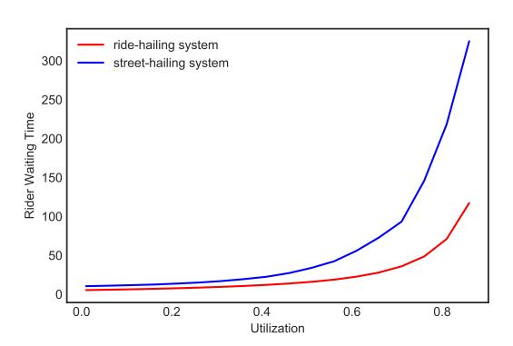
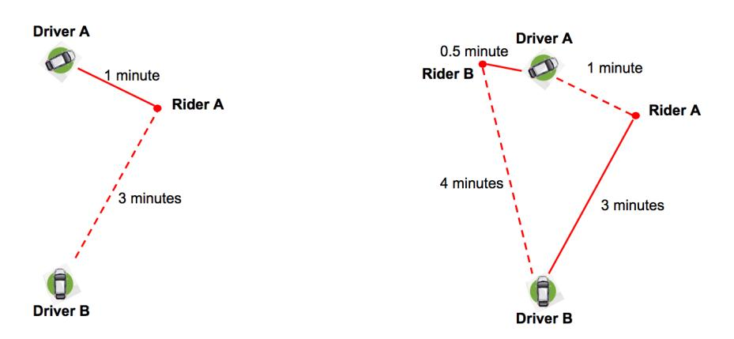
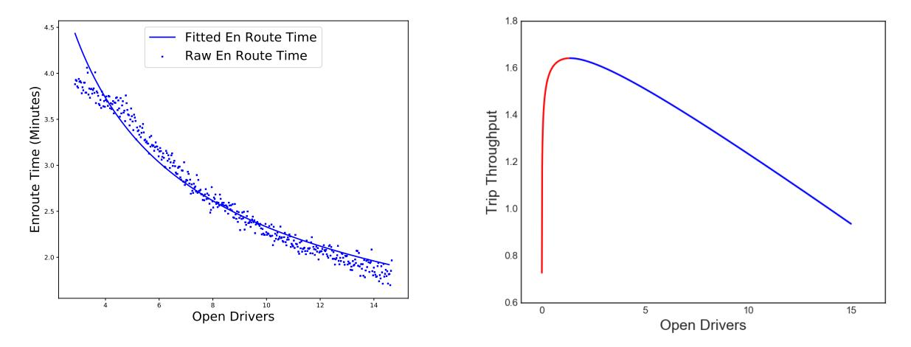
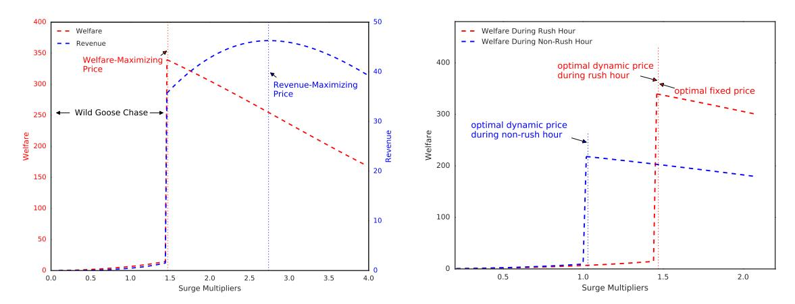
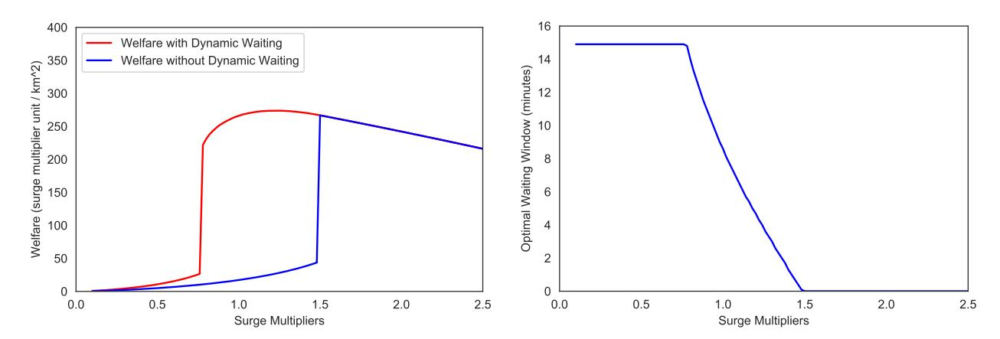
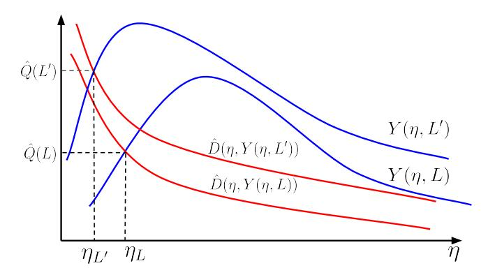

# Dynamic Pricing and Matching in Ride-Hailing Platforms

Chiwei Yan\*, Helin Zhu\*, Nikita Korolko† and Dawn Woodard Uber Technologies, San Francisco, USARide-hailing platforms such as Uber, Lyft and DiDi have achieved explosive growth and reshaped urban transportation. The theory and technologies behind these platforms have become one of the most active research topics in the fields of economics, operations research, computer science, and transportation engineering. In particular, advanced matching and dynamic pricing algorithms – the two key levers in ride-hailing – have received tremendous attention from the research community and are continuously being designed and implemented at industrial scales by ride-hailing platforms. We provide a review of matching and dynamic pricing techniques in ride-hailing, and show that they are critical for providing an experience with low waiting time for both riders and drivers. Then we link the two levers together by studying a pool-matching mechanism called dynamic waiting that varies rider waiting and walking before dispatch, which is inspired by a recent carpooling product Express Pool from Uber. We show using data from Uber that by jointly optimizing dynamic pricing and dynamic waiting, price variability can be mitigated, while increasing capacity utilization, trip throughput, and welfare. We also highlight several key practical challenges and directions of future research from a practitioner's perspective.

Key words: Ride-Hailing, Ride-Sharing, Matching, Dynamic Pricing, Dynamic Waiting

History: 2018/10, First Version; Revised on 2019/08

## 1. Introduction

Ride-hailing platforms connect riders and drivers via a centralized and automated matching and pricing system in a two-sided marketplace. Ride-hailing has experienced explosive growth; for example, Uber has completed over 10 billion trips globally and is active in over 80 countries and 700 cities, within 9 years of its initial launch (Uber 2018a). The global ride-hailing industry is projected to grow to a \$285 billion total market value by 2030 (MarketWatch 2017).

Relative to taxi services, drivers with ride-hailing services spend a higher proportion of their time on trip (capacity utilization rate); see Cramer and Krueger (2016) and Figure 1. In other words, UberX drivers spend less time waiting between ride requests or driving to pick up riders,

\* These two authors contributed equally.

&lt;sup>† Currently with Citadel Securities, Chicago, USA.

compared to taxi drivers. The story is similar on the rider side. Feng et al. (2017) demonstrated via simulations that the average rider waiting time between request and pickup (rider waiting time) can be much lower in a ride-hailing system compared with that in a street-hailing taxi system (Figure 1). Rider waiting time and capacity utilization rate are also closely related to a concept of reliability of the service: sudden spikes in demand (for instance, at the end of a concert) can cause a dramatic increase in the rider waiting time and drop in the capacity utilization rate, leading to a poor experience on both sides. This occurs because the available drivers are quickly dispatched, leading to low supply and causing newly available drivers to be dispatched to pick up distant riders. This phenomenon is called the Wild Goose Chase (WGC) by Castillo et al. (2017).

Figure 1 Comparisons for capacity utilization rate and rider waiting time. Left: capacity utilization rate comparison between taxi services and UberX (Cramer and Krueger 2016); Right: rider waiting time comparison between ride-hailing and street-hailing (Feng et al. 2017).

Two key technologies employed by ride-hailing platforms to provide high service reliability and capacity utilization rate and low rider waiting time are *matching* and *dynamic pricing* (DP). Matching means the process of dispatching available drivers to pick up riders, and DP means dynamic adjustment of prices for rides based on real-time demand and supply conditions. DP is called "surge pricing" by Uber and "prime time" by Lyft.

We survey key matching and DP algorithms for ride-hailing, from a practitioner's perspective. We show how these methods address the needs in terms of capacity utilization, rider waiting time, and service reliability. We focus on methods that satisfy the extreme scalability and robustness requirements of ride-hailing platforms; for example, Uber's current matching engine generates tens of thousands of dispatch decisions per minute, and its current DP engine generates tens of millions of price decisions at the level of geographic units every minute across the world (Uber 2018c). In addition to reviewing methods for matching and DP, we link the two levers together by studying

a pool-matching mechanism called *dynamic waiting* that varies rider waiting and walking before dispatch, which is inspired by a recent carpooling product Express Pool from Uber.

While DP has been demonstrated to be effective in improving system efficiency, it often comes with the downside of price volatility caused by short-term fluctuations in supply and demand conditions. This is due to the local nature of the problem in space and time: that is, only riders and drivers close to each other are eligible to be matched together. The dispatchable drivers and riders in a localized area over a short period of time exhibit much higher variability than that of the aggregated supply and demand in a large region over a longer time horizon. Price volatility can be undesirable for both riders and drivers: riders become less loyal to the platform (Harvard Business Review 2015), and drivers become frustrated because it is hard for them to relocate to areas of higher prices since the prices may drop by the time they arrive (Chen et al. 2015).

We show that the price volatility could be reduced by jointly optimizing DP and dynamic waiting (DW). In DW, after a rider requests they wait to be matched to a driver, up to a period of time called waiting window. This window is used to attempt to carpool together two (or more) requests whose origin locations as well as destination locations are within certain walking radius of each other. The waiting window is dynamically determined by market conditions: when supply is constrained, the waiting window increases. This mechanism has two effects. First, by asking riders to wait before being matched, the pool of eligible requests for matching is thickened, which results in a higher pool-matching rate (fractions of requests that are pool-matched) and a higher trip throughput because drivers have a better chance to fulfill more than one request in each ride. Second, it increases rider waiting time, which suppresses demand. Together, these two effects maintain the balance between supply and demand, and alleviate the WGC phenomenon. We further show that the combination of DP and DW could reduce price and its volatility, and improve capacity utilization rate, trip throughput, and welfare. Most importantly, our results showcase the benefits of jointly designing DP and matching algorithms, which has been rarely studied in the literature to the best of our knowledge.

Matching and DP algorithms have also been leveraged by many other online platforms that connect service providers and consumers. To name a few: TaskRabbit for chores and home projects, eBay for e-commerce, SpotHero for parking spaces, StubHub for concert and sports game tickets, Turo and Getaround for car-sharing, and Airbnb for hospitality service. In contrast to ride-hailing, these services provide matching suggestions and also price guidance via recommendation systems, but the final decisions are made by the participants on the platform. Food and grocery delivery platforms (such as UberEats, Instacart, or Grubhub) are more similar to ride-hailing platforms, but they have more time and flexibility for dispatching due to a lower level of urgency for the

service. The pricing and matching decisions for ride-hailing need to be solved in real-time as riders and drivers are sensitive in time. For instance, at Uber usually upfront prices are generated within a second and matches are generated within seconds.

In Sections 2 and 3, we synthesize the literature on matching and DP in ride-hailing, respectively. In Section 4 we investigate the benefits of DW, both theoretically and empirically using data from Uber. Finally, in Section 5, we highlight several outstanding practical challenges and lay out promising directions of research for pricing and matching in ride-hailing.

# 2. Matching in Ride-Hailing

Rides can be either non-shared, meaning that the ride is arranged for only one customer group (e.g., UberX), or shared, meaning that several customer groups with different pickup and dropoff locations share the ride (e.g., UberPool). In the simpler case of a non-shared ride, drivers participating on the platform cycle through three states sequentially: "open" — waiting to be dispatched, "en route" — on the way to the pickup location, and "on-trip" — driving riders to their destination, as shown below.

$$\cdots \rightarrow \text{open} \rightarrow \text{en route} \rightarrow \text{on-trip} \rightarrow \text{open} \rightarrow \cdots$$

A request can be matched with a dispatchable driver using very simple algorithms, such as the *first-dispatch protocol*. In the first-dispatch protocol only open drivers are considered as dispatchable. Each request is immediately assigned to the open driver who is predicted to have the shortest en route time.

Feng et al. (2017) compared the average rider waiting time for street-hailing (where the rider hails the first passing driver) to that for ride-hailing with the first-dispatch protocol, in a simulation. The authors found that ride-hailing generally has lower rider waiting time. However, in certain cases, the average rider waiting time of a street-hailing service can be lower. The intuition behind this observation is as follows. With the committed driver-rider matching used by ride-hailing, the driver once dispatched could miss the opportunity of being matched with a rider they drive passed by while en route. To mitigate this inefficiency, the authors proposed to apply a maximum dispatch radius (MDR) with carefully selected thresholds. MDR means that dispatch is made only if the en route time is below the threshold. This prevents the driver from being dispatched to pick up distant riders. Using MDR, the average rider waiting time in ride-hailing is typically substantially lower than the one in street-hailing, as illustrated in the right plot of Figure 1.

An alternative matching approach is *batching* as illustrated in Figure 2. Requests are collected for a short time window (e.g., a few seconds), at the end of which an optimization problem is solved to pair each request with an open driver. If there are riders that are not matched in this batch, they are carried over and re-solved in the next batching window.

Figure 2 Ride request batching.

Batching can further reduce the rider waiting time relative to the first-dispatch protocol, by consolidating requests and making better use of supply. Indeed, the latter can be viewed as a special case of the former when each batch consists of exactly one request. Ashlagi et al. (2018) numerically compare the performance of batching to that of the first-dispatch protocol using New York City yellow cabs dataset, and show that batching outperforms the first-dispatch protocol. Due to its substantial benefits, batching has been implemented widely in major ride-hailing platforms. For examples, see Uber (2019a) for an illustration of the maximum bipartite matching used by Uber, Lyft (2016a) for a discussion of Lyft's algorithm, and Zhang et al. (2017) for a detailed description of a batching algorithm used by DiDi. There are some trade-offs to take into account when selecting a batching window: on one hand, a longer batching window leads to better matching with more drivers and riders in the same batch; on the other hand, it also leads to prolonged rider waiting time before seeing a dispatch, which might deteriorate rider experience.

A typical way to model and solve the batching problem is as follows. A bipartite graph is first constructed to represent all the potential matches between riders and drivers. Each node in the graph corresponds to a request or an open driver. A weighted edge connects each pair of the rider and driver nodes, and the weight represents certain reward collected by matching this pair. The edges can be trimmed via some criteria (such as MDR) to reduce the problem size before solving the optimization problem. The detailed mathematical formulation is as follows. Denote N and Mas the sets of rider nodes and driver nodes in the same batch, respectively. The binary decision variable  $x_{ij} = 1$  if rider i and driver j are matched, and 0 otherwise. The reward for matching rider i with driver j is denoted by  $r_{ij}$ . Then the matching problem could be formulated as an integer program below.

max

$$\mathbf{x} \qquad \sum_{i \in N} \sum_{j \in M} r_{ij} x_{ij} \tag{2.1}$$

s.t.

$$\sum_{j} x_{ij} \le 1, \ \forall i \in N,
\tag{2.2}$$

$$\sum_{i} x_{ij} \le 1, \ \forall j \in M, \tag{2.3}$$

$$x_{ij} \in \{0,1\}, \ \forall i \in \mathbb{N}, \forall j \in M.$$

In particular, the objective in Eq. (2.1) is to maximize total rewards collected from the matching, and constraints (2.2) and (2.3) are to ensure that each rider/driver could be matched with at most one driver/rider, respectively. This integer programming formulation could be solved efficiently using its linear programming relaxation or directly using Hungarian Algorithm (Kuhn 1955). If the objective is to minimize the aggregated en route time, we could set  $r_{ij} = \mathcal{M} - \eta_{ij}$  in Eq. (2.1), where  $\eta_{ij}$  is the en route time for driver j to rider i, and  $\mathcal{M}$  is a sufficiently large number to bound from above all potential en route time in consideration, i.e.,  $\mathcal{M} \ge \max_{i \in N, j \in \mathcal{M}} \eta_{ij}$ . For a large geographic region, we could partition the entire region into several small areas and solve a matching problem separately for each area to achieve faster computation.

The matching algorithms described so far are myopic in the sense that they do not consider information about the future demand or supply. They are relatively easy to implement, if high-quality predictions of travel time in the road network are available. For this reason, these matching algorithms are very popular among ride-hailing platforms and exhibit relatively good performance. However, since demand and supply arrive in a dynamic fashion, there exist cases where such myopic algorithms could perform poorly. An example is shown in Figure 3, where there is one request A and two idle drivers A and B in the current batching window. Driver A is 3 minutes away from the rider, and Driver B is 1 minute away. Based on the en route time, rider A and driver B should be matched. Suppose that in the next batching window, another rider B shows up who is 0.5 minutes away from driver B and 4 minutes away from driver A. With this new information, it would have been beneficial to hold off matching rider A with driver B in the first batching window, in order to match rider A with driver A and rider B with driver B in the next batching window. By doing this, the total en route time of these two matches would be reduced from 1+4=5 minutes to 3+0.5=3.5 minutes.

Motivated by this, Ozkan and Ward (2017) developed dynamic matching policies based on a fluid linear programming formulation of the underlying stochastic matching problem where demand and supply arrive according to a non-homogeneous Poisson process, and dispatch decisions need to be made immediately after each request. The authors benchmarked their method against the first-dispatch protocol, using a simulation with synthetic inputs. They found that the first-dispatch protocol usually performs reasonably well; however, in the case where there are severe imbalances between demand and supply across regions, the proposed dynamic policies can significantly outperform the first-dispatch protocol. The intuition is that when there is a future demand spike in a specific region, drivers in nearby regions will be reserved to fulfill trips in that high-demand region, instead of the regions they are currently in. Their study suggests that such dynamic matching

Figure 3 An illustration of efficiency loss in myopic matching algorithms.

policies could potentially serve as a complement to DP for balancing demand and supply. Similarly, Hu and Zhou (2016) introduced a batched version of dynamic matching and derived the structural properties of the optimal policy under a stylized road network topology. Most recently, Ashlagi et al. (2018) proposed online algorithms that have constant competitive ratios, i.e., they achieve at least a constant fraction of the reward from an optimal offline policy with full information of future demand and supply.

Although forward-looking algorithms bring benefits theoretically, in practice the trade-off between algorithm performance and complexity of input calibration also needs to be considered. Advanced matching algorithms usually require additional predictions such as the time-varying demand and supply arrival rates. As pointed out by Ozkan and Ward (2017), errors in these inputs can potentially deteriorate the algorithm performance, while myopic algorithms are relatively parameter-free and enjoy robust performance. Some intermediate improvements to myopic matching algorithms have also been implemented on ride-hailing platforms. These improvements require few additional inputs and are very effective in bridging the optimality gap between myopic and forward-looking algorithms. As an example, Uber and Lyft have tested a feature called trip upgrade (Lyft 2016b) that dynamically re-assigns pickup assignments between en route drivers if all parties will be better off according to criteria such as the remaining en route time.

In practice, matching is further complicated due to the co-existence of multiple products and features on the same platform. For example, besides non-shared ride products, many ride-hailing platforms also provide pooling services such as UberPool and Lyft Line. Although we could treat the drivers with spare capacity as dispatchable drivers in the matching bipartite graph, the decision process is more complex because the pickup and dropoff sequences need to be taken into account as well. The addition of these considerations make the optimal pooling decisions combinatorially hard. We refer readers to Alonso-Mora et al. (2017) for some modeling and solution approaches in tackling such large-scale pool-matching and routing problems.

# 3. Dynamic Pricing in Ride-Hailing

One of the major challenges in ride-hailing is the continuously changing supply and demand volumes, especially on a local scale in space and time. Figure 4 shows the demand to supply ratio, based on data from Uber, for two neighborhoods in San Francisco: the Sunset and the Financial District. Demand is measured by the number of rider in-app sessions while supply is measured by the amount of time drivers spend on the app. The Sunset is a residential neighborhood, so riders

Figure 4 Demand to supply ratios in San Francisco. The data is taken from a weekday on May 2018, normalized at the same scale, and aggregated every 10 minutes.

often need to commute from the Sunset to the Financial District in the morning and vice versa in the evening. As a result, we see that the Sunset has a much higher demand to supply ratio than the Financial District during morning rush hour, and vice versa during evening rush hour. The demand to open supply ratio also exhibits strong variation over time. Figure 4 demonstrates that the imbalance between demand and supply is strongly localized in both space and time and exhibits high variability; in contrast, the aggregated demand to supply ratio for the entire San Francisco is relatively stable.

To mitigate such imbalance, dynamic pricing (DP) is employed by ride-hailing platforms to balance supply and demand both temporally and spatially. Uber refers to its DP decisions as *surge multipliers*, meaning that when demand is very high relative to supply the base fare is multiplied by a multiplier that is greater than one.

The utility of DP for maintaining service reliability and keeping en route times low was illustrated by Hall et al. (2015) using two examples from Uber in New York City (Figure 5). The first was at the end of an Ariana Grande concert in Madison Square Garden that led to a spike of demand and

an initial increase in the en route time. Surge pricing kicked in (indicated by the yellow intervals), which mitigated the demand peak and brought down the en route time (top left two plots). As a result, the fraction of requests that received a dispatch stayed very close to one (top right plot). By contrast, a similar demand spike occurred in Times Square on New Year's Eve 2015, but surge

Figure 5 Surge pricing during two events, as reproduced from Hall et al. (2015). Top: after an Ariana Grande concert; Bottom: New Year's Eve 2015 in Times Square. Left: the count of requests; Middle: the en route time; Right: the fraction of requests fulfilled.

did not kick in due to a technical malfunction (shown in red). Requests increased to many times their usual level (bottom left plot). The en route time increased to nearly eight minutes (bottom middle plot), and fewer than a quarter of requests were fulfilled (bottom right plot).

Methods for DP usually leverage either steady-state models or state-dependent dynamic programming techniques that focus on the temporal nature of the problem. These approaches usually require short-term predictions of demand and supply, including price elasticity estimates (Elmaghraby and Keskinocak 2003). In the case of a steady-state model, only overall expected supply and demand levels are needed, while dynamic programming approaches leverage the time series of the demand forecast to respond in a smooth fashion to upcoming demand or supply changes.

Castillo et al. (2017) proposed a steady-state model for DP in ride-hailing, and showed that DP is particularly important for ride-hailing due to the so-called Wild Goose Chase (WGC) phenomenon. The intuition is as follows. When there are very few drivers relative to demand, available drivers are quickly dispatched. Under the first-dispatch protocol, in such a supply-constrained situation the drivers may be dispatched to very distant pickup locations. This leads to high en route times,

leaving drivers with less time for taking riders to their destinations (lower capacity utilization rate). The result is reduced earnings, leading drivers to leave the platform, which in turn increases en route time. Such downward spiral of driver engagement further reduces trip throughput. Mathematically, the WGC phenomenon can be described by approximating the system with a steady-state queueing model, and considering the implications of different price points in that model. Such an analysis shows that the combination of price and en route time that maximizes trip throughput (or similar measure of value generated, such as welfare) is one with high rider and driver participation and low en route time.

DP is a lever for preventing the marketplace from entering the WGC zone, by balancing demand with supply in supply-constrained situations. Figure 5 is an empirical evidence of the WGC phenomenon during a demand spike, and the role of DP in mitigating the WGC. This example also showcases the negative rider and driver experiences when the marketplace is in the WGC zone; drivers tend to not accept or cancel a dispatch if the en route time is high (as indicated by the low request completion rate), causing wasted driver time and an inability of riders to get a dispatch.

Next we review a key step in understanding the WGC, namely the derivation of trip throughput under the steady-state queueing model in Castillo et al. (2017). The remainder of the derivation, with an extension to the setting of dynamic waiting, is provided in Section 4.

Consider a single-geo setting, meaning that all trips begin and end within the geographic region. We initially consider a fixed number, denoted by L, of drivers on the platform, who do not relocate into or out of the geolocation. Recall that drivers cycle through three states: open, en route, and on-trip. Using the first-dispatch protocol, only open drivers are dispatchable, and all requests are immediately dispatched (we will relax this constraint in Section 4). In this case, en route time is equal to rider waiting time. Further suppose each trip (from pickup to dropoff) takes a given constant time T (units of time) to complete. The steady-state trip throughput, i.e., the average number of trips completed per unit of time, is denoted by Y. We then have the flow balance equation

$$L = \overbrace{O}^{\text{open}} + \overbrace{\eta \cdot Y}^{\text{en route}} + \overbrace{T \cdot Y}^{\text{on-trip}}, \tag{3.1}$$

where O represents the number of open drivers,  $\eta$  denotes the en route time,  $\eta \cdot Y$  represents the number of en route drivers, and  $T \cdot Y$  represents the number of on-trip drivers. The en route time  $\eta$  is determined by the number of open drivers: a lower number of open drivers O leads to a higher en route time. This relationship is captured in Proposition 1.

PROPOSITION 1 (Larson and Odoni (1981)). Suppose the open drivers are distributed uniformly in a n-dimensional (n > 1) Euclidean space. Further assume a constant travel speed on the

straight line between any two points in that space. Then the expected en route time, denoted by  $\eta(O)$ , satisfies

$$\eta(O) = O^{-\frac{1}{n}},\tag{3.2}$$

where O is the number of open drivers.

There is a proof of Proposition 1 in the E-Companion EC.2.1 for the case when n = 2, which is the relevant case for ride-hailing. This model also fits well empirically with data from Uber if we relax the exponent in the en route time function (3.2) from  $-\frac{1}{n}$  to a general  $\alpha \in (-1,0)$ , as demonstrated in the left plot in Figure 6. Intuitively,  $\alpha$  is different from the theoretical value due to some violations of the assumptions in Proposition 1: in practice drivers move on a road network, travel speeds vary among road segments, and open drivers are not distributed uniformly over space.

Figure 6 The en route time and trip throughput functions. Left: the mean en route time in minutes from UberX data, and the fitted curve  $\eta(O)=7.63\cdot O^{-0.52}$ , as a function of the nearby open drivers per km²; Right: the trip throughput Y as a function of open drivers. The model parameters are calibrated based on UberX data in San Francisco downtown during rush hour: L=30 per km² and T=15.0 minutes.

From Proposition 1, we can rearrange the flow balance equation (3.1), and substitute in the expected value  $\eta(O)$  for  $\eta$  (noting that we are approximating a random variable with its mean), to obtain  $Y = (L-O)/(\eta(O)+T)$ . One way to interpret this equation is through Little's Law. In this case Y represents the long-run average trip throughput, which equals the long-run average number of busy drivers in the system (L-O) divided by the average time required for a driver to complete a trip. The latter is equal to the sum of en route time  $\eta(O)$  and trip duration T. To illustrate the behavior of the trip throughput Y as a function of the number of open drivers, we show this

approximation in the right plot in Figure 6. We can see that there is an open driver level  $O^*$  that maximizes the trip throughput. For  $O > O^*$ , the trip throughput is lower than the one at  $O^*$ ; however, since the en route time  $\eta(O)$  is lower, there is an experience versus throughput trade-off and there may be some cases in which it is desirable to have a value of  $O > O^*$ . For example, there may be a value  $O > O^*$  that leads to a higher welfare than the one at  $O^*$ . In contrast, when  $O < O^*$ , the trip throughput decreases sharply, due to the fact that en route time grows quickly. This regime is undesirable from both the experience perspective and the trip throughput perspective. As mentioned previously, it is called the WGC zone; a key function of DP is to keep the price point above the level that would lead the marketplace to enter the WGC zone. An interesting analogy of WGC is the "hypercongestion" (Walters 1961, Small and Chu 2003) phenomenon in transportation economics, where the travel speed decreases significantly as traffic flow increases. This eventually leads to a sharp decrease in throughput.

In the later sections we will look at Y as a function of en route time  $\eta$  rather than a function of O for the sake of derivation. Let  $C(\eta) \propto \eta^{-n}$  indicate the inverse function of  $\eta(\cdot)$ , which is well-defined since  $\eta(\cdot)$  is strictly decreasing. Then we could obtain the approximate trip throughput as a function of  $\eta$  and L:

$$Y(\eta, L) \stackrel{\triangle}{=} \frac{\Delta L - C(\eta)}{\eta + T}.$$

$$(3.3)$$

In addition to characterizing the WGC in terms of the open driver level, Castillo et al. (2017) also demonstrated that DP prevents the open driver level from dropping too low, and so increases trip throughput and welfare. Here welfare is defined by rider gross utility minus driver social cost, which can be viewed a measure of value created for the drivers and riders. The authors modeled the response of riders to price (surge multiplier) and waiting time, and the response of drivers to average earnings, which is a function of surge multiplier and capacity utilization rate. Such driver response to earnings can occur over a short time horizon (Chen et al. 2015). However, the bigger effect on driver participation is over a longer time horizon: experienced drivers on ride-hailing platforms eventually become cognizant about the time periods and areas of high earnings due to high demand and surge pricing, and flexibly adjust their work schedule to drive during these time periods (Chen and Sheldon 2016, Cachon et al. 2017).

Figure 7 shows the resulting welfare and platform revenue as functions of the surge multiplier. This figure is similar to Figure 5 from Castillo et al. (2017), except the model has been re-fit to recent data from Uber. In particular, the dashed lines in the left plot show dramatic losses of both welfare and revenue due to the WGC, when price is set too low. The right plot shows two such welfare curves, corresponding to non-rush hour (11am-noon) and rush hour (6pm-7pm), respectively. It also shows the welfare-maximizing dynamic prices during the two time periods; we

Figure 7 Welfare and revenue as a function of price, based on a model from Castillo et al. (2017) that has been fit to data from Uber in San Francisco downtown. Left: welfare and revenue under DP; Right: welfare under DP during rush and non-rush hours. Both quantities are in surge multiplier unit per  $km^2$  and hour.

can see that the welfare-maximizing price during rush hour is higher than the one during non-rush hour, due to the higher imbalance between demand and supply during rush hour. The right plot also shows the static price that maximizes the total welfare, aggregated over the two time periods. This mimics a scenario in which DP is disallowed (for example due to regulatory constraints), so that the platform is required to select a single price across all time periods. In this example, the welfare-maximizing static price is nearly equal to the highest dynamic price during rush hour. While such a high static price avoids the WGC, it results in lower welfare relative to that under DP.

Besides DP, other mechanisms can help in alleviating the WGC phenomenon and maintaining healthy en route time. For example, Castillo et al. (2017) demonstrated that the platform can prevent long en route times by setting a maximum dispatch radius (MDR). DiDi has rolled out a queueing mechanism by asking riders to wait in a queue if there are no dispatchable drivers inside the dispatch radius (Pingwest 2017). However, using MDR or queueing can lead to unreliable service experiences. For MDR, riders who are outside of the MDR are not fulfilled regardless of their willingness to pay; for queueing, the queue length can build up quickly which leads to long waiting time when demand outstrips supply.

While DP brings many benefits, it also comes with downsides. First, the price can fluctuate due to the natural variability in local demand and supply levels that we illustrated in Figure 4. This price variability is an undesirable experience and can cause reduced engagement of both riders and drivers. For example, high surge prices during New Year's Eve have received some negative press coverage (Lowrey 2014). Secondly, although there is evidence that surge pricing helps drivers move to high-demand areas (Lu et al. 2018), sometimes it can be hard for them to relocate quickly and

the prices may drop by the time they arrive (Chen et al. 2015). The variation in prices over time can lead riders and drivers to choose not to participate on the platform at the current time, in favor of waiting a few minutes for a more advantageous price. In this setting, riders (drivers) decide whether to make (accept) a request in the current time period or wait, knowing that they might be able to get better prices (earnings) in the following time periods. Addressing this, Chen and Hu (2019) investigated the case where both riders and drivers are strategic and forward-looking. More broadly, drivers may make a strategic decision about whether, when, and where to provide service, based on differences in surge price and earnings. Ride-hailing models for this case have been designed by Bimpikis et al. (2019) and Afèche et al. (2018). Relatedly, Ma et al. (2018) studied the design of incentive-aligned DP mechanisms in the presence of strategic driver behavior, under a multi-geo, multi-period setting. Here, an incentive-aligned mechanism means that the pricing decisions are spatially and temporally smooth so that it is always best for drivers to accept a dispatch rather than performing other actions such as relocating or waiting. Most recently, Garg and Nazerzadeh (2019) studied the form of incentive-aligned pricing mechanisms under a dynamic setting where there are multiple time periods and each time period can have different surge values.

# 4. Synergy of Pricing and Matching Technologies

In the previous section we discussed the price variability that is inherent to DP, and the resulting downsides to the user experience. In this section, we address this concern by investigating the benefits of combining DP with a pool-matching mechanism called dynamic waiting (DW), which allows batching of requests and varies rider waiting time before dispatch in order to find a good pool-match. This mechanism is inspired by the recent ride-sharing product Express Pool (Uber 2018b) from Uber. In particular, we show that DW could be used as a complement to DP to alleviate the WGC, reduce price volatility, and increase trip throughput and welfare. By jointly optimizing DP and DW, we show how one can explicitly trade off price with rider waiting time.

#### 4.1. Dynamic Waiting

Assume that each car can hold up to two riders, and that all riders opt into pooling. In DW, two riders can be pool-matched if their origin locations as well as destination locations are close; i.e., if the distance between the origins is within walk-able range (walking radius), and similarly for their destinations. Additionally, a rider can be asked to wait up to a certain duration (waiting window) before receiving a dispatch.

When a rider requests a ride, the system first checks whether there is a matching rider currently waiting. If so, these two riders are matched immediately, and the car with the shortest predicted en route time is dispatched to pick them up simultaneously at the midpoint of their origins, and drop them off at the midpoint of their destinations. If no matching rider is available, the rider is

asked to wait. If a pool-match is found within the waiting window, the match and dispatch are made; otherwise the system dispatches an open driver to this rider's origin location and will not attempt to pool-match this rider going forward. The resulting rider waiting time is then the sum of the dispatch waiting time and the en route time. An example is shown in Figure 8.

Figure 8 Dynamic Waiting (DW) for pool-matching. Riders are numbered in order of arrival time and pool-matched riders are shown in the same color (e.g., Riders 1 and 4 are pool-matched, while Rider 2 gets their own car).

Note that the DW mechanism is highly stylized. It is much simpler than the one used in the Express Pool product in the sense that only perfect (simultaneous pickup and dropoff of pool-matched riders) pool-matching is allowed. In contrast, the Express Pool product (and most other ride-sharing products) allows imperfect pool-matching, e.g., new riders can be pool-matched with riders who are on-trip.

In DW the waiting window can be dynamically adjusted: when demand outstrips supply, the waiting window can be increased. This increases the chance of pool-matching, so that fewer drivers are required to fulfill the same number of trips. Increasing the waiting window also increases the rider waiting time, which dampens demand. The combination of these two factors mitigates the WGC.

#### 4.2. Equilibrium Analysis

We wish to characterize the platform performance using measures such as welfare, trip throughput, and capacity utilization. To do this, we study the *market equilibrium*, under an extension of the steady-state queueing model reviewed in Section 3. At a high level, the platform determines price, waiting window, pool matches, and dispatch decisions. Then riders participate based on price and

waiting time, and drivers participate based on average earnings. Market equilibrium refers to the fact that in steady state the number of rides requested by the participating riders must equal the number of trips fulfilled by drivers participating on the platform. The analysis is based on a fluid approximation to the underlying process, where riders and drivers can be matched in any fractional quantities. The system is also assumed to be in steady state and deterministic. This type of analysis has been utilized in the context of ride-hailing by Banerjee et al. (2015), Taylor (2018), Bai et al. (2018), Cachon et al. (2017).

We describe the platform, demand, and supply components, introducing some assumptions which are verified in Section 4.3 for some situations. We then formalize the equilibrium.

We first describe the platform side, i.e., derive the flow balance equation and trip throughput function under DW, similar to Eq. (3.1). Due to the presence of pool-matching, Eq. (3.1) ceases to hold because a driver can fulfill more than one trip in a cycle. The car usage fraction  $f(Y;\phi)$  is the expected number of drivers required to fulfill a single request. It is a function of the trip throughput Y and the waiting window  $\phi$ , since more dense requests or a longer waiting window mean more pool matches. Note that  $f(Y;\phi) \in (1/2,1]$  because a driver can either fulfill one or two trips per cycle. The driver dispatch rate, i.e., the number of drivers needed to fulfill the trip throughput Y, is then equal to  $f(Y;\phi) \cdot Y$ . We make the following assumptions.

Assumption 1. The car usage fraction  $f(Y;\phi)$  satisfies:

- 1. For all  $\phi \geq 0$ ,  $f(Y;\phi)$  is decreasing in Y; for all  $Y \geq 0$ ,  $f(Y;\phi)$  is decreasing in  $\phi$ .
- 2. For all  $\phi \ge 0$ ,  $\lim_{Y \to 0} f(Y; \phi) = 1$  and  $\lim_{Y \to \infty} f(Y; \phi) = 1/2$ ; for all  $Y \ge 0$ ,  $\lim_{\phi \to 0} f(Y; \phi) = 1$  and  $\lim_{\phi \to \infty} f(Y; \phi) = 1/2$ .
  - 3. For all  $\phi \geq 0$ , the driver dispatch rate  $f(Y;\phi) \cdot Y$  is strictly increasing in Y.

Assumption 1.1 states that when there are more requests that can be pool-matched (either due to a higher trip throughput or a longer waiting window), the car usage fraction is lower. Assumption 1.2 says that that no requests are pool-matched when the length of the waiting window is zero or the trip throughput is zero, and that all requests are pool-matched as the waiting window or the trip throughput goes to infinity. Assumption 1.3 says that as the trip throughput increases, a higher driver dispatch rate is required, i.e., the reduction in the car usage fraction is not large enough to offset the extra requests.

Taking the car usage fraction  $f(Y;\phi)$  into account, we have the following flow balance equation under DW:

$$L = O + f(Y;\phi) \cdot Y \cdot \eta + f(Y;\phi) \cdot Y \cdot T. \tag{4.1}$$

Rearranging Eq. (4.1) leads to the implicit equation for the trip throughput function  $Y(\eta, L; \phi)$ :

$$Y \cdot f(Y;\phi) = \frac{L - C(\eta)}{\eta + T}.$$

$$(4.2)$$

Compared with Eq. (3.3), this implies that having a waiting window of  $\phi$  increases the trip throughput by a factor of  $1/f(Y;\phi)$ . Although  $Y(\eta, L;\phi)$  does not admit an explicit formula, it has the following properties (proof in E-Companion EC.2.2.)

PROPOSITION 2. Under Assumption 1, the trip throughput function  $Y(\eta, L; \phi)$  is well-defined and unique, and it satisfies

- 1. For all L > 0, we have  $\lim_{\eta \to \eta(L)} Y(\eta, L; \phi) = 0$ , where  $\eta(L)$  is the expected en route time when all drivers are open; and  $\lim_{\eta \to \infty} Y(\eta, L; \phi) = 0$ . Furthermore,  $Y(\eta, L; \phi) = \mathcal{O}(\eta^{-1})$  as  $\eta \to \infty$ .
  - 2. For all  $\eta$ ,  $Y(\eta, L; \phi)$  is increasing in L.

Proposition 2.1 indicates that the trip throughput goes to zero in the limit when all drivers or no drivers are open. Proposition 2.2 indicates that a higher level of supply leads to a higher level of trip throughput.

We next describe the demand side, i.e., derive the rider waiting time and demand arrival function under DW. Let  $w(Y;\phi)$  be the *dispatch waiting time*, i.e. the expected time between a rider's request and the time when they are dispatched a driver. Recalling that the rider waiting time is the sum of dispatch waiting time and en route time, and denoting it by  $E(\eta, Y; \phi)$ , we have

$$E(\eta, Y; \Phi) = \eta + w(Y; \phi).$$

$$(4.3)$$

We make the following assumptions on  $w(Y; \phi)$  and  $E(\eta, Y; \phi)$ .

Assumption 2. The dispatch waiting time  $w(Y;\phi)$  and the rider waiting time  $E(\eta,Y;\phi)$  satisfy:

- 1. For all  $\phi \geq 0$ ,  $w(Y;\phi)$  is decreasing in Y.
- 2. For all  $(L, \phi)$  pairs, the rider waiting time  $E(\eta, Y(\eta, L; \phi); \phi)$  is increasing in  $\eta$ .

Assumption 2.1 says that as the trip throughput increases, the dispatch waiting time decreases because riders have more chances of being matched within the waiting window. Assumption 2.2 addresses the fact that the rider waiting time is impacted by  $\eta$  in two ways: directly, through Eq. (4.3), and indirectly, through the fact that lower  $\eta$  is sometimes associated with higher trip throughput, which leads to a decrease in the dispatch waiting time. Assumption 2.2 says that the first effect is larger than the second.

Let  $\lambda$  be the rider arrival rate, meaning that there are  $\lambda$  unique riders arriving on the platform per unit of time. Depending on the price p and waiting time E shown to the riders, they make requests or leave the platform. Let D(p, E) be the resulting rider request rate, i.e., the number of ride requests per unit of time, which is upper bounded by  $\lambda$ . Note that the rider's sensitivity to walking is ignored; this is reasonable in the numerical study of Section 4.3 because we use a small maximum walking distance (100 meters). Studying the interactions between walking and waiting will bring additional trade-offs but is beyond the scope of this paper. We make the following assumptions on D(p, E).

Assumption 3. The rider request rate D(p, E) satisfies:

- 1. It is continuously differentiable in (p, E) and decreasing in both p and E.
- 2.  $\lim_{p\to\infty} D(p,E) = 0$  for all  $E \ge 0$  and  $\lim_{E\to\infty} D(p,E) = 0$  for all  $p \ge 0$ .
- 3. For all  $E \ge 0$ , the distribution of the maximum willingness-to-pay has a finite mean.
- 4. For all p > 0,  $D(p, E) = o(E^{-1})$  as E goes to infinity.
- 5. For all  $(\eta, p, \phi)$  combinations, the function  $D(p, E(\eta, Y; \phi))$  satisfies

$$\frac{dD(p, E(\eta, Y; \phi))}{dY} < 1. \tag{4.4}$$

Assumptions 3.1 to 3.3 are identical to Assumption 1 in Castillo et al. (2017). They imply that: (1) riders are less likely to request when the price or the waiting time is higher; (2) no rider will request when the price or the waiting time goes to infinity; (3) the welfare created under any price point is finite. Assumption 3.4 ensures that the request rate goes to zero sufficiently quickly as the waiting time goes to infinity, which holds under widely-used forms such as the logistic form used in the numerical study. Assumption 3.5 says that, when the trip throughput increases by some small  $\epsilon$ , the resulting decrease in the waiting time cannot lead to an increase in the rider request rate of more than  $\epsilon$ . It also holds for the explicit form used in the numerical study.

Next we establish the existence of a steady-state solution between the demand and platform components. In steady state, the rider request rate  $D(p, E(\eta, Y; \phi))$  equals the trip throughput rate  $Y(\eta, L; \phi)$ . For simplicity, we suppress the price variable p and the waiting window  $\phi$  in these two rate functions:

$$\widehat{D}(\eta, Y) \stackrel{\Delta}{=} D(p, E(\eta, Y; \phi)), \quad \text{and} \quad Y(\eta, L) \stackrel{\Delta}{=} Y(\eta, L; \phi).$$
 (4.5)

This leads to

$$Y(\eta, L) = \widehat{D}(\eta, Y(\eta, L)). \qquad (4.6)$$

We have the following properties of the solution to Eq. (4.6) (proven in E-Companion EC.2.3).

PROPOSITION 3. For all L > 0, Eq. (4.6) admits at least one solution in  $\eta > 0$ . Let  $\eta_L$  be the solution and  $\widehat{Q}(L;\phi,p)$  be the resulting trip throughput given the  $(\phi,p)$  pair (if there are multiple solutions to (4.6), choose the unique solution that leads to the greatest  $\widehat{Q}(L;\phi,p)$ ), i.e.,

$$\widehat{Q}(L;\phi,p) \stackrel{\Delta}{=} Y(\eta_L, L) = \widehat{D}(\eta_L, Y(\eta_L, L)). \tag{4.7}$$

Then the highest trip throughput  $\widehat{Q}(L;\phi,p)$  is increasing in the supply level L for all  $(\phi,p)$  pairs.

Next we describe the supply side. Assume a labor market in which drivers decide whether to participate based on the average earnings per unit of time, denoted by e. Let l(e) indicate the number of drivers who will participate at earnings level e, i.e.,  $l(\cdot)$  is the supply elasticity curve.

Assume it is an increasing, bounded, and continuously differentiable function. Also assume that drivers are paid per trip that they complete – that in the case of a pool match, the driver payment is the sum across the two trips. This leads to  $e = (1 - \theta) \cdot p \cdot Y/L$  in steady state, where  $\theta$  is the fraction of the price collected by the platform as revenue according to the agreed commission rate. Following Castillo et al. (2017) we choose  $\theta = 0.238$ . The number of drivers participating on the platform must satisfy the supply elasticity curve, i.e.,

$$L = l((1 - \theta) \cdot p \cdot Y/L). \tag{4.8}$$

Another mechanism often used in practice is to pay drivers based on the actual time and distance spent on trip rather than the number of trips fulfilled, and to give riders a discounted price for carpool trips. Through numerical studies, we have found that these two mechanisms produce qualitatively similar results.

We now establish the market equilibrium, which states that the trip throughput under Eq. (4.7) can be fulfilled exactly by the number of drivers participating on the platform under Eq. (4.8). In particular, we have the following result on the existence of a *stable* market equilibrium. The definition of equilibrium stability and the proof of Theorem 1 can be found in E-Companion EC.2.4. In cases where there are multiple market equilibria, let the *highest* equilibrium refer to the one with the highest trip throughput. Loosely speaking, an equilibrium is stable if the system of equations (4.9) and (4.10) always converges to that equilibrium whenever starting from a point that is above and sufficiently close to it.

THEOREM 1 (Market Equilibrium). Denote  $\widehat{L}(Q;p)$  as the solution to the supply elasticity curve  $L = l((1-\theta) \cdot p \cdot Q/L)$ . Then for all  $(\phi,p)$  pairs, the system of equations on supply and demand

$$L = \widehat{L}(Q; p) \tag{4.9}$$

$$Q = \widehat{Q}(L; \phi, p) \tag{4.10}$$

always admits a stable solution (a stable market equilibrium). In particular, the highest equilibrium, denoted by  $(L^*, Q^*)$ , is stable.

We can then evaluate measures such as capacity utilization rate, trip throughput, and welfare under  $(L^*, Q^*)$ . Because  $(L^*, Q^*)$  depends on  $(\phi, p)$ , these metrics also vary in accordance to the waiting window  $\phi$  and the price p. The platform could then adjust  $\phi$  and p to maximize a specific performance metric.

#### 4.3. Experiment with Data from Uber

We present computational results using Uber data to calibrate the parameters in the steady-state model from the previous section. We evaluate the market equilibria under different prices and waiting windows, in order to study the impact and interaction of DP and DW.

**4.3.1. Data Overview.** We use UberX data from weekdays (Monday through Friday) between 07/31/2017 and 09/01/2017 in downtown San Francisco (about 35km²). We focus on UberX data because the dispatches in UberPool are not based on the first-dispatch protocol, so the en route time does not fit into the model here. The interpretation of our analysis is to quantify the potential of DW if all UberX riders were to opt into a DW carpooling product. We focus on weekday data because it exhibits a consistent daily rush hour pattern.

Rider session data records the interactions of the rider on the Uber app between the time they open the app to the time they either request a ride, or a fixed period of time goes by without a request. Upon entering the destination, the app shows a quoted price (which is calculated using the surge multiplier) and an estimated waiting time to pickup. Based on the price and the waiting time, the rider decides whether to make a trip request. We use this information to calibrate the rider request rate function D(p, E).

Figure 9 Daily patterns from the Uber data. Top Left: average rider sessions per km2; Top Right: average completed trips per km2; Bottom Left: average surge multipliers; Bottom Right: average supply shifters per km2.

Rider request data records the pickup location (trip origin), the dropoff location (trip destination), the trip duration (in minutes), and the estimated en route time for each rider request. We use it to calibrate the trip duration T. Additionally, we use the en route times, together with the corresponding local density of open drivers, to calibrate the function  $\eta(\cdot)$ .

We show the time series of several data summaries by hour-of-day in Figure 9, including the number of rider sessions and completed trips, and the average surge multipliers. There are two peaks corresponding to the morning and evening rush hours, respectively.

**4.3.2.** Model Specification and Calibration. Here we lay out the empirical and identification strategies for parameter calibration.

For the constant trip duration T, we estimate it by the average trip duration from all the requests, which is 15.0 minutes. Following Proposition 1, the en route time function can be modeled using the form  $\eta(O) = \tau \cdot O^{\alpha}$ , where O is the number of open drivers. We calibrate it as follows. For each rider request, we obtain the estimated en route time, and the open driver count within 1km of the pickup location (normalized to per km2) at the request moment. We then estimate  $\alpha$  and  $\tau$  using the following linear regression on the logarithmic scale:

$$\ln(\eta) = \ln(\tau) + \alpha \ln(O) + \epsilon,$$

where  $\epsilon$  is a normally distributed random variable with mean zero. We assume the observations are independent from each other. Table 1 records the estimation result based on ordinary least squares. Due to the logarithmic transformation,  $\hat{\tau}$  needs to be corrected by a factor of  $E[e^{\epsilon}]$  to obtain an

|                                              | Coef.  | Std. Err. | p-value |
| -------------------------------------------- | ------ | --------- | ------- |
| Intercept $(\ln(\tau))$                      | 1.803  | 0.004     | < 0.001 |
| Natural Logarithm of Open Drivers $(\alpha)$ | -0.515 | 0.002     | < 0.001 |

Table 1 Estimation Results of the En Route Time Function

unbiased estimator (Newman 1993). We estimate  $E[e^{\epsilon}]$  using sample average based on the residual data, leading to a correction factor of 1.257. The final estimators are  $\hat{\tau} = e^{1.803} \cdot 1.257 = 7.626$  and  $\hat{\alpha} = -0.515$ .

Under approximations such as replacing random variables with expectations, the car usage fraction  $f(Y;\phi)$  and dispatch waiting time  $w(Y;\phi)$  admit analytic formulas as follows (see Appendix EC.2.5 for the derivation):

$$f(Y;\phi) = 0.5 + 0.5 \cdot \frac{e^{-Y\gamma\phi}}{2 - e^{-Y\gamma\phi}}, \quad \text{and} \quad w(Y;\phi) = \phi \frac{1 - e^{-Y\gamma\phi}}{Y\gamma\phi}$$
 (4.11)

where  $\gamma$  represents the probability that two arbitrary rider requests are close enough to each other in origins and destinations that they can be pool-matched. We verify in Appendix EC.2.6 that  $f(Y;\phi)$  and  $w(Y;\phi)$  in Eq.(4.11) satisfy Assumptions 1 and 2. To calibrate  $\gamma_i$  for hour-of-day i, we use Monte Carlo sampling by drawing pairs of requests randomly from that hour and checking if they can be pool-matched, i.e., checking if the distances between the origins as well as the destinations are less than the walking radius of 200 meters. The estimation results for  $\gamma_i$  are mostly between 0.0002 to 0.001 across all hours of day.

To calibrate the rider request rate function D(p, E), we extend the ideas from Castillo et al. (2017) and model the rider request rate function D(p, E) with the following form:

$$D(p, E) = \lambda \cdot r(p, E), \tag{4.12}$$

where  $\lambda$  is the number of rider sessions, and r(p, E) is the request probability given price p and waiting time E. We model the rider utility of requesting a ride as  $u(p, E) + \epsilon$ , where  $\epsilon$  is a Gumbel distributed random variable. We further specify

$$u(p, E) = \kappa + \beta \cdot p + \delta \cdot E + \sum_{i=1}^{23} \kappa_i \cdot \mathbb{I}(h = i), \tag{4.13}$$

where  $\kappa$  is a constant term representing the value of the request if other utility contributions are zero, and  $\beta$  and  $\delta$  measure the disutility of increase in price and waiting time, respectively.  $\mathbb{I}(h=i)$  is the indicator variable, and  $\kappa_i$  is the corresponding fixed effect on rider utility, for hour-of-day i. The request probability r(p, E) then is assumed to follow a logit form:

$$r(p,E) = \frac{\exp(u(p,E))}{1 + \exp(u(p,E))}.$$

$$(4.14)$$

In Appendix EC.2.6 we verify that D(p, E) satisfies Assumption 3.

The fixed hour-of-day effects  $\{\kappa_i\}$  introduced in Eq. (4.13) play an important role. Without them the model would suffer from the endogeneity issue due to the presence of unobserved demand shocks that simultaneously affect the request probability, the price (due to the fact that surge pricing kicks in), and the waiting time. Estimating price sensitivity based on observational data without controlling for such effects can cause bias. We assume the effects associated with geolocation and time of day are primary drivers of demand shocks; to address this we focus on a particular subregion (downtown San Francisco), and control for hour-of-day by including the fixed effects in the rider utility model. This approach is illustrative, and it does not represent how Uber estimates price sensitivity in practice (Uber 2019b). Estimation results for the logistic regression model in Eq. (4.14) are shown in Table 2. The fixed hour-of-day effects  $\{\kappa_i\}$  are mostly between 0.05 to 0.2 across all hours of day.

|                            | Coef.   | Std. Err. | p-value |
| -------------------------- | ------- | --------- | ------- |
| Intercept $(\kappa)$       | 1.6430  | 0.0169    | < 0.001 |
| Surge Multiplier $(\beta)$ | -0.6693 | 0.0064    | < 0.001 |
| Waiting Time $(\delta)$    | -0.0189 | 0.0001    | < 0.001 |

Table 2 Estimation Results of the Demand Model

In practice there can be some violations of the assumption that the demand shocks are completely explained by time-of-day and location. For example, demand shocks due to events such as concerts and sports games do not necessarily follow a specific time-of-day pattern. There are other approaches in the causal inference literature which systematically address identification issues in demand estimation, such as instrumental variables (Angrist and Krueger 2001) and regression discontinuity design. Cohen et al. (2016) take advantage of the rounding of surge multipliers adopted by Uber to estimate price elasticity using a regression discontinuity design.

To calibrate the supply elasticity curve l(e), we adopt the one used in Castillo et al. (2017) and Angrist et al. (2017), i.e.,  $l(e) = A (e/(1+1/\epsilon_l))^{\epsilon_l}$  with supply elasticity  $\epsilon_l = 1.2$ . The parameter A is the supply shifter which determines the base supply level. To estimate A for each hour-of-day, we follow the methodology in Castillo et al. (2017), where the actual number of completed trips is used as the throughput Q at equilibrium under the actual price. We then back out A using the equilibrium model. The estimated supply shifters are shown by time-of-day in Figure 9.

4.3.3. Experiment Results. With the calibrated parameters from the previous subsection, we solve the market equilibria under different supply and demand conditions (those arising in different hours of day), prices, and waiting windows. We then compare performance measures including welfare, trip throughput, and capacity utilization at the market equilibria under these different scenarios. We impose a maximum waiting window of 15.0 minutes to ensure that riders do not wait longer than the actual trip duration.

Recall that welfare is defined by gross utility minus social cost, where gross utility is the integral of inverse demand curve with respect to price, and social cost is the integral of inverse supply curve with respect to earnings. Using the demand and supply curves proposed previously, gross utility is  $U(p,E) = \lambda \cdot \left( \int_p^{+\infty} r(p',E) dp' + p \cdot r(p,E) \right)$ , and social cost is  $S(L) = A \cdot \left( \frac{L}{A} \right)^{1+\frac{1}{\epsilon_l}}$ .

We first look at the performance measures during the morning rush hour (8am - 9am). We compute welfare under the market equilibria corresponding to different prices, both with and without DW (Figure 10). For the scenarios without DW, we compute the market equilibria following Castillo et al. (2017). For the scenarios with DW, we compute the market equilibria following Section 4.2, and welfare is calculated as the maximum one achieved among all possible waiting windows, i.e., the one under the optimal waiting window.

Figure 10 Welfare and optimal waiting window for the morning rush hour. Left: maximum welfare as a function of surge multipliers with and without DW; Right: optimal waiting window as a function of surge multiplier (maximum waiting window is 15.0 minutes).

- Without DW, the welfare-maximizing (optimal) price is around p = 1.50, and the marketplace enters the WGC zone sharply when price falls below it.
- With DW, the optimal price is around p = 1.22 (19% lower than the optimal one when DW is absent), and the marketplace enters the WGC zone at a much lower price p = 0.76.
- With joint optimization of DP and DW, welfare is improved by 2.7%, from 266.7 to 273.8 in surge multiplier unit per hour and km2.

Also in Figure 10, we plot the optimal waiting windows under different prices. There is an explicit trade-off between price and optimal waiting window, in the sense that the optimal waiting window decreases as the price increases. In particular, the optimal waiting window stays at the maximum value of 15.0 minutes until p = 0.78, the point at which the WGC phenomenon is mitigated when DW is present; then it continues to decrease until p = 1.50, the point at which the WGC phenomenon is mitigated when DW is absent. If we relax the maximum waiting window to be greater than 15.0 minutes, the price and waiting window trade-off continues below p = 0.78.

|                               | Welfare (surge multiplier unit/km²) | Trips/km² | Utilization |
| ----------------------------- | ----------------------------------- | --------- | ----------- |
| Dynamic Price with Waiting    | 4639.93                             | 1413.50   | 59.90%      |
| Static Price with Waiting     | 4620.90                             | 1412.93   | 59.44%      |
| Dynamic Price without Waiting | 4595.26                             | 1390.74   | 55.70%      |
| Static Price without Waiting  | 4326.52                             | 1294.65   | 46.31%      |

Table 3 Welfare, trips, and capacity utilization under different pricing and waiting mechanisms.

We then look across all hours of day, and compare the total welfare, trip throughput, and capacity utilization rate under different pricing and waiting mechanisms (Table 3). We examine four different mechanisms: (1) DP & DW, where we use the dynamic p and  $\phi$  that maximize welfare for each

hour-of-day; (2) DP only, where we use the dynamic p with  $\phi = 0$  that maximizes welfare for each hour-of-day; (3) DW only, where we use the dynamic  $\phi$  and static p that maximize the aggregated welfare over all hours of day; (4) static pricing without waiting, where we use the static p with  $\phi = 0$  that maximizes the aggregated welfare over all hours of day. We impose a lower bound of 1.0 on the surge multiplier (price) across all hours of day. We make the following observations: (1) Either DP or DW is able to significantly improve the performance metrics; (2) DW outperforms DP on all the performance metrics; (3) Joint DP and DW can further improve all performance metrics. In addition to the benefits from higher welfare under DW, a higher capacity utilization rate implies lower driver deadheading, which is beneficial for reducing congestion.

Figure 11 Optimal prices and waiting windows by hour-of-day. Left: optimal dynamic and static prices; Right: optimal DW windows under DP and static pricing.

In Figure 11 we examine the optimal prices and waiting windows under the four mechanisms, and draw the following conclusions.

- The optimal dynamic prices without DW are high during the morning and evening rush hours, which is expected since the market generally is more supply constrained.
- The optimal static price without DW corresponds to the highest optimal dynamic price across all times of day (p = 1.50). This is consistent with the results of Castillo et al. (2017).
- The optimal dynamic prices with DW are lower (by 8%) and considerably less variable (by 43%) than the ones without DW. Here variability is measured using the standard deviation of optimal surge multipliers across different hours of day.
- The optimal static price with DW (p = 1.02) is slightly higher than the optimal dynamic prices with DW during non-rush hours but much lower than the ones during rush hours. Moreover, it is much lower (32%) than the one without DW, which indicates that DW could reduce the optimal static price.

In Figure 11 we also examine the optimal waiting windows with or without DP across all hours of day. Without DP the optimal waiting window can sometimes spike over 10 minutes, while with DP it is relatively stable and does not exceed 5 minutes. In summary, DP or DW alone leads to either high/volatile price or waiting time, while joint DP and DW provides a beneficial trade-off and more consistent experience.

#### 5. Conclusions & Further Research Directions

Here we have focused on scalable, robust DP and matching algorithms because they are practical for implementation by major ride-hailing platforms. More complex algorithms may exhibit better performance in theory, but typically require sophisticated modeling of the marketplace dynamics as well as more complex inputs. From a practitioner's perspective, one of the biggest challenges when designing and implementing matching and pricing algorithms at scale is to strike a balance between model complexity and accurate description of the marketplace dynamics. Here are a few areas in which this trade-off should be further explored:

- 1. Joint Pricing and Matching. In Section 4 we studied the benefits of joint pricing and matching optimization, in the context of carpooling. It is natural to further explore opportunities in this direction. Pricing could be used to convert potential rider demand into requests that produce more effective matches; for example, Uber offers UberX riders a discount at the time of request if the platform finds there is an existing UberPool trip that the rider can join with no detour.
- 2. Single versus Multiple Products. Rather than a single shared or non-shared product, a ride-hailing platform can offer multiple products with different experiences for prices, waiting times, and comfort levels. For example, Uber offers UberX (non-shared), UberPool (shared), Express Pool (shared ride with waiting and walking), UberXL (extra seats), and Uber Black (luxury service). Providing different options to riders mitigates the user impact of price or waiting time volatility from a single product. However, it introduces the need to model the interactions across different products. On the rider side, riders exhibit substitution across products, so the price or waiting time on one product affects riders' choice of other products. On the driver side, the supply base is often shared across multiple products (e.g. UberX and UberPool), so a dispatch decision can impact supply levels across different products. The mechanism design becomes more sophisticated if the pricing and matching decisions are made simultaneously for all the products. To the best of our knowledge, this has rarely been studied in the literature.
- 3. Model-based versus Model-free Approaches. The approach from this paper is model-based since the marketplace dynamics are characterized with an steady-state economic model that is fit to real data. The benefits of such model-based approaches include interpretability and the fact that they have a set of explicit assumptions that can be validated or invalidated in practice. An

alternative category is model-free or learning-based approaches such as reinforcement learning (Tang et al. 2019). These have few explicit assumptions, and are more robust in dealing with stochasticity (unlike the deterministic models used here). One could also explore hybrid approaches that incorporate a learning component into a model-based approach, which could allow it to "self-heal" in cases where the model assumptions do not quite hold.

4. Local versus Network Models. The ride-hailing marketplace exhibits micro (local) characteristics as well as macro (global) dynamics. The local characteristics come from the fact that the en route time is determined by local supply and demand conditions, while the global characteristics are the result of driver self-relocation or dispatch across geographic regions. Several recent studies (Banerjee et al. 2018, Kanoria and Qian 2019, Balseiro et al. 2019) propose state-dependent dispatching or pricing mechanisms that address such network challenges. These network models often require detailed inputs about supply and demand over the whole city, which could be challenging to calibrate and validate in practice. Devising simple yet robust mechanisms from network models could be impactful in practice, especially when they are combined with local models.

# Acknowledgments

The authors would like to thank Ali Aouad at London Business School, and Cameron Blume, Duncan Gilchrist, Jonathan Hall, Dan Knoepfle, Chenfei Lu, Eoin O'Mahony, Hamid Nazerzadeh, Lior Seeman, Kane Sweeney and Chris Wilkins at Uber for helpful discussions and insights. The authors also want to thank editors Ming Hu, Zuo-Jun (Max) Shen and Ho-Yin Mak, and the anonymous reviewers for their valuable suggestions in improving this manuscript.

#### References

- Afeche, Philipp, Zhe Liu, Costis Maglaras. 2018. Ride-hailing networks with strategic drivers: The impact of platform control capabilities on performance. Working Paper.
- Alonso-Mora, Javier, Samitha Samaranayake, Alex Wallar, Emilio Frazzoli, Daniela Rus. 2017. On-demand high-capacity ride-sharing via dynamic trip-vehicle assignment. *Proceedings of the National Academy of Sciences* **114**(3) 462–467.
- Angrist, Joshua D, Sydnee Caldwell, Jonathan V Hall. 2017. Uber vs. taxi: A driver's eye view. Tech. rep., National Bureau of Economic Research.
- Angrist, Joshua D, Alan B Krueger. 2001. Instrumental variables and the search for identification: From supply and demand to natural experiments. *Journal of Economic perspectives* **15**(4) 69–85.
- Ashlagi, Itai, Maximilien Burq, Chinmoy Dutta, Patrick Jaillet, Amin Saberi, Chris Sholley. 2018. Maximum weight online matching with deadlines.  $arXiv\ preprint\ arXiv:1808.03526$ .

- Bai, Jiaru, Kut C So, Christopher S Tang, Xiqun Chen, Hai Wang. 2018. Coordinating supply and demand on an on-demand service platform with impatient customers. *Manufacturing & Service Operations Management*.
- Balseiro, Santiago R, David B Brown, Chen Chen. 2019. Dynamic pricing of relocating resources in large networks. Abstracts of the 2019 SIGMETRICS/Performance Joint International Conference on Measurement and Modeling of Computer Systems. ACM, 29–30.
- Banerjee, Siddhartha, Ramesh Johari, Carlos Riquelme. 2015. Pricing in ride-sharing platforms: A queueing-theoretic approach. *Proceedings of the Sixteenth ACM Conference on Economics and Computation*. ACM, 639–639.
- Banerjee, Siddhartha, Yash Kanoria, Pengyu Qian. 2018. State dependent control of closed queueing networks with application to ride-hailing. arXiv preprint arXiv:1803.04959.
- Bimpikis, Kostas, Ozan Candogan, Daniela Saban. 2019. Spatial pricing in ride-sharing networks. Operations Research.
- Cachon, Gerard P, Kaitlin M Daniels, Ruben Lobel. 2017. The role of surge pricing on a service platform with self-scheduling capacity. *Manufacturing & Service Operations Management* **19**(3) 368–384.
- Castillo, Juan Camilo, Dan Knoepfle, Glen Weyl. 2017. Surge pricing solves the wild goose chase. *Proceedings* of the 2017 ACM Conference on Economics and Computation. ACM, 241–242. URL https://ssrn.com/abstract=2890666.
- Chen, Le, Alan Mislove, Christo Wilson. 2015. Peeking beneath the hood of Uber. *Proceedings of the 2015 ACM Conference on Internet Measurement Conference*. ACM, 495–508.
- Chen, M Keith, Michael Sheldon. 2016. Dynamic pricing in a labor market: Surge pricing and flexible work on the Uber platform. *Economics and Computation*. 455.
- Chen, Yiwei, Ming Hu. 2019. Pricing and matching with forward-looking buyers and sellers. Manufacturing &  $Service\ Operations\ Management$ .
- Cohen, Peter, Robert Hahn, Jonathan Hall, Steven Levitt, Robert Metcalfe. 2016. Using big data to estimate consumer surplus: The case of uber. Tech. rep., National Bureau of Economic Research.
- Cramer, Judd, Alan B Krueger. 2016. Disruptive change in the taxi business: The case of Uber. *The American Economic Review* **106**(5) 177–182.
- Elmaghraby, Wedad, Pınar Keskinocak. 2003. Dynamic pricing in the presence of inventory considerations: Research overview, current practices, and future directions. *Management Science* **49**(10) 1287–1309.
- Feng, Guiyun, Guangwen Kong, Zizhuo Wang. 2017. We are on the way: Analysis of on-demand ride-hailing systems. Working Paper URL https://ssrn.com/abstract=2960991.
- Garg, Nikhil, Hamid Nazerzadeh. 2019. Driver surge pricing. ArXiv abs/1905.07544.

- Hall, Jonathan, Cory Kendrick, Chris Nosko. 2015. The effects of Uber's surge pricing: A case study. *The University of Chicago Booth School of Business* URL http://lgluem2nc4jy1gzhn943ro0gz50.wpengine.netdna-cdn.com/wp-content/uploads/2016/01/effects\_of\_ubers\_surge\_pricing.pdf.
- Harvard Business Review. 2015. Everyone hates Uber's surge pricing here's how to fix it. URL https://hbr.org/2015/12/everyone-hates-ubers-surge-pricing-heres-how-to-fix-it.
- Hu, Ming, Yun Zhou. 2016. Dynamic type matching. Working Paper URL https://ssrn.com/abstract=2592622.
- Kanoria, Yash, Pengyu Qian. 2019. Near optimal control of a ride-hailing platform via mirror backpressure.  $arXiv\ preprint\ arXiv:1903.02764$ .
- Kuhn, Harold W. 1955. The Hungarian method for the assignment problem. *Naval Research Logistics (NRL)* **2**(1-2) 83–97.
- Larson, R.C., A.R. Odoni. 1981. Urban Operations Research. Prentice Hall PTR.
- Lowrey, Annie. 2014. Is Uber's surge-pricing an example of high-tech gouging? URL https://www.nytimes.com/2014/01/12/magazine/is-ubers-surge-pricing-an-example-of-high-tech-gouging.html?\_r=0.
- Lu, Alice, Peter I Frazier, Oren Kislev. 2018. Surge pricing moves uber's driver-partners. *Proceedings of the* 2018 ACM Conference on Economics and Computation. ACM, 3–3.
- Lyft. 2016a. Matchmaking in Lyft line: Part 1. URL https://eng.lyft.com/matchmaking-in-lyft-line-9c2635fe62c4.
- Lyft. 2016b. Matchmaking in Lyft line: Part 3. URL https://eng.lyft.com/matchmaking-in-lyft-line-part-3-d8f9497c0e51.
- Ma, Hongyao, Fei Fang, David C. Parkes. 2018. Spatio-temporal pricing for ridesharing platforms. *CoRR* abs/1801.04015.
- MarketWatch. 2017. Ride-hailing industry expected to grow eightfold to \$285 billion by 2030. URL http://www.marketwatch.com/story/ride-hailing-industry-expected-to-grow-eightfold-to-285-billion-by-2030-2017-05-24.
- Newman, Michael C. 1993. Regression analysis of log-transformed data: Statistical bias and its correction. Environmental Toxicology and Chemistry 12(6) 1129–1133.
- Ozkan, Erhun, Amy Ward. 2017. Dynamic matching for real-time ridesharing. Stochastic Systems .
- Pingwest. 2017. How didi works. URL http://en.pingwest.com/insight\_detail/yu\_jun\_interview.
- Small, Kenneth A, Xuehao Chu. 2003. Hypercongestion. *Journal of Transport Economics and Policy (JTEP)* 37(3) 319–352.
- Tang, Xiaocheng, Zhiwei Tony Qin, Fan Zhang, Zhaodong Wang, Zhe Xu, Yintai Ma, Hongtu Zhu, Jieping Ye. 2019. A deep value-network based approach for multi-driver order dispatching. *Proceedings of*

- the 25th ACM SIGKDD International Conference on Knowledge Discovery & Data Mining. ACM, 1780–1790.
- Taylor, Terry A. 2018. On-demand service platforms. *Manufacturing & Service Operations Management* **20**(4) 704–720.
- Uber. 2018a. 10 billion trips. URL https://www.uber.com/newsroom/10-billion.
- Uber. 2018b. Express pool. URL https://www.uber.com/ride/express-pool.
- Uber. 2018c. H3: A hexagonal hierarchical geospatial indexing system. URL https://github.com/uber/h3.
- Uber. 2019a. Gaining insights in a simulated marketplace with machine learning at uber. URL https://eng.uber.com/simulated-marketplace/.
- Uber. 2019b. Using causal inference to improve the uber user experience. URL https://eng.uber.com/causal-inference-at-uber/. Accessed: 2019-08-02.
- Walters, Alan A. 1961. The theory and measurement of private and social cost of highway congestion.

  Econometrica: Journal of the Econometric Society 676–699.
- Zhang, Lingyu, Tao Hu, Yue Min, Guobin Wu, Junying Zhang, Pengcheng Feng, Pinghua Gong, Jieping Ye. 2017. A taxi order dispatch model based on combinatorial optimization. Proceedings of the 23rd ACM SIGKDD International Conference on Knowledge Discovery and Data Mining. ACM, 2151–2159.

# **E-Companion**

## EC.1. Nomenclature

L Total number of drivers

O Number of open drivers

T Duration of a trip

Y Trip throughput

 $\eta$  En route time

 $\eta(\cdot)$  En route time as a function of open drivers

 $C(\cdot)$  Inverse function of  $\eta(\cdot)$ 

 $\lambda$  Rider arrival rate

 $\phi$  Waiting window

 $\gamma$  Pool-matching probability

f Car usage fraction

p Trip price

w Dispatch waiting time

E Rider waiting time

D Realized demand arrival rate

e Driver earnings per unit of time

 $\theta$  Commission rate of the platform

 $l(\cdot)$  Supply elasticity curve

 $\eta_L$  The en route time that ensures every rider request leads to a trip.

 $\widehat{Q}$  Highest trip throughput

# EC.2. Proof of Propositions and Theorems

#### EC.2.1. Proof of Proposition 1

*Proof.* Let us show the en route time as a function of the number of open drivers in the form of

$$\eta(O) = O^{-\frac{1}{2}},\tag{1}$$

on a two-dimensional plane. Note that the open drivers are assumed to be uniformly distributed on a two-dimensional plane. Suppose the intensity of drivers per unit of area is  $\mu$ , and without of loss of generality, assume the pickup location is at the origin. Then the number of drivers which are within distance r from the pickup locations follow a Poisson distribution with rate  $\mu\pi r^2$ . Furthermore, the probability that the closet driver to the pickup location is at least r away is equivalent to the probability that zero drivers are within distance r from the pickup location. Denote the random variable pickup distance as  $\mathcal{D}$ . Then we have

$$P(\mathcal{D} \le r) = 1 - \exp(-\mu \pi r^2)$$

The probability density distribution (p.d.f.) of  $\mathcal{D}$  is then

$$P(\mathcal{D}=r) = \frac{dP(\mathcal{D} \le r)}{dr} = 2\mu\pi r \exp(-\mu\pi r^2).$$

The expected pickup distance, i.e., the expectation of  $\mathcal{D}$  then satisfies

$$\mathbb{E}[\mathcal{D}] = \int_0^\infty 2\mu \pi r^2 \exp(-\mu \pi r^2) dr = \frac{1}{2} \mu^{-\frac{1}{2}}.$$
 (2)

Note that the total number of open drivers O is proportional to  $\mu$ , and by assuming a constant travel speed the en route time  $\eta$  is proportional to the expected pickup distance  $\mathbb{E}[\mathcal{D}]$ . By Eq. (2) we could see Eq. (1) holds.  $\square$ 

#### EC.2.2. Proof of Proposition 2

*Proof.* Recall the trip throughput equation Eq. (4.2)

$$Y(\eta, L; \phi) \cdot f(Y(\eta, L; \phi); \phi) = \frac{L - C(\eta)}{\eta + T}.$$
(3)

By Assumption 1.2 and Assumption 1.3, the driver dispatch rate function  $Y \cdot f(Y; \cdot, \cdot)$  goes to zero as Y goes to zero and goes to infinity as Y goes to infinity. It is also increasing in Y. Therefore, for an arbitrary  $(\eta, L)$  pair, there exists a unique  $Y \in [0, \infty)$  such that  $Y \cdot f(Y; \phi) = (L - C(\eta))/(\eta + T)$ . Hence the implicit function  $Y(\eta, L)$  from Eq. (3) is well-defined and unique.

Next let show the first statement in Proposition 2. Notice that  $\lim_{\eta \to \eta(L)} C(\eta) = L$  and  $\lim_{\eta \to \infty} C(\eta) = 0$ , we have

$$\lim_{\eta \to L} \frac{L - C(\eta)}{\eta + T} = 0, \quad \text{and} \quad \lim_{\eta \to \infty} \frac{L - C(\eta)}{\eta + T} = 0.$$

Recall that the car usage fraction  $f(Y;\phi)$  is bounded between 1/2 and 1. This implies

$$\frac{L - C(\eta)}{\eta + T} \le Y(\eta, L) \le 2 \cdot \frac{L - C(\eta)}{\eta + T}.$$

Therefore,

$$\lim_{\eta \to \eta(L)} Y(\eta, L; \phi) = 0, \quad \text{and} \quad \lim_{\eta \to \infty} Y(\eta, L; \phi) = 0.$$

Furthermore, note that  $\frac{L-C(\eta)}{\eta+T}=\mathcal{O}(\eta^{-1})$  as  $\eta\to\infty$ , we have  $Y(\eta,L;\phi)=\mathcal{O}(\eta^{-1})$  as  $\eta\to\infty$ . The first statement in Proposition 2 holds.

Next let us show the second statement. To show  $Y(\eta, L; \phi)$  is increasing in L, it is sufficient to show  $\frac{\partial Y}{\partial L} > 0$ . Taking derivative with respect to L on both sides for Eq. (3), we have

$$\frac{\partial Y}{\partial L} \cdot \left( f(Y;\phi) + \frac{\partial f(Y;\phi)}{\partial Y} \cdot Y \right) = \frac{1}{\eta + Y} > 0.$$

Therefore, it is sufficient to show  $f(Y;\phi) + \frac{\partial f(Y;\phi)}{\partial Y} \cdot Y > 0$ . From Assumption 1.3, we know  $f(Y;\phi) \cdot Y$  is increasing in Y. Taking the derivative of  $f(Y;\phi) \cdot Y$  with respect to Y, we have  $f(Y;\phi) + \frac{\partial f(Y;\phi)}{\partial Y} \cdot Y > 0$ . Proof is thus complete.

#### EC.2.3. Proof of Proposition 3

*Proof.* In order to prove this proposition, we leverage the properties of  $\widehat{D}(\eta, Y)$  and  $Y(\eta, L)$  discussed in Section 4. Most of these properties are schematically visualized in Figure EC.1.

Let us first show for any fixed L, Eq. (4.6) admits at least one solution. On one hand, from the first statement in Proposition 2, we have  $\lim_{\eta \to \eta(L)} Y(\eta, L) = 0$ . Due to the finiteness of  $\eta(L)$ , we also have  $\widehat{D}(\eta(L), Y(\eta(L), L)) > 0$ . Therefore,

$$\widehat{D}(\eta(L), Y(\eta(L), L)) > Y(\eta(L), L).$$

On the other hand, from Assumption 1.2, Assumption 3.4 and Eq. (4.3), we know  $\widehat{D}(\eta, Y(\eta, L)) = o(\eta^{-1})$  as  $\eta \to \infty$ . At the same time,  $Y(\eta, L) = \mathcal{O}(\eta^{-1})$  as  $\eta \to \infty$  according to Proposition 2. Therefore, there exists a sufficiently large  $\eta_o$  such that

$$\widehat{D}(\eta_o, Y(\eta_o, L))) < Y(\eta_o, L).$$

Due to the continuity of  $\widehat{D}(\cdot;Y)$  and  $Y(\cdot,L)$ , there exists at least one solution  $\eta \in (\eta(L),\infty)$  to Eq. (4.6).

Figure EC.1 Intersection of trip throughput and request rate functions.

Next, let us show the highest trip throughput resulting from the equation (if there are multiple) is increasing in L. As denoted in Proposition 3, let  $\widehat{Q}(L;\phi,p)$  be the highest trip throughput resulting from the equation. Further denote the corresponding solution of  $\eta$  by  $\eta_L$ . Thus, we have

$$\widehat{Q}(L;\phi,p) \stackrel{\Delta}{=} Y(\eta_L, L) = \widehat{D}(\eta_L, Y(\eta_L, L)).
\tag{4}$$

It is sufficient to show  $\forall L' > L$ ,

$$\widehat{Q}(L';\phi,p) > \widehat{Q}(L;\phi,p). \tag{5}$$

From Assumption 3.5, we have

$$\frac{\partial \widehat{D}(\eta,Y)}{\partial Y} = \frac{dD(p,E(\eta,Y;\phi))}{dY} < 1.$$

Therefore,

$$\frac{\partial \widehat{D}(\eta,Y)}{\partial Y} \cdot \frac{\partial Y(\eta,L)}{\partial L} < \frac{\partial Y(\eta,L)}{\partial L}.$$

Combining with Eq. (4), we have

$$\widehat{D}(\eta_L, Y(\eta_L, L')) < Y(\eta_L, L').$$

Note that

$$\lim_{\eta \to C(L)} \widehat{D}(\eta, Y(\eta, L')) = \widehat{D}(C(L), 0) > 0 = \lim_{\eta \to C(L)} Y(\eta, L'),$$

where recall  $C(\cdot)$  is the inverse en route time function of open drivers. Combining the above two inequalities, there exists a  $\eta'$  such that  $C(L) < \eta' < \eta_L$  and

$$\widehat{D}(\eta',Y(\eta',L'))=Y(\eta',L').$$

By Assumption 2.2, we have  $\forall L > 0$ , the function  $\widehat{D}(\eta, Y(\eta, L)) = D(p, E(\eta, Y(\eta, L); \phi))$  is decreasing in  $\eta$  because  $D(\eta, E)$  is decreasing in E and  $E(\eta, Y(\eta, L); \phi)$  is increasing in  $\eta$ . Therefore, we have

$$\widehat{D}(\eta', Y(\eta', L')) > \widehat{D}(\eta_L, Y(\eta_L, L')). \tag{6}$$

Furthermore, from Assumption 2.1 and Proposition 2.2,  $\widehat{D}(\eta, Y)$  is increasing in Y and  $Y(\eta, L)$  is increasing in L. Therefore,  $\widehat{D}(\eta, Y(\eta, L))$  is increasing in L, and thus

$$\widehat{D}(\eta_L, Y(\eta_L, L')) > \widehat{D}(\eta_L, Y(\eta_L, L)). \tag{7}$$

Combining Eq. (6) and (7) and the definition of  $\widehat{Q}$ , we have

$$\widehat{Q}(L';\phi,p) \geq \widehat{D}(\eta',Y(\eta',L')) > \widehat{D}(\eta_L,Y(\eta_L,L')) > \widehat{D}(\eta_L,Y(\eta_L,L)) = \widehat{Q}(L;\phi,p).$$

Therefore, Eq. (5) holds. Proof is thus complete.

#### EC.2.4. Proof of Theorem 1

*Proof.* The proof is similar to the one in Castillo et al. (2017). Note that below we suppress the dependency of  $\widehat{Q}(\cdot)$  and  $\widehat{L}(\cdot)$  on  $(\phi, p)$  for simplicity. We define a point  $(L^*, Q^*)$  as a *stable* market equilibrium, i.e., a stable solution of Eq. (4.9) and (4.10), if there exists a small neighborhood  $\epsilon > 0$  such that, starting from any point (L, Q) that satisfies  $L \in [L^*, L^* + \epsilon)$  and  $Q \in [Q^*, Q^* + \epsilon)$ , the following two sequences

$$L \to \widehat{L}(\widehat{Q}(L)) \to \widehat{L}(\widehat{Q}(\widehat{L}(\widehat{Q}(L)))) \to \dots$$
 (8a)

$$Q \to \widehat{Q}(\widehat{L}(Q)) \to \widehat{Q}(\widehat{L}(\widehat{Q}(\widehat{L}(Q)))) \to \dots$$
 (8b)

converge to  $L^*$  and  $Q^*$ , respectively. (We consider only positive perturbations  $(L,Q) > (L^*,Q^*)$  in the definition of stability because we are interested in the highest equilibrium, while other perturbations may lead to another equilibrium which is lower.)

In light of the fact that  $\widehat{L}(0)=0$ ,  $\widehat{Q}(0)=0$ , and both  $\widehat{L}(\cdot)$  and  $\widehat{Q}(\cdot)$  are increasing (Proposition 3 and assumption on the supply curve  $l(\cdot)$ ), we show that an equilibrium exists either at (0,0) or at certain value pair  $(L^*,Q^*)$  such that  $L^*>0$  and  $Q^*>0$ . In particular, we will show that the highest equilibrium is always stable. Note that (0,0) is the highest if  $\widehat{Q}(\cdot)$  and  $\widehat{L}(\cdot)$  do not cross at L,Q>0.

Proof by contradiction. Suppose  $(L^*, Q^*)$  is the highest equilibrium, and it is not stable. Then by the above definition of stable equilibrium we know  $\exists L' > L^*$  such that  $\widehat{L}(\widehat{Q}(L')) > L'$ . Otherwise, since the two function  $\widehat{L}(\cdot)$  and  $\widehat{Q}(\cdot)$  are increasing, the following two sequences

$$L' \to \widehat{L}(\widehat{Q}(L')) \to \widehat{L}(\widehat{Q}(\widehat{L}(\widehat{Q}(L')))) \to \cdots$$
$$\widehat{Q}(L') \to \widehat{Q}(\widehat{L}(\widehat{Q}(L'))) \to \widehat{Q}(\widehat{L}(\widehat{Q}(\widehat{L}(\widehat{Q}(L'))))) \to \cdots$$

are non-increasing and hence converging to an equilibrium solution above or equal to  $(L^*,Q^*)$ . By the assumption that  $(L^*,Q^*)$  is the highest equilibrium, the two sequences above converge to  $(L^*,Q^*)$ , which implies  $(L^*,Q^*)$  is stable. Therefore, such a L' exists. Combined with the fact that the function  $\widehat{L}(\widehat{Q}(\cdot))$  is bounded from above (since  $l(\cdot)$  is bounded), then there exists a  $L'' > L' > L^*$  such that  $\widehat{L}(\widehat{Q}(L'')) = L''$ . Then it follows  $\widehat{Q}(L'') = \widehat{Q}(\widehat{L}(\widehat{Q}(L'')))$ . by definition  $(L'',\widehat{Q}(L''))$  is an equilibrium, which contradicts with the assumption that  $(L^*,Q^*)$  is the highest equilibrium. Proof is thus complete.  $\square$ 

# EC.2.5. Approximate Analytical Formulas for $w(Y;\phi)$ and $f(Y;\phi)$

Assume there are X number of rider requests waiting to be pool-matched (in the queue). By Little's Law,  $X/w(Y;\phi)$  is the arrival (departure) rate into (out of) the waiting queue. The departure rate can be decomposed into two fractions: 1) the fraction due to being pool-matched within the waiting window; 2) the fraction that exits the queue after waiting  $\phi$  minutes without being pool-matched. For the first fraction, it is equivalent to the request rate times the probability of being pool-matched with an arbitrary request in the waiting queue. Such probability is  $1 - (1 - \gamma)^X$ , which can be approximated by  $\gamma X$  since  $\gamma$  is close to zero. Thus the first fraction is  $Y\gamma x$ . For the second fraction, note that for each request in the waiting queue, the probability that it is not pool-matched by the end of waiting window is  $e^{-Y\gamma\phi}$ . Thus the second fraction is  $e^{-Y\gamma\phi} \cdot X/w(Y;\phi)$ . Thus,

$$\frac{X}{w(Y;\phi)} = Y\gamma X + \frac{X}{w(Y;\phi)}e^{-Y\gamma\phi}.$$

Rearrange the terms, we obtain

$$w(Y;\phi) = \phi \frac{1 - e^{-Y\gamma\phi}}{Y\gamma\phi}.$$

The number of rider requests in the waiting queue X also admits an analytic formula. The arrival rate into the waiting queue equals the request rate times the probability of not being pool-matched with the current requests in the waiting queue, i.e.,

$$\frac{X}{w(Y;\phi)} = Y(1 - \gamma X).$$

This leads to

$$X = \frac{1 - e^{-Y\gamma\phi}}{2\gamma - \gamma e^{-Y\gamma\phi}}.$$

$$(9)$$

With probability  $(\gamma X + (1 - \gamma X)(1 - e^{-Y\gamma\phi}))$  a request is pool-matched, and half a driver is consumed; with probability  $(1 - \gamma X)e^{-Y\gamma\phi}$  the request is not pool-matched, and a full driver is consumed. Combined with Eq. (9), we have

$$f(Y;\phi) = 0.5 \cdot \left(\gamma X + (1 - \gamma X)(1 - e^{-Y\gamma\phi})\right) + 1 \cdot (1 - \gamma X)e^{-Y\gamma\phi} = 0.5 + 0.5 \cdot \frac{e^{-Y\gamma\phi}}{2 - e^{-Y\gamma\phi}}.$$

#### EC.2.6. Assumption Verification

In this subsection, we verify that the car usage fraction  $f(Y;\phi)$  satisfies Assumption 1 and the dispatch waiting time function  $w(Y;\phi) = \phi(1-e^{-Y\gamma\phi})/Y\gamma\phi$  satisfies Assumptions 2 and 3.

For car usage fraction  $f(Y;\phi)$ , Assumptions 1.1 and 1.2 are easy to verify. For Assumption 1.3, we have

$$\frac{\partial (Y \cdot f(Y;\phi))}{\partial Y} = 0.5 + 0.5e^{-\gamma Y\phi}/(2 - e^{-\gamma Y\phi}) - e^{\gamma Y\phi}\gamma Y\phi/(1 - 2e^{\gamma Y\phi})^{2} > 0, \forall Y > 0.$$

For dispatch waiting time  $w(Y;\phi)$ , Assumption 2.1 is easy to verify since  $(1-e^{-Y\gamma\phi})/Y\gamma\phi$  is decreasing in  $\phi$ . For Assumption 2.2, we have

$$\frac{dE(\eta, Y(\eta, L; \phi); \phi)}{d\eta} = 1 + \frac{dw(Y(\eta, L; \phi); \phi)}{d\eta} = 1 + \frac{\partial w}{\partial Y} \frac{\partial Y}{\partial \eta}$$

$$= 1 + \frac{e^{-Y\gamma\phi}(Y\gamma\phi - e^{Y\gamma\phi} + 1)}{Y^{2}\gamma} \frac{\partial Y}{\partial \eta},$$
(10)

where  $\partial w/\partial Y = e^{-Y\gamma\phi}(Y\gamma\phi - e^{Y\gamma\phi} + 1)/Y^2\gamma \in (-0.5\phi^2\gamma, 0)$ . Since Y is defined with an implicit function  $R(Y,\eta) := Y \cdot f(Y;\phi) - (L-C(\eta))/(\eta+T) = 0$ , we use implicit differentiation where

$$\frac{\partial Y}{\partial \eta} = -\frac{\partial R/\partial \eta}{\partial R/\partial Y} = \frac{\partial \frac{L-C(\eta)}{\eta+T}/\partial \eta}{0.5 + 0.5e^{-\gamma Y\phi}/(2 - e^{-\gamma Y\phi}) - e^{-\gamma Y\phi}\gamma Y\phi/(1 - 2e^{-\gamma Y\phi})^{2}}$$

The denominator  $0.5 + 0.5e^{-\gamma Y\phi}/(2 - e^{-\gamma Y\phi}) - e^{\gamma Y\phi}\gamma Y\phi/(1 - 2e^{\gamma Y\phi})^2 \in (0.5, 1)$ . As we show in Figure 6,  $\partial \frac{L-C(\eta)}{\eta+T}/\partial \eta$  takes maximal (positive) value at  $\eta = \eta(L)$ . We can then lower bound  $dE/d\eta$  as

$$\begin{split} \frac{dE}{d\eta} &\geq 1 - (0.5\phi^2 \gamma) \frac{\partial \frac{L - C(\eta)}{\eta + T} / \partial \eta \Big|_{\eta = \eta(L)}}{0.5} \\ &= 1 - \phi^2 \gamma \left. \partial \frac{L - C(\eta)}{\eta + T} / \partial \eta \right|_{\eta = \eta(L)} \\ &= 1 - \phi^2 \gamma \left( \frac{\left(1/\alpha\right) \tau^{1/\alpha} \left(\eta(L)\right)^{-1/\alpha - 1}}{\eta(L) + T} - \frac{L - (\tau/\eta(L))^{1/\alpha}}{(\eta(L) + T)^2} \right) \end{split}$$

For all the instances and the corresponding calibrated parameters in Section 4.3.2, we have verified that this lower bound is always strictly positive. Assumption 2.2 holds.

For Assumption 3, the verification of first four items are trivial and omitted here. For Assumption 3.5, we have

$$\begin{split}
\frac{dD(p,E(\eta,Y;\phi))}{dY} &= \frac{\partial D(p,E)}{\partial E} \cdot \frac{\partial E(\eta,Y;\phi)}{\partial Y} \\
&= \frac{\exp\left(u(p,E)\right)}{(1+\exp\left(u(p,E)\right))^2} \cdot (\delta) \left(\frac{e^{-Y\gamma\phi}(Y\gamma\phi - e^{Y\gamma\phi} + 1)}{Y^2\gamma}\right) \\
&\leq (1/4)\delta \cdot 0.5 \cdot \phi^2 \gamma \\
&= \frac{\delta}{8}\phi^2 \gamma
\end{split}$$

For all the instances and the corresponding calibrated parameters, we have verified that this upper bound is always less than 1. Assumption 3.5 is thus verified.